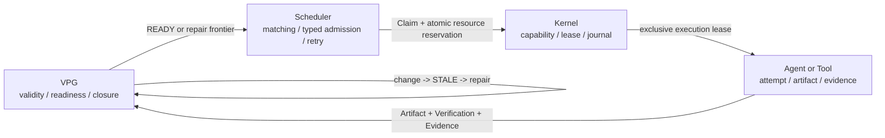

<div align="center">


### Keep valid progress. Repair only what changed.

**Most Agent runtimes decide what should run next. LongHorizonOS also decides
what remains valid after the world changes, then schedules the graph-derived
minimum repair under explicit resource and ownership constraints.**

[](https://www.python.org/)
[](LICENSE)
[](docs/releases/v0.1.0.md)
[](docs/architecture/LONGHORIZONOS-CORE-V1.md)

English | [简体中文](README.zh-CN.md)

[Run the closed loop](#run-the-closed-loop) |
[Why it exists](#why-it-exists) |
[Measured results](#measured-results) |
[Use the SDK](#use-the-sdk) |
[Current status](#current-status)

</div>

---

## Run the closed loop

LongHorizonOS requires Python 3.11 or newer. Its flagship demo is deterministic,
offline, and requires no API key:

```bash
git clone https://github.com/Yang-Jiashu/LongHorizonOS.git
cd LongHorizonOS
python -m pip install .
lhos demo recovery-repair --json
```

This is not a prerecorded output. The command runs the SDK, Scheduler, Kernel
Leases, VPG, invalidation, and repair path:

```text
worker failure
  -> recover execution ownership
source.py@v1 -> source.py@v2
  -> 3 causally affected Tasks become STALE
  -> 1 unrelated VERIFIED Task stays valid
  -> derive the minimum Repair Frontier
  -> require fresh exact-version Evidence
  -> close the Goal again
```

The JSON result includes machine-checkable fields such as
`crash_recovered`, `affected_tasks`, `preserved_tasks`, `repair_frontier`,
`repair_attempts`, and `final_closed`.

Run the two fast, offline benchmark gates:

```bash
lhos benchmark semantic-repair --quick
lhos benchmark async-agentos
```

## Why it exists

A checkpoint can tell an Agent where execution stopped. It cannot, by itself,
answer whether completed work is still justified after a requirement, file,
tool, model, API, or external fact changes.

LongHorizonOS treats that as a runtime problem:

| Runtime question | Authority in LongHorizonOS |
|---|---|
| What is still true? | Exact-version Evidence in the Verified Progress Graph |
| What became stale? | Version-aware causal invalidation |
| What can run now? | Graph-derived `READY` and Repair Frontiers |
| Is the Goal complete? | VPG closure rules, not an Agent self-report |
| Who may execute or commit? | Scheduler Claim plus Kernel Lease fencing |
| Does the machine have logical capacity? | Atomic typed resource admission |
| What survives a process restart? | Durable VPG and optional Scheduler projections |

The authority boundaries are deliberate:

> **The graph owns semantic truth and readiness. The Scheduler owns policy and
> logical admission. The Kernel owns execution authority. Agents and tools
> perform attempts and produce evidence.**

That creates two closed loops:

```text
VPG READY frontier
  -> Scheduler Claim + resource reservation
  -> Kernel Lease
  -> Agent/tool execution
  -> independent verification
  -> exact-version Evidence
  -> VPG Goal closure

Artifact/world change
  -> Evidence no longer applicable
  -> causal STALE cone
  -> Goal reopens
  -> minimum Repair Frontier
  -> fresh Evidence
  -> verified reclosure
```

LongHorizonOS complements workflow engines and cluster schedulers rather than
claiming that those systems have no state, graphs, recovery, or resource
management. Their primary mechanisms already exist separately. The project's
specific bet is that **semantic validity, selective repair, execution
ownership, and resource admission need one consistency model for stateful
Agents**.

## Architecture



| Layer | Owns | Must not decide |
|---|---|---|
| **VPG** | Dependencies, Evidence applicability, Task validity, readiness, Goal closure | Agent placement or physical execution |
| **Scheduler** | Eligibility, deterministic matching, Claims, retries, logical resource capacity | Semantic truth |
| **Kernel** | Process/Action state, capabilities, Leases, fencing, journal | Whether Evidence proves a Goal |
| **Agent / Tool** | One operational attempt and its outputs | Its own final semantic validity |

## Measured results

These are checked-in reference measurements for controlled workloads. They are
reproducible regression evidence, not universal performance claims.

### 1. Selective semantic repair

```bash
lhos benchmark semantic-repair --quick
```

The quick suite runs 24 deterministic mutation-and-repair trials plus one
temporary real-workspace scenario through the public SDK, Scheduler, Kernel
Lease, Evidence, invalidation, and Goal-closure paths.

| Reference metric | Result |
|---|---:|
| Correct deterministic trials | **24 / 24** |
| Mean weighted work saved vs full restart | **48.64%** |
| Mean weighted work saved vs oracle task-DAG checkpoint | **0%** |
| Under-invalidation / over-invalidation | **0 / 0** |
| False `VERIFIED` after invalidation | **0** |
| Overlapping ownership conflicts | **0** |
| Unsafe state-only baseline false closures | **24 / 24** |
| Workspace scenario | **3 affected, 1 preserved, Goal reclosed** |

This demonstrates correct selective repair and savings over full restart on
the included workloads. It does **not** show an advantage over an
oracle-informed task-DAG checkpoint; LongHorizonOS matches that baseline on
these task-level graphs.

See the checked-in
[aggregate result](artifacts/oss_productization_e5/summaries/summary.json) and
[measurement contract](docs/benchmarks/SEMANTIC-REPAIR.md).

### 2. Public `AgentOS.run_async` path

```bash
lhos benchmark async-agentos
# or the stricter source-checkout gate:
python scripts/benchmark_multi_agent_runtime.py --check
```

The checked-in workload uses 24 independent I/O-shaped Tasks with a 25 ms
executor delay, two Agents, a global concurrency limit of four, per-Agent
limits of two, an independent verifier, and a full logical resource vector per
Task.

| Reference metric | Serial | Concurrent |
|---|---:|---:|
| End-to-end time | **1.516 s** | **0.789 s** |
| Peak executor concurrency | **1** | **4** |
| Verified Tasks | **24 / 24** | **24 / 24** |
| Completed Claims | **24 / 24** | **24 / 24** |
| Semantically verified Attempts | **24 / 24** | **24 / 24** |
| Ownership/resource/capacity violations | **0** | **0** |
| Active reservations after completion | **0** | **0** |

Measured speedup: **1.921x**. This proves bounded overlap through public-SDK
semantic closure for this controlled I/O workload. It does not measure model
throughput, CUDA work, physical CPU/GPU isolation, distributed scheduling, or
arbitrary Agent workloads.

See the [raw result](artifacts/benchmark_results/multi-agent-runtime.json) and
[benchmark contract](docs/benchmarks/ASYNC-AGENTOS.md).

### 3. Durable VPG history

```bash
python scripts/benchmark_vpg_incremental_history.py --check
```

For a workload that adds one Task per committed patch:

| Committed patches | History rows | History payload | READY frontier event payload | Total DB | Total commit time |
|---:|---:|---:|---:|---:|---:|
| 100 | 100 | 35,274 B | 11,892 B | 483,328 B | 0.895 s |
| 200 | 200 | 70,874 B | 23,892 B | 888,832 B | 4.032 s |
| 400 | 400 | 142,074 B | 47,892 B | 1,638,400 B | 17.202 s |

At N=400, the former full-copy layout required **80,200 history rows** and was
previously measured at about **37.9 MB**. Entity-revision history now stores
**400 rows**; the latest run produced a **1.64 MB** database, a **99.50%
history-row reduction**. The READY-frontier event payload is now persisted as
a count plus SHA-256 summary, so it grows linearly (**47,892 B at N=400**)
instead of repeating the full frontier in every version.

This fixes the sequential-small-patch `O(V^2)` durable-history and
READY-frontier event-payload write amplification. End-to-end commit time is
still superlinear because the current runtime constructs, derives, validates,
decodes, and hashes a full candidate projection for every commit. The elapsed
times above are one local reference run, not a latency guarantee.

See the
[raw result](artifacts/benchmark_results/vpg-incremental-history-2026-08-12-frontier-summary-final.json).

## Use the SDK

### Minimal verified Goal

```python
from lhos.sdk import Agent, AgentOS, Goal, scripted_executor

with AgentOS(":memory:") as runtime:
    runtime.add_agent(Agent("coder", specializations=("python",)))

    goal = Goal("Ship hello")
    goal.task(
        "Write hello",
        agent="coder",
        verify=scripted_executor(artifact_id="hello.txt", version=1),
    )

    result = runtime.run(goal, max_dispatches=4)
    print(result.goal_state, result.task_states)
    # closed {'Write hello': 'verified'}
```

Run the same example:

```bash
python examples/quickstart/hello_world.py
```

### Async execution with typed resources

```python
import asyncio

from lhos.sdk import Agent, AgentOS, Goal, VerificationOutcome


async def execute(task_id: str) -> None:
    await asyncio.sleep(0.05)  # replace with async model/tool work


def verified(task_id: str) -> VerificationOutcome:
    return VerificationOutcome(
        passed=True,
        artifact_id=f"{task_id}.txt",
        version=1,
        content="verified output",
    )


async def main() -> None:
    with AgentOS(":memory:") as runtime:
        runtime.add_agent(
            Agent(
                "worker",
                executor=execute,
                max_concurrency=2,
                resource_capacity={
                    "cpu_millis": 2_000,
                    "ram_bytes": 2_000_000_000,
                    "gpu_count": 1,
                    "vram_bytes": 8_000_000_000,
                    "model_slots": {"local-model": 2},
                },
            )
        )

        goal = Goal("Parallel verified work")
        for task_id in ("A", "B"):
            goal.task(
                task_id,
                agent="worker",
                verify=lambda task_id=task_id: verified(task_id),
                resources={
                    "cpu_millis": 500,
                    "ram_bytes": 256_000_000,
                    "model_slots": {"local-model": 1},
                },
            )

        result = await runtime.run_async(goal, max_concurrency=2)
        print(result.goal_state, result.verified)


asyncio.run(main())
```

The Scheduler reserves each Task's entire vector atomically before execution
and releases it on success, failure, cancellation, and reconciliation paths.
These are **logical per-Agent capacity reservations**. They do not inspect or
enforce real host CPU, RAM, GPU, or VRAM consumption.

`run_async` accepts synchronous or asynchronous Agent executors and
`Task.verify` callbacks. The synchronous `run()` path rejects async callbacks
and releases the acquired Claim rather than silently treating them as complete.

`scripted_executor` is deterministic demo/test plumbing. Useful workloads
should provide an `Agent.executor` and an independent `Task.verify`, or use the
included command/tool integrations. A Task without applicable Evidence remains
unverified by design. `Agent.model` is configuration metadata; it does not
automatically create a provider client.

More runnable examples:

```bash
python examples/quickstart/multi_agent.py
python examples/quickstart/repair.py
python examples/quickstart/real_coding_task.py
```

## Operator surfaces

Read-only run inspection uses a durable database plus a saved manifest:

```bash
lhos status --state run.json --goal "Ship hello"
lhos inspect --state run.json --goal "Ship hello" task "Write hello"
lhos graph --state run.json --goal "Ship hello"
```

VPG lifecycle commands are explicit operator actions:

```bash
lhos vpg history --db run.db --graph GRAPH_ID --json
lhos vpg compact --db run.db --graph GRAPH_ID \
  --retain-from 100 --actor operator --reason "retention policy" --yes
lhos vpg migrate-legacy --db legacy.db --graph GRAPH_ID --json
```

Legacy migration defaults to a read-only preview. Trusting a snapshot-less
legacy projection requires the preview's exact version and hash plus explicit
operator identity and reason. History compaction requires a verified
checkpoint and `--yes`.

## What is implemented

- Evidence-backed VPG validity, graph-derived readiness, and Goal closure
- Exact Artifact-version applicability and causal `STALE` propagation
- Minimum Repair Frontier, selective re-execution, and verified reclosure
- Process / Action / Journal primitives with Crash recovery and ownership
  reconciliation
- Capability / Lease / Signal primitives and Kernel lease fencing
- Versioned Artifact FS, Namespace isolation, Version-checked commits, and
  Canonical URI security
- Public synchronous and asynchronous Agent execution paths
- Global and per-Agent async concurrency limits for sync/async executors and
  verifiers
- Deterministic Agent eligibility/matching, Claims, retries, and Attempts
- Atomic logical CPU/RAM/GPU/VRAM/model-slot admission and cleanup
- Kernel Process, Action, Capability, Lease, Signal, and Journal primitives
- Lease-generation fencing on the main SDK Evidence/VPG commit path
- Optional durable Scheduler event/state replay with hash-chain integrity
- Durable VPG entity-revision history, historical reconstruction, hashes, and
  fail-closed recovery
- VPG history retention/compaction and explicit trusted legacy migration tools
- Shell, Workspace, Git, and OpenAI-compatible integration modules
- Transactional Outbox primitive for future cross-plane integration
- Deterministic demos, observability CLI, and reproducible benchmark gates

## Current status

**Stage: experimental single-host systems prototype / early research alpha
(`v0.1.0`).** Core Architecture V1 is frozen. The public SDK, CLI, persistence
contracts, and operator workflows remain experimental `v0.x` surfaces.

Release validation details are recorded in
[`docs/releases/v0.1.0.md`](docs/releases/v0.1.0.md). Targeted correctness and
packaging gates pass; the complete non-slow repository suite is intentionally
not claimed as fully green.

## Not yet implemented:

- Distributed multi-agent cluster scheduling or multi-host consensus
- Physical host/device resource telemetry and isolation
- Provider RPM/TPM quotas, preemption, fairness, and starvation guarantees
- Cross-plane exactly-once fencing for irreversible external side effects
- General belief revision, contradiction solving, or autonomous repair planning

### Important boundaries

- Typed resources are Scheduler-owned **logical per-Agent pools**, not a shared
  host/device inventory. There is no dynamic hardware telemetry or OS-level
  CPU/GPU/RAM/VRAM enforcement.
- RPM/TPM/API quotas, browser/sandbox/workspace locks, preemption, fairness,
  and starvation guarantees are not implemented.
- Durable Scheduler replay assumes one Scheduler writer. There is no leader
  election, distributed CAS, or multi-writer fencing.
- Executor concurrency is real, but Evidence/VPG commits are serialized inside
  one `run_async` call. Independent runtime instances do not share that lock.
- The main Lease-to-VPG path is fenced, but Facts, Action, Claim completion,
  VPG patch, Lease release, and external systems are not one unified
  transaction.
- The Transactional Outbox primitive is not yet wired through every
  Action/Claim/Lease/VPG path. Irreversible external side effects are not
  exactly-once.
- Checkpoint/recovery covers durable runtime metadata/projections and optional
  workspace state, not arbitrary Python memory, call stacks, or in-flight code.
- VPG durable-history growth is incremental, but derivation/validation/hash
  work is still full-projection. Entity deletion tombstones are not yet
  implemented.
- There is no distributed cluster runtime, production sandbox, general belief
  revision, hosted service, or web dashboard.
- The repository does not yet include statistically powered real-model,
  real-GPU, or direct competitor benchmarks.

Do not evaluate this release as a complete general-purpose Agent operating
system. Evaluate it as a working prototype of a **semantic control plane plus
single-host execution/resource control loop**.

## Research direction

The next system milestones are:

1. shared host/device inventory, provider quotas, lock resources, fairness, and
   preemption;
2. driver-consumed side-effect fencing and a cross-plane commit protocol;
3. incremental VPG derivation and Merkle-style projection hashing, plus
   deletion tombstones;
4. crash campaigns and real model/tool/GPU workloads against workflow,
   checkpoint, and resource-scheduler baselines;
5. multi-process and distributed control-plane fencing.

The research question is not whether graphs or schedulers already exist. It is:

> **Can evidence-backed semantic validity drive resource-aware execution so a
> long-running Agent system preserves every still-valid result, rejects stale
> commits, and spends only the resources required for verified reclosure?**

## Documentation

- [Quick Start](docs/QUICKSTART.md)
- [Concepts and authority model](docs/CONCEPTS.md)
- [Core Architecture V1](docs/architecture/LONGHORIZONOS-CORE-V1.md)
- [Public Python API](docs/sdk/PUBLIC-API.md)
- [Recovery and repair demo](docs/demos/RECOVERY-REPAIR.md)
- [Semantic-repair benchmark](docs/benchmarks/SEMANTIC-REPAIR.md)
- [Async AgentOS benchmark](docs/benchmarks/ASYNC-AGENTOS.md)
- [Engineering review and roadmap](docs/LONGHORIZONOS_REVIEW_AND_ROADMAP_2026-08-11.md)

## Development

```bash
python -m pip install -e ".[dev]"
python -m pytest -q -m "not slow"
python -m ruff check .
python -m ruff format --check src tests examples scripts
python -m mypy src/lhos
```

Contributions are welcome. Changes that move semantic authority out of the VPG
or execution ownership away from Kernel Leases require an architecture
proposal.

---

<div align="center">

**Build Agents that can explain what remains true after the world changes.**

</div>
