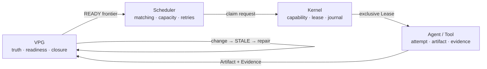

<div align="center">

# LongHorizonOS

### An evidence-backed operating runtime for long-horizon agents

**The Graph decides what remains true and what becomes ready.  
The Scheduler chooses policy. The Kernel grants ownership. Agents execute.**

[](https://www.python.org/)
[](LICENSE)
[](docs/releases/v0.1.0.md)
[](docs/architecture/LONGHORIZONOS-CORE-V1.md)

[English](README.md) | [简体中文](README.zh-CN.md)

[Why](#why-longhorizonos) · [Architecture](#architecture) ·
[Results](#measured-results) · [Quick Start](#quick-start) · [Docs](#documentation)

</div>

---

## Why LongHorizonOS?

Most agent frameworks answer **what should run next**. LongHorizonOS also
answers **what remains valid after the world changes**.

Its Verified Progress Graph (VPG) is the live semantic control plane, not a
post-run visualization. Evidence closes work, artifact versions determine
whether that evidence still applies, and graph state derives the scheduling
and repair frontier.

When an input changes, LongHorizonOS:

1. reopens the affected Goal;
2. marks only the causal cone `STALE`;
3. preserves unrelated `VERIFIED` work;
4. dispatches the graph-derived Repair Frontier;
5. closes the Goal only after fresh Evidence exists.

## Architecture



| Layer | Sole authority |
|---|---|
| **VPG** | Dependencies, semantic validity, readiness and Goal closure |
| **Scheduler** | Matching, capacity, retry and dispatch policy |
| **Kernel Lease** | Exclusive execution ownership and recovery |
| **Agent** | One attempt and its Artifact/Evidence output |

This is an OS-inspired runtime, not an OS-themed metaphor. It directly adopts
explicit state, authority boundaries, leases, journals, versioned resources
and crash recovery.

## Measured results

The advanced suite is deterministic, offline and checked against independent
oracles or explicit invariants.

| Experiment | LongHorizonOS result | Baseline / ablation |
|---|---:|---:|
| Component repair reruns | **16** | 72 full restart; 64 coarse task-DAG |
| Weighted repair work saved | **78.2609%** | vs full restart |
| Under / over invalidation | **0 / 0** | exact artifact oracle match |
| False closures without Graph/Evidence/version | **4 / 4 cases** | 16 missed invalidations |
| Resource ownership conflicts | **0** | 24 without leases |
| Duplicate executions | **0** | 36 without leases |
| Throughput / mean wait | **1.0 / 5.0 ticks** | 0.5 / 11.0 FIFO baseline |
| Projection recovery / stale commit | **pass / pass** | 0 mismatches, 0 duplicate versions |
| Long-horizon weighted work saved | **22.1145%** | 20 cells, horizons up to 200 |
| Evidence/Chaos faults | **9 / 9 detected and repaired** | 0 invariant violations |
| Largest Graph scale | **5,000 nodes** | exact invalidation and recovery |
| Security boundary | **5 / 5 attacks blocked** | 5 / 5 legal controls passed |

An existing artifact-selective workload independently reports **8 versus 64
reruns** and **87.5% savings** against a coarse task-DAG baseline. These
numbers are workload-specific; LongHorizonOS does not claim to beat an
artifact oracle. The architectural result is exact causal repair with
explainable safety.

An optional live-model probe is supported through any explicitly configured
OpenAI-compatible provider. Public reference claims remain grounded in the
deterministic offline suite; the live probe is supplementary systems evidence,
not a model-quality leaderboard. A separate controlled sweep covered
**378 cells** across 14 presets, 9 runtime modes and 3 seeds.

### Validation status

- Full test suite: **2,521 passed, 1 skipped**
- Static gates: **Ruff and mypy clean**
- Package release checks: **wheel/sdist build, metadata audit, `twine check`,
  fresh-environment install and CLI smoke tests passed**
- External validity: **Terminal-Bench and SWE-bench are pending**; they require
  a Docker/WSL-capable runner and are not represented as completed scores here

See the full [advanced evaluation](docs/benchmarks/ADVANCED-EVALUATION.md) and
[artifact-selective benchmark](docs/benchmarks/ARTIFACT-SELECTIVE-REPAIR.md).

## Quick Start

```bash
python -m pip install .

# Failure → recovery → mutation → repair → reclosure
lhos demo recovery-repair

# Offline, deterministic, no API key
lhos benchmark semantic-repair --quick
lhos benchmark advanced --json
```

```python
from lhos.sdk import Agent, AgentOS, Goal, scripted_executor

runtime = AgentOS(":memory:")
runtime.add_agent(Agent("coder", specializations=("python",)))

goal = Goal("Ship hello")
goal.task(
    "Write hello",
    agent="coder",
    verify=scripted_executor(artifact_id="hello.txt", version=1),
)

result = runtime.run(goal, max_dispatches=4)
print(result.goal_state)  # closed
```

Execution without applicable Evidence remains unverified by design.

## What is included?

- Verified Progress Graph and graph-derived multi-agent scheduling
- Causal invalidation, minimum Repair Frontier and Goal reclosure
- Process / Action / Journal
- Capability / Lease / Signal
- Crash recovery
- Versioned Artifact FS
- Namespace isolation
- Version-checked commits
- Canonical URI security
- Read-only observability CLI, deterministic demos and benchmarks

## Project status

**Core Architecture V1 is frozen.** Kernel, VPG, scheduling and local repair
are implemented. The public SDK and CLI remain release-candidate surfaces.

Still in progress: production sandboxing, distributed execution, broader
`AgentOS` integration for Context VM, and larger real-world
Artifact/Evidence workloads. LongHorizonOS is not yet a general-purpose
autonomous planner.

Not yet implemented:

- Distributed multi-agent cluster
- General belief revision
- Distributed repair cluster

## Documentation

- [Quick Start](docs/QUICKSTART.md)
- [Concepts and authority model](docs/CONCEPTS.md)
- [Core Architecture V1](docs/architecture/LONGHORIZONOS-CORE-V1.md)
- [Public Python API](docs/sdk/PUBLIC-API.md)
- [Recovery and repair demo](docs/demos/RECOVERY-REPAIR.md)
- [Semantic-repair benchmark](docs/benchmarks/SEMANTIC-REPAIR.md)
- [Artifact-selective repair benchmark](docs/benchmarks/ARTIFACT-SELECTIVE-REPAIR.md)
- [Advanced evaluation](docs/benchmarks/ADVANCED-EVALUATION.md)

## Development

```bash
python -m pip install -e ".[dev]"
python -m pytest -q -m "not slow"
python -m ruff check .
python -m mypy src/lhos
```

Contributions that move semantic authority out of the VPG or ownership away
from Kernel Leases require an architecture proposal.

---

<div align="center">

**Build agents that can explain what remains true after the world changes.**

</div>
