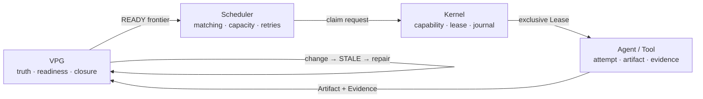

<div align="center">

# LongHorizonOS

### An evidence-backed operating runtime for long-horizon agents

**The Graph decides what remains true and what becomes ready.  
The Scheduler chooses policy. The Kernel grants ownership. Agents execute.**

[](https://www.python.org/)
[](LICENSE)
[](docs/releases/v0.1.0.md)
[](docs/architecture/LONGHORIZONOS-CORE-V1.md)

English | [简体中文](README.zh-CN.md)

[Why](#why-longhorizonos) · [Architecture](#architecture) ·
[Results](#measured-results) · [Quick Start](#quick-start) · [Docs](#documentation)

</div>

---

## Why LongHorizonOS?

Most agent frameworks answer **what should run next**. LongHorizonOS also
answers **what remains valid after the world changes**.

Its Verified Progress Graph (VPG) is not a post-run visualization. It is the
live semantic control plane: Evidence closes work, Artifact versions determine
applicability, and graph state derives the scheduling and repair frontier.

When an input changes, LongHorizonOS:

1. reopens the affected Goal;
2. marks only the causal cone `STALE`;
3. preserves unaffected `VERIFIED` work;
4. re-executes the graph-derived Repair Frontier;
5. closes the Goal only after fresh Evidence exists.

## Architecture



| Layer | Sole authority |
|---|---|
| **VPG** | Dependencies, semantic validity, readiness and Goal closure |
| **Scheduler** | Matching, capacity, retry and dispatch policy |
| **Kernel Lease** | Exclusive execution ownership and recovery |
| **Agent** | One attempt and its Artifact/Evidence output |

This is an OS-inspired runtime, not an OS-themed metaphor. It directly adopts
the mechanisms that create useful invariants: explicit state, authority
boundaries, leases, journals, versioned resources and crash recovery.

## Measured results

The reproducible quick benchmark runs 24 deterministic mutation-and-repair
trials plus a real-workspace scenario.

| Result | LongHorizonOS |
|---|---:|
| Valid deterministic trials | **24 / 24** |
| Weighted work saved vs full restart | **48.64%** |
| Under / over invalidation | **0 / 0** |
| False `VERIFIED` after invalidation | **0** |
| Overlapping ownership conflicts | **0** |
| State-only resume false closures | **24 / 24** |
| Real-workspace repair | **3 affected, 1 preserved, Goal reclosed** |

An opt-in live StepCode probe with `gpt-5.6-sol` observed **3 model calls**
for LongHorizonOS versus **4** for full restart: **25% fewer calls**, with the
Goal closed again and no false `VERIFIED` state.

> [!NOTE]
> On the current task-level workloads, LongHorizonOS matches an
> oracle-informed task-DAG checkpoint: 3 calls versus 3 live, and 0% additional
> weighted saving offline. The present advantage is semantic safety,
> explainability and automatic repair derivation—not a fabricated win over an
> oracle. Artifact/Evidence-level workloads are the next benchmark frontier.

See the [benchmark protocol and limitations](docs/benchmarks/SEMANTIC-REPAIR.md).

## Quick Start

```bash
python -m pip install .

# Closed loop: failure → recovery → mutation → repair → reclosure
lhos demo recovery-repair

# Offline, deterministic, no API key
lhos benchmark semantic-repair --quick
```

```python
from lhos.sdk import Agent, AgentOS, Goal, scripted_executor

runtime = AgentOS(":memory:")
runtime.add_agent(Agent("coder", specializations=("python",)))

goal = Goal("Ship hello")
goal.task(
    "Write hello",
    agent="coder",
    verify=scripted_executor(artifact_id="hello.txt", version=1),
)

result = runtime.run(goal, max_dispatches=4)
print(result.goal_state)  # closed
```

Execution without applicable Evidence remains unverified by design.

## What is included?

- Verified Progress Graph and graph-derived multi-agent scheduling
- Causal invalidation, minimum Repair Frontier and Goal reclosure
- Process / Action / Journal
- Capability / Lease / Signal
- Crash recovery and Versioned Artifact FS
- Namespace isolation and Version-checked commits
- Canonical URI security
- Read-only observability CLI, deterministic demos and benchmarks

## Project status

**Core Architecture V1 is frozen.** Kernel, VPG, scheduling and local repair
are implemented. The public SDK and CLI remain release-candidate surfaces.

Still in progress: production sandboxing, distributed execution, primary
`AgentOS` integration for Context VM, and Artifact/Evidence-level comparative
workloads. LongHorizonOS is not yet a general-purpose autonomous planner.

Not yet implemented:

- Distributed multi-agent cluster
- General belief revision
- distributed repair cluster

## Documentation

- [Quick Start](docs/QUICKSTART.md)
- [Concepts and authority model](docs/CONCEPTS.md)
- [Core Architecture V1](docs/architecture/LONGHORIZONOS-CORE-V1.md)
- [Public Python API](docs/sdk/PUBLIC-API.md)
- [Recovery and repair demo](docs/demos/RECOVERY-REPAIR.md)
- [Semantic-repair benchmark](docs/benchmarks/SEMANTIC-REPAIR.md)

## Development

```bash
python -m pip install -e ".[dev]"
python -m pytest -q -m "not slow"
python -m ruff check .
python -m mypy src/lhos
```

Contributions are welcome. Changes that move semantic authority out of the VPG
or ownership away from Kernel Leases require an architecture proposal.

---

<div align="center">

**Build agents that can explain what remains true after the world changes.**

</div>
