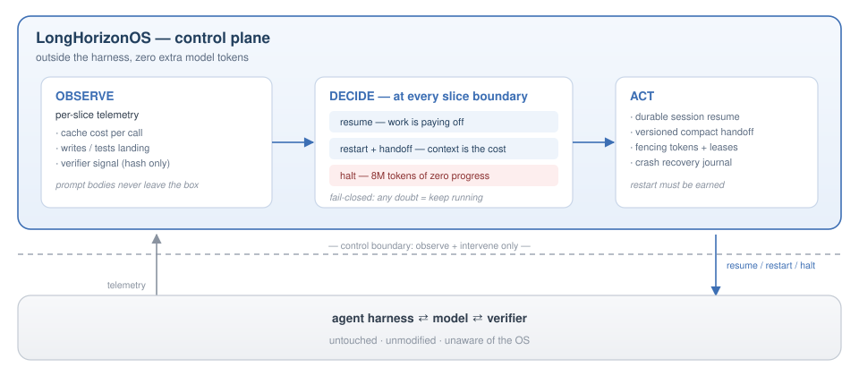
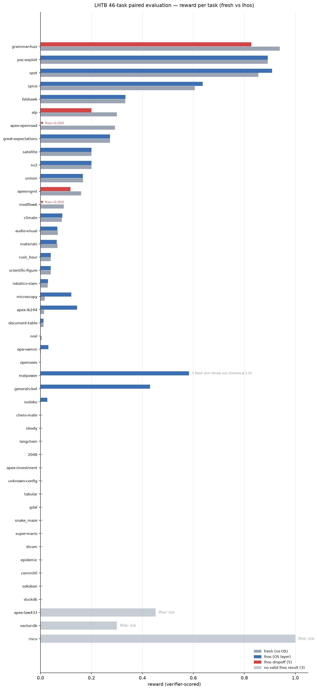
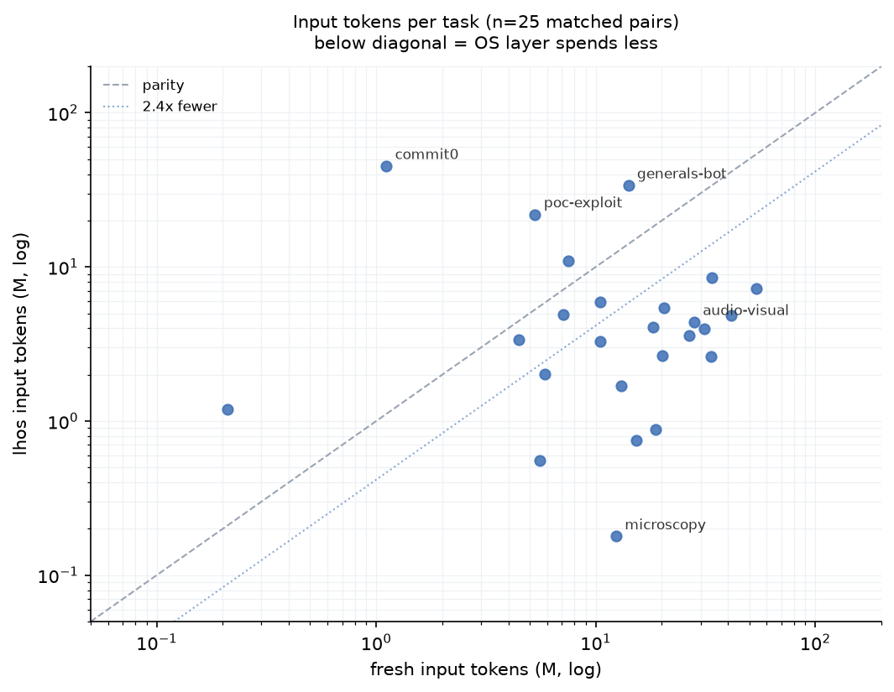

<div align="center">


# LongHorizonOS

### The operating system for long-running agents

**Your harness keeps the agent alive.<br/>LongHorizonOS keeps it honest.**

<br/>

<!-- Badges Row 1: Project Identity -->
[](https://www.python.org/)
[](LICENSE)
[](docs/releases/v0.1.0.md)

<!-- Badges Row 2: GitHub Metrics -->
[](https://github.com/Yang-Jiashu/LongHorizonOS/stargazers)
[](https://github.com/Yang-Jiashu/LongHorizonOS/network/members)
[](https://github.com/Yang-Jiashu/LongHorizonOS/issues)
[](https://github.com/Yang-Jiashu/LongHorizonOS/commits/main)

<!-- Badges Row 3: Tech & Eval -->
[](#%EF%B8%8F-evaluation-46-task-longhorizonbenchmark-lhtb-paired-arms)
[](https://github.com/Yang-Jiashu/LongHorizonOS)
[](https://github.com/Yang-Jiashu/LongHorizonOS)
[](https://github.com/Yang-Jiashu/LongHorizonOS/graphs/contributors)

<br/>

English | [简体中文](README.zh-CN.md)

</div>

---

## 📑 Table of Contents

- [The failure you already know](#the-failure-you-already-know)
- [The idea: an exoskeleton, not a transplant](#the-idea-an-exoskeleton-not-a-transplant)
- [✨ Key Mechanisms](#-key-mechanisms)
- [🏗️ What ships in this release](#️-what-ships-in-this-release)
- [📊 Evaluation: 46-task LongHorizonBenchmark (LHTB), paired arms](#%EF%B8%8F-evaluation-46-task-longhorizonbenchmark-lhtb-paired-arms)
- [Why not just \[prompt harder / bigger context / native compaction\]?](#why-not-just-prompt-harder--bigger-context--native-compaction)
- [🚀 Quick Start](#-quick-start)
- [🗺️ Roadmap](#️-roadmap)
- [📚 Documentation](#-documentation)
- [🧑‍💻 Development](#-development)
- [Contributing · Security · License](#contributing--security--license)
- [Acknowledgments](#acknowledgments)

---

## The failure you already know

Long-horizon agents don't crash. They do something worse: **they keep going**.

Real traces from our benchmark fleet, before the OS layer existed:

> **`apex-openroad`** — 158 slice-resumes over 3.5 hours. Every resume re-read its entire conversation; by the end the agent was paying **183,000 tokens per model call**. 45.9M tokens burned, reward went 0.292 → 0. Nobody stopped it. Nothing even noticed.

> **`super-mario`** — 120M tokens. The agent never cleared the first level. It was "working" the entire time.

> **`audio-visual`** — a 90-minute session in which **54% of the slices did literally nothing**: zero tool calls, zero progress, while the verifier kept asking "done yet?" and the harness kept answering "keep going."

Every long-running agent stack has these sessions. They are not edge cases; they are the tail that eats the budget. The harness cannot fix them, because the harness *is* the thing that is running. You need a layer outside it.

---

## The idea: an exoskeleton, not a transplant

LongHorizonOS wraps an existing agent harness and treats every run as a **process under an operating system**:

<p align="center">

</p>

Same model. Same harness. Same task. The only difference is that **someone is watching the meter**.

---

## ✨ Key Mechanisms

OS analogies are intentional. Every gate is fail-closed: ambiguous telemetry means *keep running*.

<div align="center">

| | OS Concept | LongHorizonOS Implementation |
|---|---|---|
| ⏱️ | **Time Quantum** | Bounded execution slices — a drifting run is never more than one slice away from intervention |
| 🔄 | **Context Switch** | Restart with compacted semantic handoff — goals, evidence, artifact URIs forward; the 100K-token transcript stays behind |
| 💡 | **Investment, Not Alarm** | Restarts must be *earned*: fires only if handoff carries state and the previous restart demonstrably paid for itself |
| 🧨 | **OOM Killer** | Rate-limited severe valve — cache-per-call ≥ 4× the soft line forces a restart; never churns |
| 🐕 | **Watchdog** | Stop-loss halt — 8M tokens of burn with zero writes, zero tests, and frozen verifier → stop. Any life resets the clock |
| 📑 | **Page Table** | Versioned progress graph (goals / artifacts / evidence / validity). Mid-run changes invalidate only the affected subgraph. Verified work is never redone. |

</div>

The reward red line is structural, not aspirational.

---

## 🏗️ What ships in this release

The artifact core is a crash-consistent, content-addressed store wrapped in a capability model:

<div align="center">

| Capability | What it means |
|---|---|
| 📝 **Process / Action / Journal** | Every mutation is a journaled, atomic event; a process may act only through explicitly spawned actions |
| 🔐 **Capability / Lease / Signal** | Resource access is capability-gated, ownership is lease-based, control flows through typed signals |
| 💥 **Crash Recovery** | SIGKILL-resilient with exactly-once semantics; replaying the journal reconstructs the exact pre-crash state |
| 🗃️ **Versioned Artifact FS** | Artifacts are immutable, content-addressed, and versioned; reads & writes go through an atomic write protocol |
| 🧱 **Namespace Isolation** | Each process namespace is isolated; cross-namespace access requires an explicit capability |
| ✅ **Version-checked Commits** | Optimistic concurrency via expected versions — stale writes are refused instead of silently lost |
| 🔗 **Canonical URI Security** | Artifact URIs are canonicalized and path traversal is rejected at the boundary |

</div>

### Not yet implemented

- **Distributed multi-agent cluster** — the control plane is single-host today.
- **General belief revision** — the progress graph is versioned but does not yet retract prior conclusions in general.

---

## 📊 Evaluation: 46-task LongHorizonBenchmark (LHTB), paired arms

Each of the 46 **LHTB** (**LongHorizonBenchmark**) tasks (real software-engineering and data-science workloads, machine-checked verifiers) runs **twice** — identical model (`stepfun/step-3.7-flash`), task binary, budget, and verifier:

- **fresh** — the harness alone
- **lhos** — the same run under LongHorizonOS

<div align="center">
<br/>

### ── Core KPIs ──

# <span style="font-size:2.4em;color:#2ea043">37 / 42</span>

### reward parity-or-better

<br/>

# <span style="font-size:2.4em;color:#4A7DBF">22 / 27 (81%)</span>

### where either arm scored

<br/>

# <span style="font-size:2.4em;color:#8957e5">~2.4×</span>

### fewer input tokens

<br/>

# <span style="font-size:2.4em;color:#e6850a">0</span>

### harness changes required

<br/>



<br/><br/>



</div>

**What you are looking at:** left — every task's verifier reward, both arms; red marks the five dropoffs we disclose below; grey marks the three tasks with no valid lhos result. The denominator, spelled out: 46 tasks − 3 without a valid lhos result − 1 invalid pairing (matpower, see †) = 42; fifteen of the 42 are 0–0 pairs (both arms scored zero), which count as parity but carry no signal — the 22/27 rate excludes them. Right — input tokens per task on log axes; below the diagonal means the OS layer spent less. `commit0` is the visible counterexample above the line — we disclose it rather than crop it.

<details>
<summary><b>Full 46-task paired results table</b> (single-seed rewards; ±0.01 tolerance)</summary>

| # | task | fresh | lhos | Δ | note |
|---|---|---:|---:|---:|---|
| 1 | grammar-fuzz | 0.939 | 0.828 | -0.111 | **dropoff** |
| 2 | poc-exploit | 0.892 | 0.892 | +0.000 | parity |
| 3 | spot | 0.855 | 0.909 | +0.054 | improved |
| 4 | spice | 0.606 | 0.636 | +0.030 | improved |
| 5 | foldseek | 0.333 | 0.333 | +0.000 | parity |
| 6 | alp | 0.300 | 0.200 | -0.100 | **dropoff** |
| 7 | apex-openroad | 0.292 | 0.000 | -0.292 | **dropoff** |
| 8 | great-expectations | 0.273 | 0.273 | -0.000 | parity |
| 9 | satellite | 0.200 | 0.200 | +0.000 | parity |
| 10 | su2 | 0.200 | 0.200 | +0.000 | parity |
| 11 | unison | 0.167 | 0.167 | -0.000 | parity |
| 12 | apexmgmt | 0.160 | 0.118 | -0.042 | **dropoff** |
| 13 | modflow6 | 0.092 | 0.000 | -0.092 | **dropoff** |
| 14 | climate | 0.084 | 0.086 | +0.002 | parity |
| 15 | audio-visual | 0.068 | 0.066 | -0.002 | parity |
| 16 | materials | 0.067 | 0.064 | -0.004 | parity |
| 17 | rush_hour | 0.040 | 0.040 | +0.000 | parity |
| 18 | scientific-figure | 0.040 | 0.040 | +0.000 | parity |
| 19 | robotics-slam | 0.029 | 0.029 | +0.000 | parity |
| 20 | microscopy | 0.017 | 0.121 | +0.104 | improved |
| 21 | apex-ib244 | 0.014 | 0.144 | +0.130 | improved |
| 22 | document-table | 0.012 | 0.012 | +0.000 | parity |
| 23 | nrel | 0.005 | 0.000 | -0.005 | parity |
| 24 | epa-swmm | 0.002 | 0.031 | +0.029 | improved |
| 25 | opensees | 0.001 | 0.000 | -0.001 | parity |
| 26 | matpower | 0.000 | 0.583 | +0.583 | invalid pairing † |
| 27 | generals-bot | 0.000 | 0.430 | +0.430 | improved |
| 28 | sudoku | 0.000 | 0.027 | +0.027 | improved |
| 29 | chess-mate | 0.000 | 0.000 | +0.000 | parity |
| 30 | nbody | 0.000 | 0.000 | +0.000 | parity |
| 31 | langchain | 0.000 | 0.000 | +0.000 | parity |
| 32 | 2048 | 0.000 | 0.000 | +0.000 | parity |
| 33 | apex-investment | 0.000 | 0.000 | +0.000 | parity |
| 34 | unknown-config | 0.000 | 0.000 | +0.000 | parity |
| 35 | tabular | 0.000 | 0.000 | +0.000 | parity |
| 36 | gdal | 0.000 | 0.000 | +0.000 | parity |
| 37 | snake_maze | 0.000 | 0.000 | +0.000 | parity |
| 38 | super-mario | 0.000 | 0.000 | +0.000 | parity |
| 39 | dicom | 0.000 | 0.000 | +0.000 | parity |
| 40 | epidemic | 0.000 | 0.000 | +0.000 | parity |
| 41 | commit0 | 0.000 | 0.000 | +0.000 | parity |
| 42 | sokoban | 0.000 | 0.000 | +0.000 | parity |
| 43 | duckdb | 0.000 | 0.000 | +0.000 | parity |
| 44 | apex-law433 | 0.452 | — | — | no valid lhos result |
| 45 | vector-db | 0.300 | — | — | no valid lhos result |
| 46 | riscv | 1.000 | — | — | no valid lhos result |

† fresh arm timed out in this pairing; that task's historical fresh value is 1.0 — treat the row as invalid, not as a gain.

</details>

**The honest part, because it matters:** 5 of the 42 valid tasks score *lower* under the OS layer. We know why, per case: restart-sensitive recovery on some, a context-bloat limitation on two long sessions. 3 tasks produced no valid result (provider censorship, budget hard-stop). The current policy generation (v2: investment-gated restarts, severe valve, stop-loss halt) targets exactly these; the research log tracks whether they move. If they don't move, this section will keep saying so.

---

## Why not just [prompt harder / bigger context / native compaction]?

- **Prompting** asks the agent to police itself. The agent is the thing that is drifting.
- **Bigger context** makes the 183K-tokens-per-call problem *more expensive*, not less.
- **Native compaction** happens inside the session, blind to budget, verifier signal, and whether the last three restarts paid off. The OS sees all of it — it is the only layer that never gets compacted.

---

## 🚀 Quick Start

```bash
python -m pip install -e ".[dev]"

# No API key needed. Build a goal, crash mid-run, recover, change an
# upstream file — and watch only the affected subgraph re-verify:
lhos demo recovery-repair --json
```

---

## 🗺️ Roadmap

<div align="center">

| Phase | Status | What's inside |
|---|---|---|
| **Now** | 🟢 Shipped | Research alpha · single-host · DeepSeek Harness integration · 46-task paired **LongHorizonBenchmark (LHTB)** evaluation |
| **Next** | 🟡 In focus | Harness-agnostic capability matrix · partial in-session compaction · richer policy telemetry |
| **The Point** | 🔭 Horizon | A training substrate — continuation decisions logged, replayable, and policy-addressable. Schedule policies (and eventually learned models) trained & benchmarked *inside* the OS against real long-horizon workloads |

</div>

---

## 📚 Documentation

| | |
|---|---|
| **Using it** | [User & Operator Manual](docs/USER-OPERATOR-MANUAL.md) · [Quick Start](docs/QUICKSTART.md) · [Python API](docs/sdk/PUBLIC-API.md) · [Harness Protocol](docs/HARNESS-SESSION-PROTOCOL.md) |
| **Understanding it** | [Concepts](docs/CONCEPTS.md) · [Architecture](docs/architecture/LONGHORIZONOS-CORE-V1.md) · [Compute Management](docs/LONG-HORIZON-COMPUTE-MANAGEMENT.md) |
| **Status** | [Release Notes](docs/releases/v0.1.0.md) · [Implementation Status](docs/IMPLEMENTATION-STATUS.md) · [Roadmap](docs/ROADMAP.md) · [Changelog](CHANGELOG.md) |

---

## 🧑‍💻 Development

```bash
python -m pytest -q -m "not slow"
python -m ruff check src tests && python -m ruff format --check src tests examples scripts
python -m mypy src/lhos
```

---

## Contributing · Security · License

[CONTRIBUTING.md](CONTRIBUTING.md) · [SECURITY.md](SECURITY.md) · [Apache-2.0](LICENSE)

---

## Acknowledgments

All experiments were enabled by the [StepFun Builder Program](https://platform.stepfun.com/builder-program), which provided the model API and inference quota (model `stepfun/step-3.7-flash`, credential via the `STEPFUN_API_KEY` environment variable).

---

<div align="center">

**[⬆ Back to Top](#longhorizonos)**

</div>
