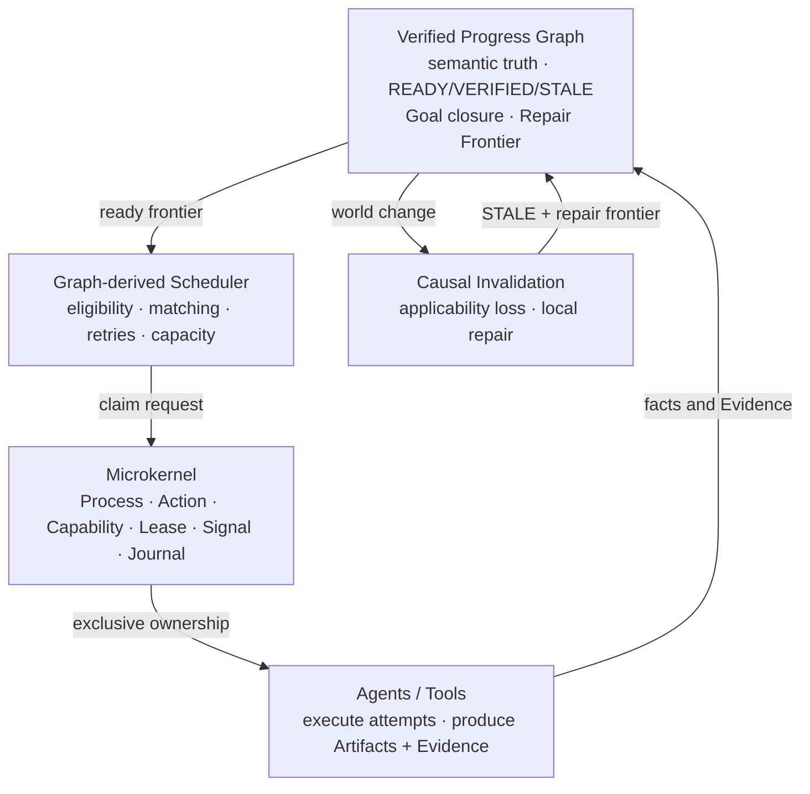

<div align="center">

# LongHorizonOS

### A state-centric operating runtime for long-horizon agents

**The Graph decides what is true and what is ready.  
The Kernel decides who owns execution. Agents do the work and submit Evidence.**

[](https://www.python.org/)
[](LICENSE)
[](docs/releases/v0.1.0.md)
[](docs/architecture/LONGHORIZONOS-CORE-V1.md)

English | [简体中文](README.zh-CN.md)

[Quick Start](#quick-start) · [Architecture](#architecture) ·
[Demo](#run-the-closed-loop-demo) · [Documentation](#documentation)

</div>

---

## What is LongHorizonOS?

Most agent frameworks organize calls, messages, or workflows. LongHorizonOS
organizes **durable semantic progress**.

It combines a microkernel-style execution plane with an evidence-backed
**Verified Progress Graph (VPG)**. The VPG is not a visualization generated
after a run: it is the live semantic control plane and the source of the
scheduling frontier.

When an artifact or external fact changes, LongHorizonOS preserves unaffected
verified work, invalidates only the causal cone, reopens the Goal, and derives
the minimum Repair Frontier required to close it again.

> [!IMPORTANT]
> The Scheduler selects policy; it does not invent truth. Task ownership starts
> only after the Kernel grants an exclusive Lease. Agents cannot directly mark
> a Task `VERIFIED` or close a Goal.

## Why another agent runtime?

Long-running agents need answers that a queue alone cannot provide:

- What remains valid after the world changes?
- Why is a task complete, and which artifact versions support that claim?
- Who owns a task after a worker crashes?
- Which work must be repaired, and which work must be preserved?
- Can the runtime recover from durable state without replaying the whole plan?

LongHorizonOS makes these questions explicit system invariants.

## Architecture



| Layer | Authority |
|---|---|
| **Graph / VPG** | Dependencies, semantic state, readiness, Goal lifecycle |
| **Scheduler** | Agent matching, capacity, retry and dispatch policy |
| **Kernel** | Processes, capabilities, exclusive ownership and recovery |
| **Agent** | One execution attempt and its produced facts |

This does not attempt to treat every OS analogy literally. It directly adopts
the mechanisms that provide useful invariants: explicit state, authority
boundaries, durable journals, resource ownership and crash recovery.

## Key features

- **Verified progress** — immutable Evidence bound to exact ArtifactVersions.
- **Causal repair** — deterministic invalidation with preserved verified work.
- **Resource-safe execution** — Kernel Lease is the ownership linearization point.
- **Crash-consistent state** — durable claims, attempts, journals and projections.
- **Read-only observability** — inspect saved runs without mutating the Graph.
- **Offline proof path** — the flagship demo requires no model key or network.

Implemented subsystems:

- Process / Action / Journal
- Capability / Lease / Signal
- Crash recovery
- Versioned Artifact FS
- Namespace isolation
- Optimistic concurrency
- Canonical URI security
- Context VM, Verified Progress Graph and graph-derived multi-agent scheduling

## Run the closed-loop demo

```bash
python -m pip install .
lhos demo recovery-repair
```

The demo exercises the real Kernel, VPG, Scheduler, Artifact bridge and
invalidation runtime:

```text
verified Goal
  -> worker failure and Lease recovery
  -> ArtifactVersion changes
  -> causal STALE propagation
  -> minimum Repair Frontier
  -> fresh Evidence
  -> Goal closes again
```

Use `lhos demo recovery-repair --json` for machine-readable output.

## Quick Start

```python
from lhos.sdk import Agent, AgentOS, Goal, scripted_executor

runtime = AgentOS(":memory:")
runtime.add_agent(Agent("coder", specializations=("python",)))

goal = Goal("Ship hello")
goal.task(
    "Write hello",
    agent="coder",
    verify=scripted_executor(artifact_id="hello.txt", version=1),
)

result = runtime.run(goal, max_dispatches=4)
print(result.goal_state)  # closed
```

A successful execution without valid Evidence remains unverified by design.
See the [Quick Start guide](docs/QUICKSTART.md) for multi-agent execution and
local repair.

## Project status

**Core Architecture V1 is frozen.** The semantic and resource authority
boundaries are stable. The public SDK, CLI and integrations remain release
candidate surfaces.

| Area | Status |
|---|---|
| Kernel, Artifact FS, Context VM | Implemented |
| VPG, scheduling, invalidation, local repair | Implemented |
| Python SDK and read-only CLI | Experimental |
| Deterministic adapters and demos | Available |
| Production sandboxing and hardening | In progress |

Not yet implemented:

- Distributed multi-agent cluster
- General belief revision
- distributed repair cluster
- General-purpose LLM planner and autonomous self-healing

## Documentation

- [Core Architecture V1](docs/architecture/LONGHORIZONOS-CORE-V1.md)
- [Concepts and authority model](docs/CONCEPTS.md)
- [Quick Start](docs/QUICKSTART.md)
- [Public Python API](docs/sdk/PUBLIC-API.md)
- [Recovery and repair demo](docs/demos/RECOVERY-REPAIR.md)
- [Semantic-repair benchmark](docs/benchmarks/SEMANTIC-REPAIR.md)
- [Security policy](SECURITY.md)

## Development

```bash
python -m pip install -e ".[dev]"
python -m pytest -q
```

Contributions are welcome. Please read [CONTRIBUTING.md](CONTRIBUTING.md).
Changes that move semantic authority out of the Graph or ownership away from
Kernel Leases require an architecture proposal, not an ordinary patch.

---

<div align="center">

**Build agents that can explain what remains true after the world changes.**

</div>
