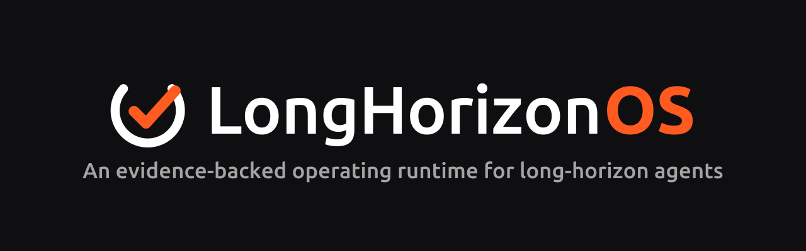
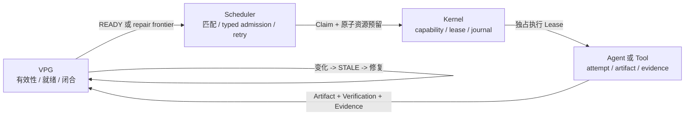

<div align="center">



### 保留仍然有效的进度，只修复真正变化的部分

**大多数 Agent 运行时主要决定“下一步运行什么”；LongHorizonOS 还会判断
“世界变化后什么仍然有效”，并在明确的资源与所有权约束下，只调度 Graph
推导出的最小修复。**

[](https://www.python.org/)
[](LICENSE)
[](docs/releases/v0.1.0.md)
[](docs/architecture/LONGHORIZONOS-CORE-V1.md)

[English](README.md) | 简体中文

[跑通闭环](#跑通闭环) |
[为什么需要它](#为什么需要它) |
[真实测评](#真实测评) |
[使用 SDK](#使用-sdk) |
[当前阶段](#当前阶段)

</div>

---

## 跑通闭环

LongHorizonOS 需要 Python 3.11 或更高版本。核心 Demo 确定性运行、完全离线，
不需要 API Key：

```bash
git clone https://github.com/Yang-Jiashu/LongHorizonOS.git
cd LongHorizonOS
python -m pip install .
lhos demo recovery-repair --json
```

这不是预先录制的输出。命令会经过真实的 SDK、Scheduler、Kernel Lease、VPG、
失效传播和修复路径：

```text
Worker 故障
  -> 恢复执行所有权
source.py@v1 -> source.py@v2
  -> 因果相关的 3 个 Task 变为 STALE
  -> 1 个无关的 VERIFIED Task 保持有效
  -> 推导最小 Repair Frontier
  -> 要求新的精确版本 Evidence
  -> Goal 再次闭合
```

JSON 结果包含 `crash_recovered`、`affected_tasks`、`preserved_tasks`、
`repair_frontier`、`repair_attempts`、`final_closed` 等机器可检查字段。

随后可以运行两个快速、离线的测评门禁：

```bash
lhos benchmark semantic-repair --quick
lhos benchmark async-agentos
```

## 为什么需要它

Checkpoint 可以告诉 Agent 上次执行停在哪里，但它本身无法回答：当需求、文件、
工具、模型、API 或外部事实变化以后，过去完成的工作是否仍然成立。

LongHorizonOS 把这个问题交给运行时：

| 运行时问题 | LongHorizonOS 中的权威来源 |
|---|---|
| 什么仍然为真？ | Verified Progress Graph 中的精确版本 Evidence |
| 什么已经过期？ | 感知版本的因果失效传播 |
| 现在什么可以运行？ | Graph 推导的 `READY` 与 Repair Frontier |
| Goal 是否完成？ | VPG 闭合规则，而不是 Agent 自我声明 |
| 谁可以执行或提交？ | Scheduler Claim 与 Kernel Lease fencing |
| 逻辑资源是否足够？ | 原子的 typed resource admission |
| 进程重启后保留什么？ | 持久化 VPG 与可选 Scheduler projection |

权威边界是刻意划分的：

> **Graph 负责语义真值和就绪状态；Scheduler 负责策略和逻辑资源准入；
> Kernel 负责执行权；Agent 与工具只负责执行和产生 Evidence。**

系统由两个闭环组成：

```text
VPG READY frontier
  -> Scheduler Claim + 资源预留
  -> Kernel Lease
  -> Agent/工具执行
  -> 独立验证
  -> 精确版本 Evidence
  -> VPG Goal closure

Artifact/外部世界变化
  -> Evidence 不再适用
  -> 因果 STALE cone
  -> Goal 重新打开
  -> 最小 Repair Frontier
  -> 新 Evidence
  -> verified reclosure
```

LongHorizonOS 并不声称其他 Workflow Engine 或集群调度器没有状态、Graph、恢复
或资源管理。这些机制已经分别存在。项目真正的差异化判断是：
**Stateful Agent 的语义有效性、选择性修复、执行所有权和资源准入，需要一个统一的
一致性模型。**

## 架构



| 层级 | 负责 | 不应该决定 |
|---|---|---|
| **VPG** | 依赖、Evidence 适用性、Task 有效性、就绪状态、Goal 闭合 | Agent 放置或物理执行 |
| **Scheduler** | Eligibility、确定性匹配、Claim、重试、逻辑资源容量 | 语义真值 |
| **Kernel** | Process/Action 状态、Capability、Lease、fencing、Journal | Evidence 是否足以证明 Goal |
| **Agent / Tool** | 一次执行及其输出 | 自己最终是否在语义上有效 |

## 真实测评

下面是仓库中已经保存的受控 workload 参考结果。它们是可复现的回归证据，不是对
所有 Agent workload 和硬件的泛化性能宣称。

### 1. 选择性语义修复

```bash
lhos benchmark semantic-repair --quick
```

快速测评运行 24 个确定性变更/修复试验，以及一个临时真实工作区场景。执行路径
覆盖公开 SDK、Scheduler、Kernel Lease、Evidence、失效传播与 Goal 闭合。

| 参考指标 | 结果 |
|---|---:|
| 正确的确定性试验 | **24 / 24** |
| 相比全量重跑的平均加权工作量节省 | **48.64%** |
| 相比 oracle task-DAG checkpoint 的平均额外节省 | **0%** |
| 漏失效 / 过度失效 | **0 / 0** |
| 失效后错误保留 `VERIFIED` | **0** |
| 重叠所有权冲突 | **0** |
| 不安全 state-only baseline 的错误闭合 | **24 / 24** |
| 工作区场景 | **影响 3 个、保留 1 个、Goal 重新闭合** |

它证明当前 workload 上的选择性修复是正确的，并且相比全量重启节省工作量。
它**没有**证明优于 oracle-informed task-DAG checkpoint；在当前任务级 Graph
上，LongHorizonOS 与该 baseline 持平。

参考[聚合结果](artifacts/oss_productization_e5/summaries/summary.json)和
[测量口径](docs/benchmarks/SEMANTIC-REPAIR.md)。

### 2. 公开 `AgentOS.run_async` 路径

```bash
lhos benchmark async-agentos
# 更严格的源码门禁：
python scripts/benchmark_multi_agent_runtime.py --check
```

仓库内参考 workload 包含 24 个相互独立、I/O-shaped 的 Task，每个 executor
延迟 25 ms；使用 2 个 Agent、全局并发 4、每 Agent 并发 2、独立 verifier，
并为每个 Task 申请完整逻辑资源向量。

| 参考指标 | 串行 | 并行 |
|---|---:|---:|
| 端到端耗时 | **1.516 s** | **0.789 s** |
| Executor 峰值并发 | **1** | **4** |
| VERIFIED Task | **24 / 24** | **24 / 24** |
| COMPLETED Claim | **24 / 24** | **24 / 24** |
| 语义验证通过的 Attempt | **24 / 24** | **24 / 24** |
| 所有权/资源/容量违规 | **0** | **0** |
| 结束后的活跃资源预留 | **0** | **0** |

测得加速比为 **1.921x**。它证明受控 I/O workload 能通过公开 SDK 并发执行并
正确走到语义闭合；它不代表真实模型吞吐、CUDA 工作、物理 CPU/GPU 隔离、
分布式调度或任意 Agent workload 的加速。

参考[原始结果](artifacts/benchmark_results/multi-agent-runtime.json)和
[测评口径](docs/benchmarks/ASYNC-AGENTOS.md)。

### 3. VPG 持久化历史

```bash
python scripts/benchmark_vpg_incremental_history.py --check
```

在“每个 patch 新增一个 Task”的 workload 中：

| 提交 patch 数 | History 行数 | History payload | READY frontier 事件 payload | 数据库总大小 | 总提交耗时 |
|---:|---:|---:|---:|---:|---:|
| 100 | 100 | 35,274 B | 11,892 B | 483,328 B | 0.895 s |
| 200 | 200 | 70,874 B | 23,892 B | 888,832 B | 4.032 s |
| 400 | 400 | 142,074 B | 47,892 B | 1,638,400 B | 17.202 s |

N=400 时，旧 full-copy 结构需要 **80,200 条 history 记录**，此前实测约
**37.9 MB**。最新运行中 entity-revision history 只保存 **400 条记录**，数据库为
**1.64 MB**，history 行数减少 **99.50%**。READY frontier 事件现在持久化为
count + SHA-256 摘要，因此其 payload 也呈线性增长（N=400 为 **47,892 B**），
不再在每个版本重复写完整 frontier。

这已经修复连续小 patch 中 durable history 与 READY-frontier 事件 payload 的
`O(V^2)` 写放大。但端到端提交耗时仍然超线性，因为当前运行时每次提交仍会对
完整候选 projection 做构造、派生、解码、校验与 hash。上表是一次本机参考运行，
不是延迟保证。

参考[原始结果](artifacts/benchmark_results/vpg-incremental-history-2026-08-12-frontier-summary-final.json)。

## 使用 SDK

### 最小 Verified Goal

```python
from lhos.sdk import Agent, AgentOS, Goal, scripted_executor

with AgentOS(":memory:") as runtime:
    runtime.add_agent(Agent("coder", specializations=("python",)))

    goal = Goal("Ship hello")
    goal.task(
        "Write hello",
        agent="coder",
        verify=scripted_executor(artifact_id="hello.txt", version=1),
    )

    result = runtime.run(goal, max_dispatches=4)
    print(result.goal_state, result.task_states)
    # closed {'Write hello': 'verified'}
```

运行同一个示例：

```bash
python examples/quickstart/hello_world.py
```

### 异步执行与 typed resources

```python
import asyncio

from lhos.sdk import Agent, AgentOS, Goal, VerificationOutcome


async def execute(task_id: str) -> None:
    await asyncio.sleep(0.05)  # 替换为异步模型或工具调用


def verified(task_id: str) -> VerificationOutcome:
    return VerificationOutcome(
        passed=True,
        artifact_id=f"{task_id}.txt",
        version=1,
        content="verified output",
    )


async def main() -> None:
    with AgentOS(":memory:") as runtime:
        runtime.add_agent(
            Agent(
                "worker",
                executor=execute,
                max_concurrency=2,
                resource_capacity={
                    "cpu_millis": 2_000,
                    "ram_bytes": 2_000_000_000,
                    "gpu_count": 1,
                    "vram_bytes": 8_000_000_000,
                    "model_slots": {"local-model": 2},
                },
            )
        )

        goal = Goal("Parallel verified work")
        for task_id in ("A", "B"):
            goal.task(
                task_id,
                agent="worker",
                verify=lambda task_id=task_id: verified(task_id),
                resources={
                    "cpu_millis": 500,
                    "ram_bytes": 256_000_000,
                    "model_slots": {"local-model": 1},
                },
            )

        result = await runtime.run_async(goal, max_concurrency=2)
        print(result.goal_state, result.verified)


asyncio.run(main())
```

Scheduler 会在执行前原子预留 Task 的完整资源向量，并在成功、失败、取消和
reconcile 路径释放资源。这些是**每 Agent 的逻辑容量预留**，不会检测或强制限制
真实主机的 CPU、RAM、GPU 或 VRAM 消耗。

`run_async` 支持同步或异步的 Agent executor 与 `Task.verify`。同步 `run()`
会拒绝异步 callback，并释放已经取得的 Claim，而不会把它静默当作已完成。

`scripted_executor` 是确定性的 Demo/测试工具。真实 workload 应提供
`Agent.executor` 与独立的 `Task.verify`，或使用仓库中的命令/工具集成。
没有适用 Evidence 的 Task 会保持未验证状态。`Agent.model` 只是配置元数据，
不会自动创建 Provider Client。

更多可运行示例：

```bash
python examples/quickstart/multi_agent.py
python examples/quickstart/repair.py
python examples/quickstart/real_coding_task.py
```

## 运维入口

只读 Run 检查需要持久化数据库和已保存的 Manifest：

```bash
lhos status --state run.json --goal "Ship hello"
lhos inspect --state run.json --goal "Ship hello" task "Write hello"
lhos graph --state run.json --goal "Ship hello"
```

VPG 生命周期命令是显式的 Operator 操作：

```bash
lhos vpg history --db run.db --graph GRAPH_ID --json
lhos vpg compact --db run.db --graph GRAPH_ID \
  --retain-from 100 --actor operator --reason "retention policy" --yes
lhos vpg migrate-legacy --db legacy.db --graph GRAPH_ID --json
```

旧库迁移默认只进行只读预览。信任一个缺少 snapshot 的旧 projection 时，必须
提交预览返回的精确版本和 hash，并明确提供操作人和原因。History compaction
要求存在经过验证的 checkpoint，并显式传入 `--yes`。

## 已实现能力

- Evidence-backed VPG 有效性、Graph 推导的就绪状态与 Goal 闭合
- 精确 Artifact 版本适用性与因果 `STALE` 传播
- 最小 Repair Frontier、选择性重执行与 verified reclosure
- Process / Action / Journal 原语、Crash recovery 与执行所有权 reconcile
- Capability / Lease / Signal 原语及 Kernel Lease fencing
- Versioned Artifact FS、Namespace isolation、Version-checked commits 与
  Canonical URI security
- 公开的同步与异步 Agent 执行路径
- 同步/异步 executor 与 verifier 的全局和每 Agent 并发限制
- 确定性 Agent eligibility/matching、Claim、retry 与 Attempt
- CPU/RAM/GPU/VRAM/model-slot 逻辑资源向量的原子准入与清理
- Kernel Process、Action、Capability、Lease、Signal 与 Journal 原语
- 主 SDK Evidence/VPG commit 路径上的 Lease-generation fencing
- 可选的 Scheduler 事件/状态持久化 replay 与 hash-chain 完整性校验
- VPG entity-revision 历史、历史重建、hash 与 fail-closed recovery
- VPG history retention/compaction 与显式可信旧库迁移工具
- Shell、Workspace、Git 与 OpenAI-compatible 集成模块
- 为后续跨平面接线准备的 Transactional Outbox primitive
- 确定性 Demo、可观测 CLI 与可复现 Benchmark 门禁

## 当前阶段

**项目阶段：实验性的单机系统原型 / 早期研究 Alpha（`v0.1.0`）。**
Core Architecture V1 已冻结；公开 SDK、CLI、持久化契约和 Operator 工作流仍是
实验性的 `v0.x` 接口。

发布校验详情见 [`docs/releases/v0.1.0.md`](docs/releases/v0.1.0.md)：
定向正确性与打包门禁已通过；完整 non-slow 仓库测试没有宣称全部通过。

## 尚未实现（Not yet implemented）

- Distributed multi-agent cluster 调度与多主机共识
- 物理主机/Device resource telemetry 与隔离
- Provider RPM/TPM quota、preemption、fairness 与 starvation guarantee
- 不可逆外部副作用的跨平面 exactly-once fencing
- 通用 belief revision、矛盾求解与自主 repair planning

### 重要边界

- Typed resource 是 Scheduler 管理的**每 Agent 逻辑资源池**，不是共享主机/
  Device Inventory；没有动态硬件 telemetry，也没有 OS 级 CPU/GPU/RAM/VRAM
  enforcement。
- 尚未实现 RPM/TPM/API quota、browser/sandbox/workspace lock、preemption、
  fairness 和 starvation guarantee。
- Durable Scheduler replay 假设只有一个 Scheduler writer；没有 leader
  election、分布式 CAS 或 multi-writer fencing。
- Executor 并发是真实的，但单次 `run_async` 内的 Evidence/VPG commit 会串行化；
  不同 runtime 实例之间并不共享这把锁。
- 主 Lease-to-VPG 路径已经 fencing，但 Facts、Action、Claim completion、
  VPG patch、Lease release 与外部系统还不是一个统一事务。
- Transactional Outbox primitive 尚未接入所有 Action/Claim/Lease/VPG 主路径；
  外部不可逆副作用不是 exactly-once。
- Checkpoint/recovery 覆盖持久化 runtime metadata/projection 和可选 workspace
  状态，不保存任意 Python 内存、调用栈或正在运行的代码。
- VPG durable history 的增长已经增量化，但 derivation/validation/hash 仍处理
  完整 projection；实体删除 tombstone 尚未实现。
- 尚无分布式集群、生产级 sandbox、通用 belief revision、托管服务或 Web
  Dashboard。
- 仓库还缺少具有统计效力的真实模型、真实 GPU 和直接竞品对比测评。

因此，不应把当前版本评价为完整的通用 Agent 操作系统。更准确的定义是：
**一个已经能运行的语义控制平面 + 单机执行/资源控制闭环原型。**

## 研究方向

下一阶段的系统工程重点是：

1. 共享 Host/Device Inventory、Provider quota、Lock resource、fairness 与
   preemption；
2. Driver 消费 fencing token 的副作用协议，以及跨平面 commit protocol；
3. 增量 VPG derivation、Merkle 风格 projection hash 和 deletion tombstone；
4. Crash campaign，以及真实模型/工具/GPU workload 对 Workflow、Checkpoint
   和 Resource Scheduler baseline 的测评；
5. 多进程与分布式 Control Plane fencing。

真正的研究问题不是“Graph 或 Scheduler 是否已经存在”，而是：

> **能否让 Evidence-backed semantic validity 直接驱动资源感知执行，使长时程
> Agent 系统保留所有仍然有效的结果、拒绝 stale commit，并且只花费 verified
> reclosure 真正需要的资源？**

## 文档

- [快速开始](docs/QUICKSTART.md)
- [概念与权威模型](docs/CONCEPTS.md)
- [Core Architecture V1](docs/architecture/LONGHORIZONOS-CORE-V1.md)
- [公开 Python API](docs/sdk/PUBLIC-API.md)
- [恢复与修复 Demo](docs/demos/RECOVERY-REPAIR.md)
- [语义修复 Benchmark](docs/benchmarks/SEMANTIC-REPAIR.md)
- [Async AgentOS Benchmark](docs/benchmarks/ASYNC-AGENTOS.md)
- [工程 Review 与路线图](docs/LONGHORIZONOS_REVIEW_AND_ROADMAP_2026-08-11.md)

## 开发

```bash
python -m pip install -e ".[dev]"
python -m pytest -q -m "not slow"
python -m ruff check .
python -m ruff format --check src tests examples scripts
python -m mypy src/lhos
```

欢迎贡献。任何把语义权威移出 VPG，或把执行所有权移出 Kernel Lease 的变更，
都需要先提交架构提案。

---

<div align="center">

**让 Agent 能够解释：世界变化之后，究竟还有什么是真的。**

</div>
