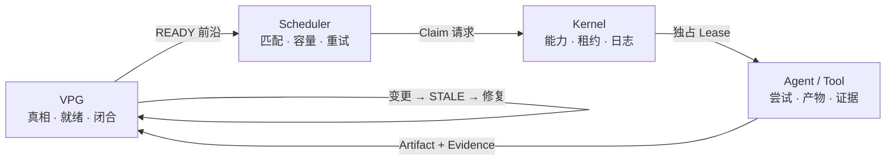

<div align="center">

# LongHorizonOS

### 面向长时程 Agent 的证据驱动运行时

**Graph 决定什么仍然为真、什么已经就绪。  
Scheduler 选择调度策略。Kernel 授予资源所有权。Agent 负责执行。**

[](https://www.python.org/)
[](LICENSE)
[](docs/releases/v0.1.0.md)
[](docs/architecture/LONGHORIZONOS-CORE-V1.md)

[English](README.md) | [简体中文](README.zh-CN.md)

</div>

---

## 为什么需要 LongHorizonOS？

大多数 Agent 框架回答“下一步运行什么”。LongHorizonOS 还回答：
**世界发生变化后，哪些进度仍然有效？**

Verified Progress Graph（VPG）不是事后生成的流程图，而是实时语义控制平面：
Evidence 负责闭合工作，Artifact 版本决定证据是否仍适用，Graph 状态直接推出
调度前沿和修复前沿。

当输入变化时，LongHorizonOS 会：

1. 重新打开受影响的 Goal；
2. 只将因果闭包标记为 `STALE`；
3. 保留无关的 `VERIFIED` 工作；
4. 执行 Graph 推导出的 Repair Frontier；
5. 只有产生新 Evidence 后才重新闭合 Goal。

## 架构



| 层 | 唯一权威 |
|---|---|
| **VPG** | 依赖、语义有效性、就绪状态和 Goal 闭合 |
| **Scheduler** | Agent 匹配、容量、重试和派发策略 |
| **Kernel Lease** | 独占执行所有权和故障恢复 |
| **Agent** | 单次执行尝试及其 Artifact/Evidence 输出 |

这不是给 Agent 套一层“操作系统”术语，而是直接采用操作系统中真正有用的
机制：显式状态、权威边界、租约、日志、版本化资源和崩溃恢复。

## 可复现实验结果

Advanced Evaluation 完全离线、确定性运行，并使用独立 oracle 或显式不变量校验。

| 实验 | LongHorizonOS | 基线 / 消融 |
|---|---:|---:|
| 组件修复重跑次数 | **16** | 全量重启 72；粗粒度 task-DAG 64 |
| 相对全量重启节省加权工作量 | **78.2609%** | 同一 workload |
| 漏失效 / 过失效 | **0 / 0** | 与 artifact oracle 精确一致 |
| 去掉 Graph/Evidence/版本后的错误闭合 | **4 / 4 个 case** | 漏掉 16 次失效 |
| 资源所有权冲突 | **0** | 无 Lease 基线 24 |
| 重复执行 | **0** | 无 Lease 基线 36 |
| 吞吐 / 平均等待 | **1.0 / 5.0 ticks** | FIFO 基线 0.5 / 11.0 |
| 投影恢复 / 过期提交拒绝 | **通过 / 通过** | 0 个投影不一致、0 个重复版本 |
| 长时程加权工作量节省 | **22.1145%** | 20 个实验格，最长 200 步 |
| Evidence/Chaos 故障 | **9 / 9 检出并可修复** | 0 个安全不变量违规 |
| 最大 Graph 规模 | **5,000 节点** | 精确失效与投影恢复 |
| 安全边界 | **5 / 5 攻击被阻断** | 5 / 5 合法操作通过 |

另一个 Artifact 选择性修复 workload 得到 **8 对 64 次重跑、节省 87.5%**，
对比的是粗粒度 task-DAG，而不是 artifact oracle。LongHorizonOS 的核心优势是：
以可解释的方式从 Graph、Evidence 和版本状态推导安全且精确的修复集合。

项目支持通过显式配置的 OpenAI-compatible 服务运行可选在线模型测评。
公开结论仍以确定性离线测评为依据；在线测评仅作为补充的系统证据，
不用于比较模型能力。另一个 controlled sweep 覆盖了 **378 个实验格**：
14 种场景、9 种运行模式、3 个 seed。

### 验证状态

- 全量测试：**2,521 passed，1 skipped**
- 静态门禁：**Ruff 和 mypy 均通过**
- 发版检查：**wheel/sdist 构建、元数据审计、`twine check`、全新环境安装和 CLI 冒烟测试均通过**
- 外部有效性：**Terminal-Bench 和 SWE-bench 尚待执行**；它们需要支持
  Docker/WSL 的运行环境，因此这里不把它们写成已完成的分数

详见 [Advanced Evaluation](docs/benchmarks/ADVANCED-EVALUATION.md) 和
[Artifact 选择性修复 Benchmark](docs/benchmarks/ARTIFACT-SELECTIVE-REPAIR.md)。

## 快速开始

```bash
python -m pip install .

# 故障 → 恢复 → 变更 → 修复 → 重新闭合
lhos demo recovery-repair

# 离线、确定性运行，不需要 API Key
lhos benchmark semantic-repair --quick
lhos benchmark advanced --json
```

```python
from lhos.sdk import Agent, AgentOS, Goal, scripted_executor

runtime = AgentOS(":memory:")
runtime.add_agent(Agent("coder", specializations=("python",)))

goal = Goal("Ship hello")
goal.task(
    "Write hello",
    agent="coder",
    verify=scripted_executor(artifact_id="hello.txt", version=1),
)

result = runtime.run(goal, max_dispatches=4)
print(result.goal_state)  # closed
```

没有适用 Evidence 的执行结果会按设计保持为未验证状态。

## 已包含能力

- Verified Progress Graph 与 Graph 驱动的多 Agent 调度
- 因果失效、最小 Repair Frontier 和 Goal 重新闭合
- Process / Action / Journal
- Capability / Lease / Signal
- 崩溃恢复与版本化 Artifact FS
- 命名空间隔离与带版本检查的提交
- Canonical URI 安全
- 只读观测 CLI、确定性 Demo 和 Benchmark

## 项目状态

**Core Architecture V1 已冻结。** Kernel、VPG、调度和局部修复已经实现；
公开 SDK 与 CLI 仍处于 release candidate 阶段。

仍在推进：生产级沙箱、分布式执行、更完整的 Context VM `AgentOS` 集成，以及
更大规模的真实 Artifact/Evidence workload。LongHorizonOS 目前不是通用自主规划器。

尚未实现：

- 分布式多 Agent 集群
- 通用信念修正
- 分布式修复集群

## 文档

- [快速开始](docs/QUICKSTART.md)
- [概念与权威模型](docs/CONCEPTS.md)
- [Core Architecture V1](docs/architecture/LONGHORIZONOS-CORE-V1.md)
- [公开 Python API](docs/sdk/PUBLIC-API.md)
- [恢复与修复 Demo](docs/demos/RECOVERY-REPAIR.md)
- [语义修复 Benchmark](docs/benchmarks/SEMANTIC-REPAIR.md)
- [Artifact 选择性修复 Benchmark](docs/benchmarks/ARTIFACT-SELECTIVE-REPAIR.md)
- [Advanced Evaluation](docs/benchmarks/ADVANCED-EVALUATION.md)

## 开发

```bash
python -m pip install -e ".[dev]"
python -m pytest -q -m "not slow"
python -m ruff check .
python -m mypy src/lhos
```

任何将语义权威移出 VPG，或将执行所有权移出 Kernel Lease 的改动，都需要先提交架构提案。

---

<div align="center">

**让 Agent 能解释：世界变化之后，究竟还有什么是真的。**

</div>
