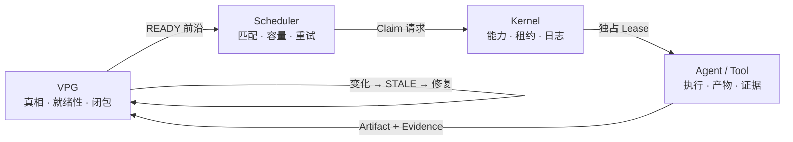

<div align="center">

# LongHorizonOS

### 面向长时程 Agent 的证据驱动操作运行时

**Graph 决定什么仍然为真、什么可以执行。  
Scheduler 选择策略，Kernel 授予所有权，Agent 负责执行。**

[](https://www.python.org/)
[](LICENSE)
[](docs/releases/v0.1.0.md)
[](docs/architecture/LONGHORIZONOS-CORE-V1.md)

[English](README.md) | 简体中文

[为什么](#为什么需要-longhorizonos) · [架构](#架构) ·
[实测结果](#实测结果) · [快速开始](#快速开始) · [文档](#文档)

</div>

---

## 为什么需要 LongHorizonOS？

多数 Agent 框架回答的是：**下一步运行什么**。LongHorizonOS 还要回答：
**世界变化之后，哪些进度仍然有效**。

Verified Progress Graph（VPG）不是任务结束后生成的流程图，而是实时语义
控制平面：Evidence 负责闭合工作，Artifact 版本决定证据是否仍然适用，
Graph 状态直接推导调度前沿和修复前沿。

当输入发生变化时，LongHorizonOS 会：

1. 重新打开受影响的 Goal；
2. 只将因果锥标记为 `STALE`；
3. 保留不受影响的 `VERIFIED` 工作；
4. 重新执行 Graph 推导出的 Repair Frontier；
5. 仅在产生新 Evidence 后再次关闭 Goal。

## 架构



| 层级 | 唯一权威 |
|---|---|
| **VPG** | 依赖、语义有效性、就绪性与 Goal 闭包 |
| **Scheduler** | 匹配、容量、重试和派发策略 |
| **Kernel Lease** | 独占执行所有权与故障恢复 |
| **Agent** | 一次执行尝试及其 Artifact/Evidence 输出 |

这不是给 Agent 套一层“操作系统”术语，而是直接采用能建立严格不变量的
机制：显式状态、权威边界、Lease、Journal、版本化资源和崩溃恢复。

## 实测结果

可复现的 quick benchmark 包含 24 个确定性“变更—失效—修复”试验，
并额外运行一个真实工作区场景。

| 指标 | LongHorizonOS |
|---|---:|
| 有效确定性试验 | **24 / 24** |
| 相比全量重跑节省的加权工作量 | **48.64%** |
| 漏失效 / 过度失效 | **0 / 0** |
| 失效后错误保留 `VERIFIED` | **0** |
| 重叠所有权冲突 | **0** |
| 仅恢复状态导致的错误闭包 | **24 / 24** |
| 真实工作区修复 | **影响 3 个、保留 1 个、Goal 重新闭合** |

可选的 StepCode 在线测评使用 `gpt-5.6-sol`：LongHorizonOS 实际调用
**3 次模型**，全量重跑调用 **4 次**，节省 **25%**；最终 Goal 重新闭合，
且没有错误的 `VERIFIED` 状态。

> [!NOTE]
> 在当前任务级依赖 workload 上，LongHorizonOS 与“知道正确答案”的
> task-DAG checkpoint 持平：在线 3 次对 3 次，离线额外节省为 0%。
> 当前已经证明的优势是语义安全、可解释性和自动推导修复，而不是虚构一个
> 对 oracle 的性能胜利。下一步需要 Artifact/Evidence 级 workload。

完整口径见[测评协议与局限](docs/benchmarks/SEMANTIC-REPAIR.md)。

## 快速开始

```bash
python -m pip install .

# 完整闭环：故障 → 恢复 → 变更 → 修复 → 重新闭合
lhos demo recovery-repair

# 离线、确定性、不需要 API Key
lhos benchmark semantic-repair --quick
```

```python
from lhos.sdk import Agent, AgentOS, Goal, scripted_executor

runtime = AgentOS(":memory:")
runtime.add_agent(Agent("coder", specializations=("python",)))

goal = Goal("Ship hello")
goal.task(
    "Write hello",
    agent="coder",
    verify=scripted_executor(artifact_id="hello.txt", version=1),
)

result = runtime.run(goal, max_dispatches=4)
print(result.goal_state)  # closed
```

执行成功但没有适用 Evidence 的任务，仍然保持未验证状态。

## 已实现能力

- Verified Progress Graph 与 Graph 派生的多 Agent 调度
- 因果失效、最小 Repair Frontier 与 Goal 重新闭合
- Process / Action / Journal
- Capability / Lease / Signal
- 崩溃恢复与版本化 Artifact FS
- 命名空间隔离与带版本检查的提交
- Canonical URI 安全
- 只读可观测 CLI、确定性 Demo 与 Benchmark

## 项目状态

**Core Architecture V1 已冻结。** Kernel、VPG、调度和局部修复已经实现；
公开 SDK 与 CLI 仍处于 Release Candidate 阶段。

仍在推进：生产级沙箱、分布式执行、Context VM 接入主 `AgentOS`，以及
Artifact/Evidence 级对比 workload。LongHorizonOS 目前不是通用自主规划器。

尚未实现：

- 分布式多 Agent 集群
- 通用信念修正
- 分布式修复集群

## 文档

- [快速开始](docs/QUICKSTART.md)
- [概念与权威模型](docs/CONCEPTS.md)
- [Core Architecture V1](docs/architecture/LONGHORIZONOS-CORE-V1.md)
- [公开 Python API](docs/sdk/PUBLIC-API.md)
- [恢复与修复 Demo](docs/demos/RECOVERY-REPAIR.md)
- [语义修复 Benchmark](docs/benchmarks/SEMANTIC-REPAIR.md)

## 开发

```bash
python -m pip install -e ".[dev]"
python -m pytest -q -m "not slow"
python -m ruff check .
python -m mypy src/lhos
```

欢迎贡献。任何将语义权威移出 VPG，或将执行所有权移出 Kernel Lease 的
改动，都需要架构提案。

---

<div align="center">

**让 Agent 能够解释：世界变化之后，究竟还有什么是真的。**

</div>
