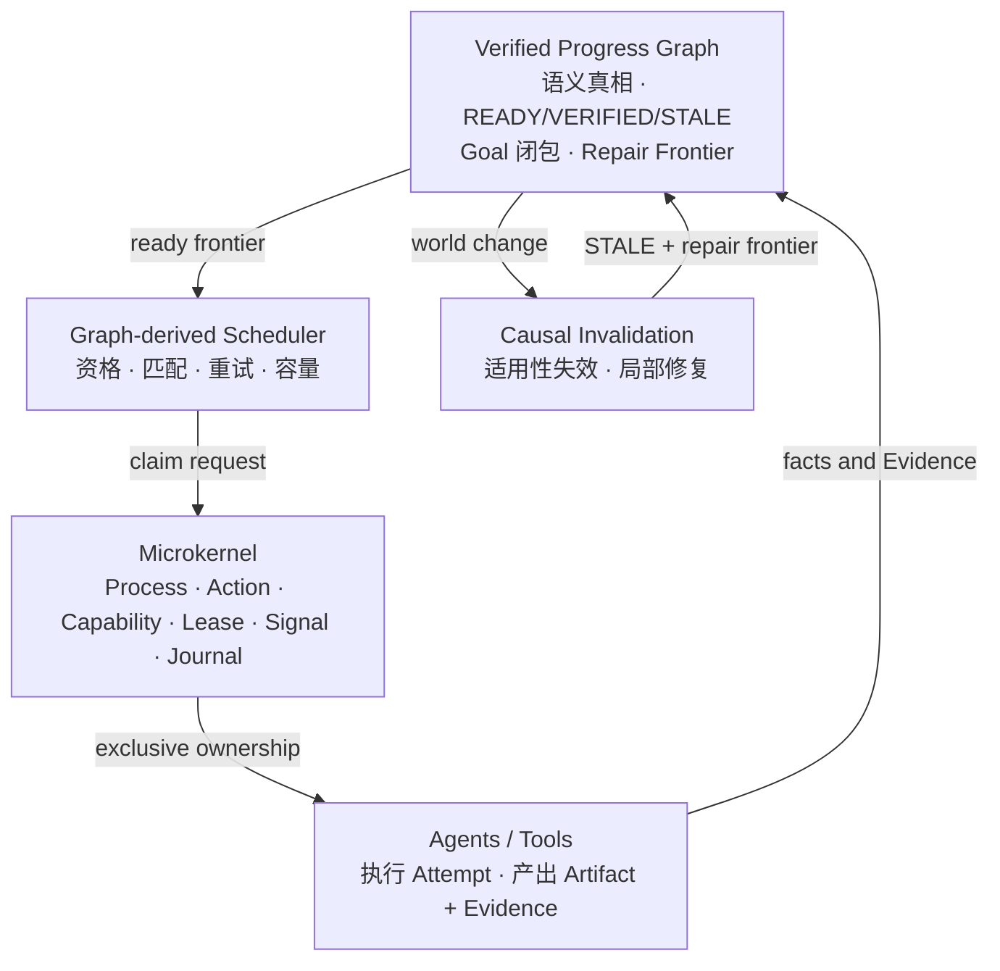

<div align="center">

# LongHorizonOS

### 面向长时程 Agent 的状态中心操作运行时

**Graph 决定什么是真的、什么可以被调度。  
Kernel 决定谁拥有执行权。Agent 负责执行，并提交 Evidence。**

[](https://www.python.org/)
[](LICENSE)
[](docs/releases/v0.1.0.md)
[](docs/architecture/LONGHORIZONOS-CORE-V1.md)

[English](README.md) | 简体中文

[快速开始](#快速开始) · [架构](#架构) ·
[闭环演示](#运行闭环演示) · [文档](#文档)

</div>

---

## LongHorizonOS 是什么？

多数 Agent 框架组织的是调用、消息或工作流。LongHorizonOS 组织的是
**可持久化、可验证、可修复的语义进度**。

它将微内核式执行平面与基于证据的 **Verified Progress Graph（VPG）**
结合起来。VPG 不是运行结束后生成的流程图，而是实时语义控制平面，也是
宏观调度前沿的唯一来源。

当 Artifact 或外部事实发生变化时，LongHorizonOS 会保留仍然有效的已验证
工作，只失效受影响的因果锥，重新打开 Goal，并推导恢复语义闭包所需的最小
Repair Frontier。

> [!IMPORTANT]
> Scheduler 只负责策略选择，不创造语义真相。只有 Kernel 成功授予独占
> Lease，任务所有权才成立。Agent 不能直接把 Task 标记为 `VERIFIED`，
> 也不能直接关闭 Goal。

## 为什么需要新的 Agent 运行时？

长时程 Agent 需要回答队列本身无法回答的问题：

- 世界变化后，哪些结果仍然有效？
- 任务为什么算完成，依赖哪些精确版本的证据？
- Worker 崩溃后，任务所有权如何恢复？
- 哪些工作必须重做，哪些工作必须保留？
- 能否从持久化状态恢复，而不是重跑整个计划？

LongHorizonOS 将这些问题建模为明确的系统不变量。

## 架构



| 层 | 权威边界 |
|---|---|
| **Graph / VPG** | 依赖、语义状态、就绪性、Goal 生命周期 |
| **Scheduler** | Agent 匹配、容量、重试与派发策略 |
| **Kernel** | Process、Capability、独占所有权与恢复 |
| **Agent** | 一次执行尝试及其产出的事实 |

项目不会把所有 OS 类比生硬照搬，而是直接采用能提供严谨不变量的机制：
显式状态、权威边界、持久化 Journal、资源所有权和崩溃恢复。

## 核心能力

- **可验证进度**：Evidence 不可变，并绑定精确 ArtifactVersion。
- **因果修复**：确定性失效传播，同时保留不受影响的已验证工作。
- **资源安全执行**：Kernel Lease 是任务所有权的线性化点。
- **崩溃一致状态**：Claim、Attempt、Journal 和 Projection 均可持久化。
- **只读可观测性**：查看已保存运行时不会重新编译或修改 Graph。
- **离线证明路径**：旗舰 Demo 不需要模型密钥或网络。

已实现子系统：

- Process / Action / Journal
- Capability / Lease / Signal
- Crash recovery
- Versioned Artifact FS
- Namespace isolation
- Optimistic concurrency
- Canonical URI security
- Context VM、Verified Progress Graph、Graph-derived Scheduler

## 运行闭环演示

```bash
python -m pip install .
lhos demo recovery-repair
```

该 Demo 使用真实的 Kernel、VPG、Scheduler、Artifact bridge 和
invalidation runtime：

```text
Goal 已验证
  -> Worker 故障与 Lease 恢复
  -> ArtifactVersion 变化
  -> 因果 STALE 传播
  -> 推导最小 Repair Frontier
  -> 生成新 Evidence
  -> Goal 再次闭合
```

机器可读输出：`lhos demo recovery-repair --json`。

## 快速开始

```python
from lhos.sdk import Agent, AgentOS, Goal, scripted_executor

runtime = AgentOS(":memory:")
runtime.add_agent(Agent("coder", specializations=("python",)))

goal = Goal("Ship hello")
goal.task(
    "Write hello",
    agent="coder",
    verify=scripted_executor(artifact_id="hello.txt", version=1),
)

result = runtime.run(goal, max_dispatches=4)
print(result.goal_state)  # closed
```

执行成功但没有有效 Evidence 的任务仍然保持未验证，这是有意的 fail-closed
设计。多 Agent 和局部修复示例见[快速开始文档](docs/QUICKSTART.md)。

## 项目状态

**Core Architecture V1 已冻结。** 语义权威和资源权威边界已经稳定；公开
SDK、CLI 与集成仍处于 Release Candidate 阶段。

| 模块 | 状态 |
|---|---|
| Kernel、Artifact FS、Context VM | 已实现 |
| VPG、调度、失效传播、局部修复 | 已实现 |
| Python SDK 与只读 CLI | 实验性 |
| 确定性 Adapter 与 Demo | 可用 |
| 生产级沙箱和安全加固 | 进行中 |

尚未实现：

- 分布式多 Agent 集群
- 通用信念修正
- 分布式修复集群
- 通用 LLM Planner 与自主自愈

## 文档

- [Core Architecture V1](docs/architecture/LONGHORIZONOS-CORE-V1.md)
- [概念与权威模型](docs/CONCEPTS.md)
- [快速开始](docs/QUICKSTART.md)
- [公开 Python API](docs/sdk/PUBLIC-API.md)
- [恢复与修复 Demo](docs/demos/RECOVERY-REPAIR.md)
- [语义修复 Benchmark](docs/benchmarks/SEMANTIC-REPAIR.md)
- [安全策略](SECURITY.md)

## 开发

```bash
python -m pip install -e ".[dev]"
python -m pytest -q
```

欢迎贡献，请先阅读 [CONTRIBUTING.md](CONTRIBUTING.md)。任何将语义权威移出
Graph，或将任务所有权移出 Kernel Lease 的改动，都需要架构提案，而不是
普通补丁。

---

<div align="center">

**让 Agent 能够解释：世界变化之后，究竟还有什么是真的。**

</div>
