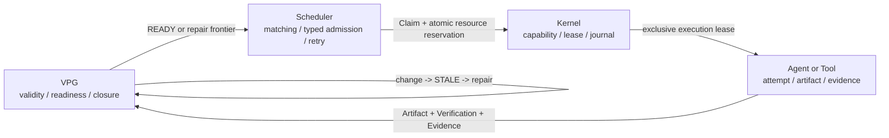

# LongHorizonOS User and Operator Manual

> This document contains the complete installation, SDK, Harness, Context,
> resource, recovery, operator, benchmark, and implementation-boundary material.  
> See [`README.md`](../README.md) for the project overview and shortest installation path.  
> 中文说明书：[`USER-OPERATOR-MANUAL.zh-CN.md`](USER-OPERATOR-MANUAL.zh-CN.md).

---

<div align="center">


### Stateful online compute for long-horizon Agents

**LongHorizonOS treats long-running Agent execution as a stateful online
computation problem. It continuously observes semantic progress, cognition,
context, and resources, and dynamically schedules, reuses, interrupts,
parallelizes, and repairs computation to minimize the cost of verified goal
completion.**

`Schedule · Reuse · Interrupt · Parallelize · Repair`

**Harnesses enable long-running Agents; LongHorizonOS makes
long-running Agent computation efficient.**

**Graph represents the evolving computation; the OS continuously schedules
from the Graph.**

Today’s `v0.1.x` alpha implements the bounded single-host core of that idea:
graph-relative invalidation and selective repair, Kernel-fenced ownership,
bounded `adaptive=True` scheduling, and explicit logical resource-aware
admission. Always-on autonomous policy control, physical resource management,
and distributed-runtime claims remain target design, not current guarantees.

[](https://www.python.org/)
[](../LICENSE)
[](releases/v0.1.0.md)
[](architecture/LONGHORIZONOS-CORE-V1.md)

English | [中文说明书](USER-OPERATOR-MANUAL.zh-CN.md)

[The one-minute version](#the-one-minute-version) |
[Run the closed loop](#run-the-closed-loop) |
[Why it exists](#why-it-exists) |
[Measured results](#measured-results) |
[Use the SDK](#use-the-sdk) |
[Current status](#current-status) |
[Compute-management design](LONG-HORIZON-COMPUTE-MANAGEMENT.md)

</div>

---

## The one-minute version

A Harness keeps one Agent working. LongHorizonOS decides **whether that work is
still worth doing** — and stops it mid-flight when it is not.

Two measurements say what that is worth. Both run real child processes and
measure real wall-clock. Neither calls a model, so neither claims a token or
monetary saving.

### 1. Stopping work that is already doomed

A sibling task commits a new version of an artifact while two peers are still
reading the old version. The metric is child process time spent on work whose
input was already superseded — read from the child's own usage report, so a kill
is observed rather than inferred from a shorter runtime.

| Input declaration | Doomed child time (median, n=7) | Kills | Bystander harmed |
|---|---:|---:|---:|
| Complete — conflict graph refuses to co-schedule | **0 ms** | 0 | never |
| Incomplete, preemption off | **4126 ms** | 0 | never |
| Incomplete, preemption on | **265 ms** | 7/7 | **never** |

Read the rows in order, because the middle one is the only one that is a
problem:

1. With a **correct** declaration the race cannot happen at all — the derived
   conflict graph separates the writer from its readers. Preemption is the
   second line of defence, not the first.
2. A declaration that is **non-empty but wrong** is the dangerous case: the
   graph trusts it, finds no overlap, co-schedules anyway, and 4.1 s of child
   compute runs on inputs that no longer exist. Agents under-declare their reads
   in practice, so this is the realistic case, not a contrived one.
3. Preemption removes **~94%** of that doomed compute.

The last column is the one that would have sunk the feature. A preemption that
fired too broadly would destroy *valid* computation, which is worse than never
firing at all. The bystander — whose declared input never changed — was never
touched in any run of any arm.

Two honest caveats about that table. The control row reads 0 ms because the
conflict graph defers the readers to a later batch, so within the measured
single-batch window they never ran — the writer then waits out its 30 s
coordination timeout and the row's `wall_clock` field is that timeout, not work.
It is evidence that the race cannot occur, not evidence that a correct
declaration is free. And the preemption row leaves the Goal `open`, because the
killed work is not re-dispatched inside the measured window — the benchmark
measures *doomed compute avoided*, not end-to-end time-to-verified.

Raw result: [`artifacts/incomplete-declaration-20260818.json`](../artifacts/incomplete-declaration-20260818.json).

### 2. Scheduling the critical path first

42 tasks: one heavy 10-deep serial chain plus 30 cheap wide tasks — a graph
shape where *when* you start the chain decides when the Goal closes.

| | serial | static parallel | LongHorizonOS |
|---|---:|---:|---:|
| Wall-clock (median, n=3) | 9.31 s | 7.07 s | **6.33 s** |
| `chain_priority` | 0.743 | 0.743 | **0.344** |

`chain_priority` is the mean normalised start position of the chain's tasks:
`0.743` means the chain was deferred toward the end of the dispatch order,
`0.344` means it went early. It is deterministic, so unlike wall-clock it
*explains* the timing difference instead of restating it.

Raw result: [`artifacts/critical-path-heavy.json`](../artifacts/critical-path-heavy.json).

### 3. The known ceiling: dispatch is a batch barrier

The number above is a floor, and the reason is a mechanism, not tuning.
`run_async` plans a batch and then awaits **all** of it before replanning, so a
slot freed by a short task cannot be refilled until the batch's slowest task
finishes. Measuring capacity that was free while runnable work was already
waiting for it (n=3, the same 42-task workload):

| | serial | static parallel | LongHorizonOS |
|---|---:|---:|---:|
| Wall-clock (median) | 7.63 s | 6.09 s | **5.12 s** |
| Concurrency left unusable | — (one slot) | 26.5% | **39.3%** |

So the 1.19x here is achieved while roughly two fifths of the available
concurrency goes unused. Work-conserving continuous dispatch is the largest
known unclaimed win in this repository, and it is not implemented.

The uncomfortable part is worth stating directly: **the barrier penalizes the
better scheduler more.** Prioritizing the critical path is the right call, and it
works — but it leaves a queue of runnable, deliberately deprioritized cheap work
that a barrier then cannot spend freed slots on. The static arm looks tidier on
this metric precisely because it made a worse ordering decision.

The metric integrates `min(free slots, runnable-but-not-started)` over time.
Both clamps are load-bearing: without the free-slot term a deprioritized task
counts as waste, and without the runnable term a serial chain's genuine
dependency stall does. Taking the minimum rather than summing per task is what
keeps it comparable to wall-clock — thirty tasks waiting on one two-second
barrier is two slot-seconds lost, not sixty.

Raw result: [`artifacts/barrier-cost-20260819.json`](../artifacts/barrier-cost-20260819.json).

### Where this does nothing
On a symmetric workload with no decision to make — 8 equal-cost tasks, two
independent subtrees, graph never changes — `static ÷ adaptive` measures
**0.93x (n=5)** to **~1.00x (n=7)**. LongHorizonOS is level with, or slightly
behind, a good static plan.

That is the **correct** result, not a disappointing one. A static plan is
already optimal on that workload, so an online scheduler can only match it while
paying for the machinery. A *win* there would mean the measurement was broken.

Online scheduling pays for itself when the graph **changes** (something is
superseded, invalidated, or wrong) or when the graph has **shape** (a critical
path, an unequal cost distribution). It is not a general speedup and this
repository does not report it as one.

---

## Run the closed loop

LongHorizonOS requires Python 3.11 or newer. Its flagship demo is deterministic,
offline, and requires no API key:

```bash
git clone https://github.com/Yang-Jiashu/LongHorizonOS.git
cd LongHorizonOS
python -m pip install .
lhos demo recovery-repair --json
```

This is not a prerecorded output. The command runs the SDK, Scheduler, Kernel
Leases, VPG, invalidation, and repair path:

```text
worker failure
  -> recover execution ownership
source.py@v1 -> source.py@v2
  -> 3 causally affected Tasks become STALE
  -> 1 unrelated VERIFIED Task stays valid
  -> derive the minimum Repair Frontier
  -> require fresh exact-version Evidence
  -> close the Goal again
```

The JSON result includes machine-checkable fields such as
`crash_recovered`, `affected_tasks`, `preserved_tasks`, `repair_frontier`,
`repair_attempts`, and `final_closed`.

The bounded online-supervisor demo exercises the caller-owned online execution
loop over the real SDK authority path:

```bash
lhos demo online-supervisor --json
```

It runs `start -> observe -> execute bounded epoch -> re-observe` until three
dependent tasks close the Goal. The JSON explicitly reports
`bounded = true`, `daemon_started = false`, `uses_llm = false`, dispatched and
verified task IDs, graph versions, and the terminal stop reason. The executor
and verifiers are deterministic local controls; this is not an always-on
service, a real-model benchmark, or a telemetry-driven physical-resource
placement claim. The collector itself is observation-only; a caller may
explicitly map a trusted sample through `derive_host_capacity(...)` and apply
it to one named logical Scheduler pool with `AgentOS.apply_host_capacity(...)`.
That bridge is fail-closed logical admission only, not physical placement,
isolation, or quotas. See
[Bounded Event-Driven Supervisor](EVENT-DRIVEN-SUPERVISOR.md).

The provenance boundary demo is a separate, deterministic v0.2 experiment:

```bash
lhos demo provenance-repair --json
```

It exercises the standalone `lhos.provenance` observation primitive:

```text
explicit versioned reads
  -> declared-vs-observed coverage
  -> STRICT denies an unknown input (fail closed)
  -> filing.csv@v1 -> filing.csv@v2
  -> graph-relative affected cone + repair frontier
  -> durable JSONL hash-chain replay
```

The JSON result is deliberately explicit about its scope:
`hidden_probe_coverage = "UNKNOWN"`, `strict_fail_closed = true`,
`automatic_dependency_discovery = false`, and `graph_relative = true`.
The SDK now has an explicit `context_v1` adapter: when a task opts into it,
the `ExecutionContext` and coverage report are carried into the normal
Evidence/VPG commit path. Legacy `task_id` callbacks remain an explicit
compatibility mode and are represented as `UNKNOWN` for strict coverage.
This is **not** automatic dependency discovery: the recorder only captures
reads at explicit executor/tool boundaries and cannot discover arbitrary
Python, browser, operating-system, or implicit semantic dependencies. A
`COMPLETE` provenance report is coverage evidence, not by itself a VPG
`VERIFIED` result. See
[the provenance demo contract](demos/PROVENANCE-REPAIR.md) and
[the provenance API contract](PROVENANCE-CONTRACT.md).

When a `context_v1` Attempt receives a Context VM snapshot, valid
`page_bindings` are automatically recorded as exact `READ` provenance events
(`source="context_vm"`); malformed bindings are recorded as unknown rather
than guessed. This closes the common case where an Agent was handed a page but
did not repeat `ctx.read()`. It still covers only materialized Context pages,
not hidden Python, browser, network, or tool reads.

`ActionGateway` is an **opt-in, injected primitive** for effects that an
executor explicitly routes through `ExecutionContext`. With
`secure_mode=True`, the SDK rejects `legacy_task_id` callbacks before user
code runs and requires `context_v1`. This boundary only covers calls such as
`ctx.submit_effect(...)` and `ctx.submit_tool(...)`; it cannot intercept
arbitrary direct Python file, network, browser, subprocess, or SDK I/O. A
gateway receipt is not an exactly-once guarantee: secure mode requires an
idempotency key for non-pure effects, and malformed, mismatched, or uncertain
receipts are recorded as an unknown/uncertain write before semantic progress
is rejected. This is an explicit instrumented boundary, not a universal
transaction coordinator.

For workspace-backed files, the opt-in `WorkspaceProvenanceGateway` adds a
root-confined, capability-scoped read/write boundary with exact-byte SHA-256
recording, atomic writes, and compare-before-write checks. In strict mode, a
caller-supplied positive `version` must be validated by either
`version_validator(snapshot) -> bool` or a Facts-like
`version_authority.read_hash(pid, uri, version)`; the integer alone is not
semantic authority. Audit/compatibility mode may retain an unverified caller
version and records `version_source="caller"`. This gateway remains a bounded
mediated primitive: it cannot intercept direct filesystem/API I/O or combine
workspace, Facts, Action, and VPG updates in one transaction.
Before semantic Evidence commit, the built-in SDK also performs a bounded
point-in-time `validate_read_set_current()` /
`require_read_set_current()` check for reads made through this gateway.
Changed, deleted, unavailable, or truncated checks fail closed as
`STALE_COGNITION` / `READ_SET_UNAVAILABLE`. This is a mediated single-host
freshness fence, not a filesystem lock or a cross-plane atomic transaction.
The focused commit-validation slice has **47 tests** (the broader mediated
workspace/provenance gate has **53** overlapping tests).

Kernel Actions also persist a side-effect class, recovery policy, and retry
budget. A first driver dispatch exception may trigger **at most one** fenced
retry for `PURE + RETRY`; retry admission is durably reserved before
redispatch (`retry_count` plus an `ACTION_RETRY_RESERVED` journal event), and
the retry must pass the current lease/fencing check and `commit_if_fenced()`.
Retry exceptions or `UNKNOWN` outcomes become `UNCERTAIN`. `IDEMPOTENT`
actions inspect rather than blindly redispatch, while irreversible or unknown
effects fail closed unless inspection is explicitly requested. Direct Kernel
`SubmitAction` remains a compatibility surface whose default is `PURE + RETRY`;
`secure_mode` requires explicit effect-contract fields at the process-originated
syscall boundary, but strict admission for every custom driver and raw callback
is not yet implemented. Legacy action rows/events without retry-budget state
are treated conservatively as having no retry budget.
For the Transactional Outbox, a zero-delay retry remains immediately eligible
at the caller's explicit logical timestamp after an async publisher failure;
positive retry delays remain anchored to completion time.

Run the fast, offline benchmark gates:

```bash
lhos benchmark semantic-repair --quick
lhos benchmark async-agentos
lhos benchmark hidden-provenance
lhos benchmark online-compute --json
lhos benchmark compute-budget --json
lhos benchmark resource-aware-runtime --json
lhos benchmark wallclock-adaptive-runtime --json
lhos benchmark harness-adaptive --json
```

The hidden-provenance gate is a safety check, not a performance claim: it
verifies that missing or explicitly unknown input provenance is denied by
strict admission, while `audit` remains available during migration. See
[the benchmark contract](benchmarks/HIDDEN-PROVENANCE.md).

`harness-adaptive` exercises the real `AgentOS.run_async` authority path with
an exact-identity Harness adapter. It compares fixed concurrency with an
explicit `ConflictGraph` on the same four-task workload and reports semantic
closure plus ownership evidence. The built-in provider is deterministic and
synthetic; this is not a real-model or GPU benchmark. See
[the Harness benchmark contract](benchmarks/HARNESS-ADAPTIVE.md).

The compute-budget path is explicit opt-in. Pass `budget_aware=True`,
`adaptive=True`, caller-declared `budget_estimates`, and `budget_limits` to
`AgentOS.run()` or `run_async()` to let the verified-progress policy filter
each bounded epoch. The Scheduler still decides authoritative readiness,
Claims, Leases, and dispatch. A declared estimate is charged only after that
task is actually dispatched; a failed or stale dispatched attempt still
consumes its declaration, while a Scheduler rejection consumes nothing.
These declared values are not provider-measured billing, invoices, quota
enforcement, or physical CPU/GPU reservations. The sync execution path does now
measure real wall-clock and records it (with any executor-supplied token/cost
counters) through `UsageLedger.record_measured`, and a bounded per-task integer
EWMA (0.25x–4x) calibrates the token/time/cost dimensions of later runs toward
that measured history. The async execution path now also measures real executor
wall-clock (a monotonic span per dispatch, surfaced as `executor_elapsed_ms`) and
feeds it into the same calibration, and per-task success/failure/input-churn
counts are now observed from Attempt terminal states
(`observe_task_outcomes`) rather than declared. Task *value* and
verification-token estimates stay declared, and the `UsageLedger` is still an
immutable **in-memory, non-durable** object with no cross-run persistence. See
[Explicit compute budgets](COMPUTE-BUDGET.md).

Budget plans expose `ComputeBudgetRemaining`: `None` means that dimension is
unbounded, while `0` means a bounded ceiling is exhausted. Admission may be
partial; deferred READY tasks retain explicit budget-blocker reasons. Only
task IDs actually dispatched by the authoritative Scheduler are charged, so a
partial admission or a graph race with no dispatch does not consume budget.

## Why it exists

A checkpoint can tell an Agent where execution stopped. It cannot, by itself,
answer whether completed work is still justified after a requirement, file,
tool, model, API, or external fact changes.

LongHorizonOS treats that as a runtime problem:

| Runtime question | Authority in LongHorizonOS |
|---|---|
| What is still true? | Exact-version Evidence in the Verified Progress Graph |
| What became stale? | Version-aware causal invalidation |
| What can run now? | Graph-derived `READY` and Repair Frontiers |
| Is the Goal complete? | VPG closure rules, not an Agent self-report |
| Who may execute or commit? | Scheduler Claim plus Kernel Lease fencing |
| Does the machine have logical capacity? | Atomic typed resource admission |
| What survives a process restart? | Durable VPG and optional Scheduler projections |

### Harness boundary

LongHorizonOS does not replace an Agent Harness. A Harness owns the reliable
execution loop for one Agent session: model calls, tools, session state,
checkpoint/resume, retry, and local verification. LongHorizonOS is the global
control plane over one or more such executions.

```text
Model
  -> Harness session: how one Agent keeps doing the work
  -> LongHorizonOS control plane: proposes whether that computation should
     START, CONTINUE, DEFER, PREEMPT, or REBASE as global state changes; it can
     request only supported transitions through an explicitly registered,
     identity-fenced adapter
```

The VPG is therefore not just a task log. It is the versioned control state for
the evolving computation: validity, dependencies, versions, READY and repair
frontiers, and the declared structure from which scheduling signals are
derived. The Harness decides how an Agent performs an admitted unit of work;
LongHorizonOS proposes whether that Harness execution is still the best place
to spend the next unit of compute (and can request only supported transitions
through an explicitly registered, identity-fenced adapter). The current
`AgentOS` bridge can deliver exact-identity cooperative `PREEMPT`/`REBASE`
interrupts. For explicitly registered live sessions, changed-read
`REBASE`/`FULL_RELOAD` can also use a bounded durable fresh-Attempt handoff.
That handoff remains release-then-acquire rather than cross-plane atomic, and
the caller must register or recover the replacement Harness.

The public Harness session protocol and its current bounded guarantees are
documented in [Harness Session Protocol](HARNESS-SESSION-PROTOCOL.md).
The note-to-code delivery status is tracked in
[Mind-VLA Implementation Matrix](MIND-VLA-IMPLEMENTATION-MATRIX.md).

For a file-backed `AgentOS`, accepted Harness control transitions are also
replayable as **bounded logical metadata**: the hash-verified Scheduler journal
can restore session revision/state/checkpoint/progress and the request
idempotency index when a replacement adapter presents the same complete
session identity. This does not restore callback or model memory, prompts,
outputs/details, Python stacks, executable checkpoints, or in-flight code, and
it does not transfer Claims or Kernel Leases. `REBASE`/`PREEMPT` therefore
remain explicit ownership/interrupt operations rather than transparent
cross-restart process migration.

The authority boundaries are deliberate:

> **The graph owns semantic truth and readiness. The Scheduler owns policy and
> logical admission. The Kernel owns execution authority. Agents and tools
> perform attempts and produce evidence.**

That creates two closed loops:

```text
VPG READY frontier
  -> Scheduler Claim + resource reservation
  -> Kernel Lease
  -> Agent/tool execution
  -> independent verification
  -> exact-version Evidence
  -> VPG Goal closure

Artifact/world change
  -> Evidence no longer applicable
  -> causal STALE cone
  -> Goal reopens
  -> minimum Repair Frontier
  -> fresh Evidence
  -> verified reclosure
```

LongHorizonOS complements workflow engines and cluster schedulers rather than
claiming that those systems have no state, graphs, recovery, or resource
management. Their primary mechanisms already exist separately. The project's
specific bet is that **semantic validity, selective repair, execution
ownership, and resource admission need one consistency model for stateful
Agents**.

The longer-term control model is documented in
[Long-Horizon Compute Management](LONG-HORIZON-COMPUTE-MANAGEMENT.md).
It is a design proposal, not a claim that the current alpha already provides
telemetry-driven physical GPU scheduling/placement, automatic provenance
discovery, sandbox isolation, or distributed coordination. The alpha exposes an
observation-only host telemetry collector plus an explicit reserve-based bridge
to one logical Scheduler pool; neither provides physical admission, placement,
isolation, or quotas.

## Architecture



| Layer | Owns | Must not decide |
|---|---|---|
| **VPG** | Dependencies, Evidence applicability, Task validity, readiness, Goal closure | Agent placement or physical execution |
| **Scheduler** | Eligibility, deterministic matching, Claims, retries, logical resource capacity | Semantic truth |
| **Kernel** | Process/Action state, capabilities, Leases, fencing, journal | Whether Evidence proves a Goal |
| **Agent / Tool** | One operational attempt and its outputs | Its own final semantic validity |

## Measured results

These are checked-in reference measurements for controlled workloads. They are
reproducible regression evidence, not universal performance claims.

### 1. Selective semantic repair

```bash
lhos benchmark semantic-repair --quick
```

The quick suite runs 24 deterministic mutation-and-repair trials plus one
temporary real-workspace scenario through the public SDK, Scheduler, Kernel
Lease, Evidence, invalidation, and Goal-closure paths.

| Reference metric | Result |
|---|---:|
| Correct deterministic trials | **24 / 24** |
| Mean weighted work saved vs full restart | **48.64%** |
| Mean weighted work saved vs oracle task-DAG checkpoint | **0%** |
| Under-invalidation / over-invalidation | **0 / 0** |
| False `VERIFIED` after invalidation | **0** |
| Overlapping ownership conflicts | **0** |
| Unsafe state-only baseline false closures | **24 / 24** |
| Workspace scenario | **3 affected, 1 preserved, Goal reclosed** |

This demonstrates correct selective repair and savings over full restart on
the included workloads. It does **not** show an advantage over an
oracle-informed task-DAG checkpoint; LongHorizonOS matches that baseline on
these task-level graphs.

See the checked-in
[aggregate result](../artifacts/oss_productization_e5/summaries/summary.json) and
[measurement contract](benchmarks/SEMANTIC-REPAIR.md).

### 2. Public `AgentOS.run_async` path

```bash
lhos benchmark async-agentos
# or the stricter source-checkout gate:
python scripts/benchmark_multi_agent_runtime.py --check
```

The checked-in workload uses 24 independent I/O-shaped Tasks with a 50 ms
executor delay, two Agents, a global concurrency limit of four, per-Agent
limits of two, an independent verifier, and a full logical resource vector per
Task. It runs three paired serial/concurrent samples and reports their median
speedup instead of letting one timing sample decide the gate.

| Reference metric | Serial | Concurrent |
|---|---:|---:|
| Median end-to-end time | **2.067 s** | **0.954 s** |
| Peak executor concurrency | **1** | **4** |
| Verified Tasks | **24 / 24** | **24 / 24** |
| Completed Claims | **24 / 24** | **24 / 24** |
| Semantically verified Attempts | **24 / 24** | **24 / 24** |
| Ownership/resource/capacity violations | **0** | **0** |
| Active reservations after completion | **0** | **0** |

Measured median paired speedup: **2.124x**. This proves bounded overlap through public-SDK
semantic closure for this controlled I/O workload. It does not measure model
throughput, CUDA work, physical CPU/GPU isolation, distributed scheduling, or
arbitrary Agent workloads.

See the [raw result](../artifacts/benchmark_results/multi-agent-runtime.json) and
[benchmark contract](benchmarks/ASYNC-AGENTOS.md).

### 3. Durable VPG history

```bash
python scripts/benchmark_vpg_incremental_history.py --check
```

For a workload that adds one Task per committed patch:

| Committed patches | History rows | History payload | READY frontier event payload | Total DB | Total commit time |
|---:|---:|---:|---:|---:|---:|
| 100 | 100 | 35,274 B | 11,892 B | 483,328 B | 0.895 s |
| 200 | 200 | 70,874 B | 23,892 B | 888,832 B | 4.032 s |
| 400 | 400 | 142,074 B | 47,892 B | 1,638,400 B | 17.202 s |

At N=400, the former full-copy layout required **80,200 history rows** and was
previously measured at about **37.9 MB**. Entity-revision history now stores
**400 rows**; the latest run produced a **1.64 MB** database, a **99.50%
history-row reduction**. The READY-frontier event payload is now persisted as
a count plus SHA-256 summary, so it grows linearly (**47,892 B at N=400**)
instead of repeating the full frontier in every version.

This fixes the sequential-small-patch `O(V^2)` durable-history and
READY-frontier event-payload write amplification. End-to-end commit time is
still superlinear because the current runtime constructs, derives, validates,
decodes, and hashes a full candidate projection for every commit. The elapsed
times above are one local reference run, not a latency guarantee.

See the
[raw result](../artifacts/benchmark_results/vpg-incremental-history-2026-08-12-frontier-summary-final.json).

### 4. Online compute control (deterministic simulator)

```bash
lhos benchmark online-compute --json
```

The checked-in scenario compares a fixed eager policy with a bounded adaptive
policy over the same four-task graph and the same simulated costs. Both reach
the same verified task set. After a simulated API change, the adaptive policy
defers the unstable/conflicting branch instead of paying for stale retries.

| Controlled metric | Static | Adaptive |
|---|---:|---:|
| Total simulated tokens | **2,760** | **1,440** |
| Simulated wall time | **10.0 s** | **5.0 s** |
| Stale/repeated work tokens | **1,320** | **0** |
| Verified progress / token | **0.0003623** | **0.0006944** |
| Verified progress / minute | **6.0** | **12.0** |

The simulator accepts a reproducible provider profile when you want to vary
the accounting scale without changing the workload:

```bash
lhos benchmark online-compute --json \
  --provider-id cheap-sim \
  --latency-multiplier 1.5 \
  --input-token-multiplier 0.75 \
  --output-token-multiplier 0.5 \
  --output-cost-per-token-usd 0.000005
```

The JSON report includes the provider profile, stale/re-executed task IDs,
verified-progress traces, scheduling-epoch parallelism, cost reduction, and
stale-attempt/re-execution reductions. This is a deterministic **offline
simulator** and metric-plumbing regression, not evidence of real-model
acceleration. Durations, token counts, costs, stability, and conflicts are
explicit inputs. It does not measure LLM quality, provider pricing, physical
CPU/GPU/RAM/VRAM placement, distributed scheduling, hidden dependency
discovery, or production throughput. See
[the benchmark contract](benchmarks/ONLINE-COMPUTE-CONTROL.md).

For programmatic, bounded sweeps, the benchmark API also exports
`run_multi_seed_benchmark(seeds=(...))`. It returns auditable per-seed reports
plus mean/min/max summaries while preserving the single-seed
`run_benchmark()` contract:

```python
from lhos.benchmarks.adaptive_control import run_multi_seed_benchmark

report = run_multi_seed_benchmark(seeds=(7, 11, 19))
```

The canonical controlled scenario is seed-invariant: its seed is recorded as
metadata, so repeated seeds exercise aggregation and reproducibility rather
than independent stochastic workloads. A caller must generate seed-dependent
scenario parameters to obtain actual workload variation. This API therefore
does not constitute a statistically powered real-LLM/provider/GPU evaluation.

### 5. Resource-aware adaptive runtime

```bash
lhos benchmark resource-aware-runtime --json
```

This deterministic synthetic workload runs the same four-task graph through
the real `AgentOS.run_async` → Scheduler → Claim/Kernel Lease → verifier → VPG
Evidence path. With one 1,000-millicore logical pool and task requests of
700/700/300/300, conflict-only scheduling closes in **3 epochs** after
**1 advisory over-capacity proposal and 1 Scheduler rejection**; resource-aware
packing closes the same VERIFIED Goal in **2 epochs**, with **0 proposal
capacity violations and 0 resource rejections**. Both admitted/executor
capacity-violation counts are zero. This is not a wall-clock, physical
CPU/GPU/RAM/VRAM, or real-LLM acceleration claim. See the
[benchmark contract](RESOURCE-AWARE-RUNTIME-BENCHMARK.md) and
[`artifacts/resource-aware-runtime-20260815.json`](../artifacts/resource-aware-runtime-20260815.json).

### 6. Real local wall-clock adaptive runtime gate

```bash
lhos benchmark wallclock-adaptive-runtime --json
```

This bounded deterministic I/O workload performs actual `asyncio.sleep` work
through the public `AgentOS.run_async` → Scheduler → Claim → Kernel Lease →
AsyncWorkerPool → verifier → VPG Evidence path. Resource/conflict-aware
packing reaches the same VERIFIED Goal in **2 epochs with 0 resource
rejections**, versus **3 epochs and 1 rejection** for the resource-blind
baseline. A local reference run observed roughly **1.29x** wall-clock speedup,
but timing is informational only; this is not an LLM/GPU/physical-resource or
production-throughput claim. See
[the wall-clock benchmark contract](ADAPTIVE-WALLCLOCK-RUNTIME-BENCHMARK.md).

The bounded replanning example demonstrates the online control loop with an
explicit caller-owned resample:

```bash
python examples/resource_replanning_e2e.py
```

It first selects two 500-byte logical tasks from a 1,000-byte pool, then
applies a new sample that lowers the named pool to 500 bytes and replans the
remaining frontier one task per epoch. The example is bounded and single-host;
it does not start a daemon or claim physical placement/GPU control. See the
[resource replanning contract](RESOURCE-REPLANNING-E2E.md).

### 7. Harness-path adaptive control

```bash
python -m lhos.cli.core benchmark harness-adaptive --json
```

This benchmark uses the public `AgentOS.run_async` path, Scheduler
Claim/Attempt admission, Kernel Lease fencing, an exact-identity Harness
`START`, independent verification, and VPG Evidence commit. On the checked-in
deterministic workload, both policies close the same four-task Goal:

| Controlled metric | Static | Adaptive |
|---|---:|---:|
| Attempts | **5** | **4** |
| Synthetic usage tokens | **1,120** | **896** |
| Stale/rework tokens | **224** | **0** |
| Local elapsed time | **418.6 ms** | **369.4 ms** |
| Goal closure / ownership path | **true / true** | **true / true** |

The static policy intentionally overlaps two writers and retries one failed
attempt; the adaptive policy serializes the declared conflict while keeping
independent work concurrent. Usage is synthetic accounting and the local wall
clock is orientation-only. This does not measure hidden provenance discovery,
real-model quality, physical resource placement, or distributed throughput.
See [the benchmark contract](benchmarks/HARNESS-ADAPTIVE.md) and the raw
result at
`artifacts/harness-adaptive-20260815-final.json`.

### 8. Baseline vs LongHorizonOS wall-clock

```bash
python -m lhos.benchmarks.baseline_vs_lhos
```

This deterministic synthetic workload closes the **same** VERIFIED Goal twice
through the public `AgentOS.run_async` path: a serial single-agent baseline
(`adaptive=False`, `max_concurrency=1`) versus adaptive LongHorizonOS (three
agents, `adaptive=True`, so graph-utility ranks the frontier, the derived
conflict graph batches non-conflicting work, and matching may prefer an agent
that already holds a task's declared reads). The workload is a four-task
critical-path chain plus six independent side tasks, all deterministic
`asyncio.sleep` work.

The run-independent facts are the point: both arms close the identical verified
task set; **7 of 10** dispatches are warm (the selected agent already held the
task's declared reads); and a ranking ablation shows repair-first lexical
ordering selects **none** of the critical path while graph-utility places the
critical-path head first. Wall-clock speedup over the serial baseline is
informational only and noisy: five local runs ranged **1.55x–1.94x (median
~1.70x)** and the single checked-in sample measured **~2.11x**, all under the
**2.5x** critical-path ceiling. This calls no model, allocates no GPU, executes
no real coding task, and measures no token or monetary saving; it measures the
Scheduler's behaviour, not an Agent's competence. See the raw result at
[`artifacts/baseline-vs-lhos-20260817.json`](../artifacts/baseline-vs-lhos-20260817.json).

### 9. Mid-flight preemption payoff

```bash
python -m lhos.benchmarks.preemption_payoff --repeat 7
```

The headline table is in [The one-minute version](#the-one-minute-version). This
is the reproduction command and the contract the benchmark enforces on itself.

Wall-clock and the size of the saving are deliberately **not** gated by the
regression tests, because they are real measurements and therefore noisy. What is
gated are the three facts that make the measurement mean anything:

- the superseding commit genuinely landed **while the victims were still
  running** — the superseding task blocks on an `asyncio.Event` per victim rather
  than relying on sleep timing, because an earlier benchmark in this repository
  measured nothing at all when its change landed after the batch had already
  finished;
- preemption actually **killed** something, observed from the child's own
  `terminated_by == "semantic_interrupt"` report rather than inferred from a
  shorter runtime;
- the bystander, whose declared input never changed, was **never touched**.

Regression tests: `tests/benchmarks/test_preemption_payoff.py`.

### 10. Critical-path scheduling and the static/adaptive crossover

```bash
# the shape where scheduling order decides the makespan
python -m lhos.benchmarks.scheduling_regimes --shape critical-path --repeat 3

# the shape where it does not -- the null result, kept deliberately
python -m lhos.benchmarks.scheduling_regimes --shape symmetric --repeat 5
```

The critical-path workload is 42 tasks — a heavy 10-deep serial chain plus 30
cheap wide tasks — and was chosen after the symmetric 8-task version produced a
null result. Both shapes ship, because the null result is what defines the
boundary of the claim; deleting it would leave only the flattering half.

The deciding metric is `chain_priority`, the mean normalised start position of
the chain's tasks. It is a deterministic property of the dispatch order, so
unlike wall-clock it *explains* the difference rather than restating it — and it
reproduces exactly. Re-running the critical-path shape at a 60x smaller
iteration count still yields `0.7428 / 0.7428 / 0.3437` for
serial/static/adaptive, while the wall-clock ratio over the same two runs moved
from `1.1177x` to `1.0312x`. That gap is the whole reason the deterministic
metric exists.

Raw results:
[`artifacts/critical-path-heavy.json`](../artifacts/critical-path-heavy.json),
[`artifacts/critical-path-wide.json`](../artifacts/critical-path-wide.json),
[`artifacts/scheduling-regimes-final-20260817.json`](../artifacts/scheduling-regimes-final-20260817.json).

## Use the SDK

### Minimal verified Goal

```python
from lhos.sdk import Agent, AgentOS, Goal, scripted_executor

with AgentOS(":memory:") as runtime:
    runtime.add_agent(Agent("coder", specializations=("python",)))

    goal = Goal("Ship hello")
    goal.task(
        "Write hello",
        agent="coder",
        verify=scripted_executor(artifact_id="hello.txt", version=1),
    )

    result = runtime.run(goal, max_dispatches=4)
    print(result.goal_state, result.task_states)
    # closed {'Write hello': 'verified'}
```

Run the same example:

```bash
python examples/quickstart/hello_world.py
```

### Opt-in mediated effects (`context_v1`)

Use an injected gateway when a task must perform an external effect. The
gateway below is only a shape-compatible example; a real integration must
execute the sink operation and persist/reconcile its receipt.

```python
from lhos.sdk import (
    Agent,
    AgentOS,
    EffectRequest,
    Goal,
    VerificationOutcome,
)


class DemoGateway:
    def submit(self, request: EffectRequest) -> dict:
        # Replace this with a real, idempotent sink operation.
        return {
            "effect_id": request.effect_id,
            "status": "completed",
            "action_id": f"action:{request.effect_id}",
            "idempotency_key": request.declaration.idempotency_key,
        }


def execute(ctx) -> VerificationOutcome:
    ctx.declare_effect(
        "publish",
        side_effect_class="idempotent",
        resource_uri="sink://release",
        idempotency_key="publish-v1",
        operation="write",
    )
    ctx.submit_effect("publish", "write", arguments={"version": 1})
    return VerificationOutcome(
        passed=True,
        artifact_id="release.txt",
        version=1,
        content="published",
    )


with AgentOS(
    ":memory:",
    secure_mode=True,
    action_gateway=DemoGateway(),
) as runtime:
    runtime.add_agent(
        Agent("publisher", executor=execute, executor_api="context_v1")
    )
    goal = Goal("Publish release")
    goal.task("publish", agent="publisher")
    result = runtime.run(goal, max_dispatches=1)
```

`secure_mode` is deliberately opt-in and does not sandbox arbitrary Python.
Treat the gateway as a mediated contract for instrumented effects, not as a
universal transaction coordinator.

### Async execution with typed resources

```python
import asyncio

from lhos.sdk import Agent, AgentOS, Goal, VerificationOutcome


async def execute(task_id: str) -> None:
    await asyncio.sleep(0.05)  # replace with async model/tool work


def verified(task_id: str) -> VerificationOutcome:
    return VerificationOutcome(
        passed=True,
        artifact_id=f"{task_id}.txt",
        version=1,
        content="verified output",
    )


async def main() -> None:
    with AgentOS(":memory:") as runtime:
        runtime.add_agent(
            Agent(
                "worker",
                executor=execute,
                max_concurrency=2,
                resource_capacity={
                    "cpu_millis": 2_000,
                    "ram_bytes": 2_000_000_000,
                    "gpu_count": 1,
                    "vram_bytes": 8_000_000_000,
                    "model_slots": {"local-model": 2},
                },
            )
        )

        goal = Goal("Parallel verified work")
        for task_id in ("A", "B"):
            goal.task(
                task_id,
                agent="worker",
                verify=lambda task_id=task_id: verified(task_id),
                resources={
                    "cpu_millis": 500,
                    "ram_bytes": 256_000_000,
                    "model_slots": {"local-model": 1},
                },
            )

        result = await runtime.run_async(goal, max_concurrency=2)
        print(result.goal_state, result.verified)


asyncio.run(main())
```

The Scheduler reserves each Task's entire vector atomically before execution
and releases it on success, failure, cancellation, and reconciliation paths.
These are **logical per-Agent capacity reservations**. They do not inspect or
enforce real host CPU, RAM, GPU, or VRAM consumption.

`run_async` accepts synchronous or asynchronous Agent executors and
`Task.verify` callbacks. The synchronous `run()` path rejects async callbacks
and releases the acquired Claim rather than silently treating them as complete.

`scripted_executor` is deterministic demo/test plumbing. Useful workloads
should provide an `Agent.executor` and an independent `Task.verify`, or use the
included command/tool integrations. A Task without applicable Evidence remains
unverified by design. `Agent.model` is configuration metadata; it does not
automatically create a provider client.

More runnable examples:

```bash
python examples/quickstart/multi_agent.py
python examples/quickstart/repair.py
python examples/quickstart/real_coding_task.py
```

### Opt-in bounded adaptive epochs

The SDK also exposes the first bounded slice of the online compute-management
loop. Set `adaptive=True` to re-observe runtime state at each scheduling epoch:

```python
from lhos.sdk import (
    Agent,
    AgentOS,
    ConflictGraph,
    Goal,
    TaskAccessSet,
    VerificationOutcome,
)

goal = Goal("State-dependent batch")
goal.task("api", agent="worker", outputs=("artifact://api",))
goal.task("backend", agent="worker", inputs=("artifact://api",),
          outputs=("workspace://backend",))
goal.task("docs", agent="worker", inputs=("artifact://api",),
          outputs=("workspace://docs",))

conflicts = ConflictGraph.from_access_sets(
    [
        TaskAccessSet(task_id="api", write_set=("artifact://api",)),
        TaskAccessSet(
            task_id="backend",
            read_set=("artifact://api",),
            write_set=("workspace://backend",),
        ),
        TaskAccessSet(
            task_id="docs",
            read_set=("artifact://api",),
            write_set=("workspace://docs",),
        ),
    ]
)

result = await runtime.run_async(
    goal,
    adaptive=True,
    conflict_graph=conflicts,
    max_concurrency=2,
)
```

Each epoch produces a deterministic frontier/batch proposal and passes its
selected task ids to the existing Scheduler as an **advisory filter**, together
with a **dispatch-order ranking** (graph-utility by default) that the Scheduler
applies as a stable reorder of its authoritative frontier. The ranking only
decides which already-ready tasks are offered a Claim first; it can never admit
an unready task. Readiness, eligibility, logical resource admission, Claim,
Lease, and fencing remain authoritative in the Scheduler/Kernel.
`adaptive=False` is the default.
The bounded path is not an always-on controller. Both `run()` and
`run_async()` can propose up to the explicit `max_parallelism` bound; the async
path additionally cannot execute more than `max_concurrency` callbacks at
once. Synchronous `run()` may claim several independent tasks in one epoch, but
its caller-owned callbacks still execute sequentially, so real executor
concurrency requires `run_async()`. Conflict edges come only from explicit
`Task.inputs`/`outputs` or a caller-supplied `ConflictGraph`;
undeclared/unknown access is treated serial-only rather than assumed
independent.

For a read-only batch proposal that also fits explicit logical resource
requests, use `ResourceAwareParallelismPolicy` directly or the
`AgentOS.suggest_resource_aware_batch(...)` facade:

```python
from lhos.sdk import (
    ResourceAwareParallelismPolicy,
    TaskAccessSet,
)

# `goal` must already be compiled in `runtime`; `conflicts` is explicit.
suggestion = runtime.suggest_resource_aware_batch(
    goal,
    conflicts,
    task_resources={
        "backend": {"cpu_millis": 600},
        "docs": {"cpu_millis": 300},
    },
    max_parallelism=4,
)
print(suggestion.selected_task_ids, suggestion.deferred_task_ids)

# Equivalent pure policy surface:
state = runtime.runtime_state(goal)
suggestion = ResourceAwareParallelismPolicy(max_parallelism=4).suggest(
    state,
    conflicts,
    {"backend": {"cpu_millis": 600}, "docs": {"cpu_millis": 300}},
)
```

This policy is deterministic and advisory: it combines the immutable
`RuntimeStateView`, explicit task requests, and an explicit `ConflictGraph`;
Scheduler/Kernel still revalidate readiness, admission, Claims, Leases, and
fencing before execution. The optional host telemetry adapter is not silently
substituted for logical capacity; callers may explicitly use the
[telemetry-to-logical-capacity bridge](RESOURCE-TELEMETRY.md) for one
named pool.

For the actual execution path, enable the same policy explicitly:

```python
result = await runtime.run_async(
    goal,
    adaptive=True,
    resource_aware=True,
    conflict_graph=conflicts,
    max_parallelism=4,
    max_concurrency=4,
)
```

The result retains a bounded `resource_audit` per resource-aware epoch, while
the Scheduler/Kernel remains the final authority for admission and fencing.

When requested (`persist_adaptive_epochs=True`, or
`plan_frontier(persist=True)`), each immutable policy epoch is persisted as a bounded,
idempotent `SCHEDULING_EPOCH_PLANNED` Scheduler audit event. The event records
IDs, versions, hashes, selected/deferred task prefixes, and bounded
unavailability reasons—not prompts, model outputs, or full Context. Persisting
an epoch is an audit/replay operation; it does not claim work or bypass
Scheduler/Kernel admission.

`AgentOS.runtime_state(goal)` exposes the four observed planes
(semantic progress, Agent cognition, Context VM bindings, and logical
resources). Each scheduled Attempt receives a fenced `Context VM` snapshot and
durable `AgentSnapshot`; commit-time read-set validation can quarantine obsolete
reasoning as `STALE_COGNITION`. The bounded
`AgentOS.plan_compute_routing(...)` facade can also score explicit
version-pinned context overlap and emit a read-only
`REUSE_AGENT`/`FRESH_AGENT`, model-tier, context-budget, and verification-strength
recommendation. These are advisory policy outputs: they do not start a process,
claim work, dispatch a provider, or mutate the Scheduler. This is still not
automatic hidden-read discovery, killable preemption on the default execution
path, automatic provider scheduling, or telemetry-driven physical GPU placement. The optional
`collect_host_resource_telemetry()` adapter reports CPU/RAM and optional NVIDIA
GPU/VRAM observations; only an explicit `apply_host_capacity(...)` call can
update a named logical pool, and it does not provide placement, isolation, or
quotas.

For an already compiled Goal, the SDK also exposes an explicit bounded control
loop:

```python
controller = runtime.computation_controller(
    goal,
    max_parallelism=2,
    dispatcher=None,  # proposals only
)
audit = controller.step(dispatch=False)
```

`AgentOS.online_control(...)` is an alias. The controller performs one bounded
`observe -> reconcile -> plan -> dispatch -> observe` epoch at a time. With no
dispatcher it is read-only: it does not claim work, acquire Leases, execute an
Agent, or publish Evidence. A caller may inject a dispatcher, including the
identity-fenced Harness adapter, but then the registered Harness remains the
execution authority. An ownerless `START` action is rejected; Scheduler/AgentOS
must first create a Claim/Attempt and register the matching session. Before
Harness code runs, the dispatcher validates graph id/version, task, Agent,
Claim, Attempt, and semantic epoch. This is not a background scheduler or an
automatic replacement for the authoritative `run()`/`run_async()` path.

For callers that need one bounded bridge from policy planning into the
authoritative Scheduler, use `schedule_online_epoch(...)`:

```python
epoch = runtime.schedule_online_epoch(
    goal,
    max_parallelism=2,
    plan_only=False,
    keep_claims=True,
    persist_epoch=True,
)

for dispatch in epoch.dispatches:
    print(dispatch.task_id, dispatch.claim_id, dispatch.lease_id)

# The method above admits exact Claim/Attempt/Lease identities, but does not
# execute a Harness.  Either run the normal execution/verification lifecycle,
# or explicitly clean up retained ownership:
cleanup = runtime.release_online_epoch(epoch)
assert cleanup.complete
```

`schedule_online_epoch` first runs the deterministic policy
(`observe -> reconcile -> plan`), checks the graph version, and then passes the
selected task IDs as an advisory filter to the existing Scheduler. The
Scheduler remains authoritative for readiness, Agent eligibility, logical
resource admission, Claim/Attempt creation, and Kernel Lease fencing.
`plan_only=True` (the default) creates no ownership. With
`plan_only=False`, `keep_claims=False` automatically releases newly admitted
Claims; `keep_claims=True` returns exact live dispatches and makes cleanup the
caller’s responsibility. `release_online_epoch(...)` releases only those
exact retained Claim identities and is idempotent at the Scheduler boundary.
This is a bounded **policy planning -> authoritative admission -> explicit
cleanup** primitive, not an automatic Harness execution loop: it never invokes
an Agent executor, Harness hook, verifier, or semantic commit.

If a caller retained ownership and already has one exact Harness adapter per
Claim, it can bind those identities explicitly:

```python
handoff = runtime.handoff_online_epoch_to_harness(
    epoch,
    {dispatch.claim_id: harness_by_claim[dispatch.claim_id]
     for dispatch in epoch.dispatches},
)
```

`handoff_online_epoch_to_harness(...)` validates the complete
graph/task/Agent/process/Claim/Attempt/semantic-epoch/Lease fence before
registering each session. Exact replay is idempotent and stale or incomplete
mappings fail closed. It does **not** execute the Harness, release ownership,
perform Context rebase, or coordinate Scheduler/Kernel/Harness state as one atomic
transaction.

For the smallest **executing** vertical slice, use the separate one-shot
`execute_online_epoch(...)` API:

```python
result = await runtime.execute_online_epoch(
    goal,
    max_concurrency=2,
    max_dispatches=2,
    conflict_graph=conflicts,
    persist_epoch=True,
)
```

This method executes exactly one bounded adaptive `AgentOS` epoch by delegating
to the real `run_async(..., adaptive=True, max_steps=1)` path. The existing
Scheduler remains authoritative for readiness and admission, creates the real
Claim/Attempt/Lease identities, invokes the configured Agent executor and
verifier, and serializes successful Evidence into the VPG. The returned object
is a normal `RunResult`, with additive `meta["online_epoch"]` audit metadata.
The audit distinguishes policy-selected task IDs from tasks actually dispatched
after authoritative Scheduler admission, and records whether the bounded serial
fallback ran and which tasks it dispatched.

The execution audit classifies the epoch conservatively: `completed` includes
the semantic commit phase, `completed_with_failures` records dispatch or
verification failure and omits `commit`, `no_dispatch` records planning and
admission without user-code dispatch, and `no_work_budget` is the strict
zero-budget observation case.

This API is deliberately **independent** of the retained-ownership bridge
above: it does not accept an `OnlineEpochScheduleResult`, cannot consume Claims
retained by `schedule_online_epoch(..., keep_claims=True)`, and does not perform
a Claim/Lease/Harness handoff. It executes the Agent callbacks registered on
`AgentOS`; it does not create, resume, pause, rebase, or terminate an external
Harness session.

For a bounded caller-invoked sequence, use:

```python
loop = await runtime.execute_online_epochs(
    goal,
    max_epochs=8,
    max_concurrency=2,
    max_dispatches_per_epoch=2,
)
```

`execute_online_epochs(...)` re-observes the VPG after every real epoch and
stops on Goal closure, epoch failure, no dispatch, no work budget, or the
explicit epoch limit. It remains a synchronous caller-owned loop: it is not a
daemon, does not restore arbitrary Python call stacks, does not consume
retained online-epoch ownership, and does not manage external Harness sessions.

`max_dispatches=0` is a strict no-work return, not a planning-only epoch.
The normal Goal registration/compile-if-missing setup still occurs, but the
execution loop does not observe or plan an adaptive epoch, persist a scheduling
epoch, create a Claim/Lease, or call user executors/verifiers. Its audit outcome
is `no_work_budget`, and the executed phase list contains only the initial
result observation.

For callers that explicitly opt in, `ComputeProviderRegistry` together with
`AgentOS(provider_registry=...)` provides a bounded provider execution adapter.
With `adaptive=True` and
`Task.metadata["compute_routing"]["provider_routing"]["enabled"] = true`, the
runtime can resolve registered model, verifier, and optional Context-adapter
hooks for that scheduled Attempt. Resolution happens after Scheduler Claim and
Context setup; provider hooks cannot claim work, acquire Leases, or publish
semantic Evidence. Focused sync/async, fail-closed, and opt-out coverage is in
`tests/sdk/test_provider_routing.py`. This is explicit execution wiring, not
automatic provider selection, a provider-aware Scheduler, or physical resource
placement. `AgentOS.plan_interrupts(..., persist=True)`
remains an auditable proposal operation; for a live `run_async()` batch,
`AgentOS.deliver_interrupt(...)` performs exact graph/epoch/claim/task/attempt
validation and routes a cooperative token to a token-aware executor. The async
SDK also re-checks the interrupt at the verifier-to-Evidence commit fence, so a
late or ignored interrupt cannot publish `VERIFIED` Evidence. This still does
not force-kill arbitrary callbacks or coordinate arbitrary third-party Harness
sessions. For an explicitly registered live session, `REBASE`/`FULL_RELOAD`
now use a bounded durable handoff: the old Claim is fenced/released, a fresh
Attempt is admitted, and the old Harness binding is detached. The same plan
can be replayed idempotently. This remains release-then-acquire rather than a
cross-plane atomic transaction; callers must register a new Harness for the
replacement Attempt and use `recover_handoff(...)` when recovery is required.
The main SDK also has a separate bounded fresh-Attempt refresh path when
explicit manifest/Facts coverage is complete.

## Operator surfaces

Read-only run inspection uses a durable database plus a saved manifest:

```bash
lhos status --state run.json --goal "Ship hello"
lhos inspect --state run.json --goal "Ship hello" task "Write hello"
lhos graph --state run.json --goal "Ship hello"
```

VPG lifecycle commands are explicit operator actions:

```bash
lhos vpg history --db run.db --graph GRAPH_ID --json
lhos vpg compact --db run.db --graph GRAPH_ID \
  --retain-from 100 --actor operator --reason "retention policy" --yes
lhos vpg migrate-legacy --db legacy.db --graph GRAPH_ID --json
```

Legacy migration defaults to a read-only preview. Trusting a snapshot-less
legacy projection requires the preview's exact version and hash plus explicit
operator identity and reason. History compaction requires a verified
checkpoint and `--yes`.

## What is implemented

- Evidence-backed VPG validity, graph-derived readiness, and Goal closure
- Flat per-task verification build cost: `build_verification_indices()`
  precomputes VERIFIES/PRODUCES adjacency once per pass instead of re-walking
  the edge list for every Task, removing an O(N·E) hotspot so large goals no
  longer hit the earlier practical SDK task-count ceiling. `MAX_PATCH_OPS = 500`
  still guards untrusted patches; large trusted goals publish atomically
  through the composition-root path.
- Exact Artifact-version applicability and causal `STALE` propagation
- Minimum Repair Frontier, selective re-execution, and verified reclosure
- Process / Action / Journal primitives with Crash recovery and ownership
  reconciliation
- Capability / Lease / Signal primitives and Kernel lease fencing
- Versioned Artifact FS, Namespace isolation, Version-checked commits, and
  Canonical URI security
- Public synchronous and asynchronous Agent execution paths
- Global and per-Agent async concurrency limits for sync/async executors and
  verifiers
- Deterministic Agent eligibility/matching, Claims, retries, and Attempts.
  Matching now adds a bounded context-residency term: an Agent whose durable
  `AgentSnapshot` read-set already covers a Task's declared reads is preferred
  (capped by `LOCALITY_BONUS_MAX`), so warm-*agent* selection is live even
  though warm-*process* reuse is not.
- Durable `AgentSnapshot` state for scheduled Attempts, including
  `ContextIdentity`, explicit read-set/write-set bindings, computation
  progress, and measured cost fields
- Commit-time read-guard validation that quarantines an Attempt as
  `STALE_COGNITION` instead of allowing an obsolete reasoning state to commit
  new Evidence; the guard and its state survive Scheduler close/reopen
- Bounded automatic stale-cognition repair on the main `run()`/`run_async()`
  path: when an explicit, authoritative `ContextManifest` can be refreshed,
  the stale Claim/Lease is fenced and released, a fresh Attempt/Context VM
  snapshot is admitted through the normal Scheduler path, and only the
  replacement Attempt may publish Evidence. Unknown, hidden, unversioned, or
  unauthorized reads fail closed; this is not an atomic external Harness
  handoff.
- Read-only `RuntimeStateView` / `GlobalRuntimeState` projections, exposed by
  `AgentOS.runtime_state(goal)`, covering semantic progress, Agent cognition,
  context, and logical resources
- Opt-in deterministic planning primitives:
  `FrontierPolicy`/`SchedulingEpoch` for WHAT/WHEN frontier suggestions. The
  standalone `FrontierPolicy` default remains repair-first lexical ordering,
  but the `adaptive=True` execution epoch now plans with
  `ranking_strategy="graph_utility"`, which ranks safe frontier candidates by
  the declared-VPG critical path and immediate downstream unlock value without
  bypassing repair priority or safety filters.
  `ConflictGraph`/`DynamicParallelismPolicy` for explicit read/write-aware
  batch suggestions, and `SemanticInterruptPolicy` for auditable
  `CONTINUE`/`DEFER`/`PREEMPT`/`REBASE`/`REVERIFY` proposals
- An explicit bounded `OnlineComputationController`, exposed through
  `AgentOS.computation_controller(...)` / `online_control(...)`, performs
  `observe -> reconcile -> plan -> dispatch -> observe` epochs. The default
  facade is read-only; an injected dispatcher may enter a registered Harness
  only after exact action-identity fencing.
- A bounded Scheduler-backed online epoch bridge,
  `AgentOS.schedule_online_epoch(...)`, connects policy planning to one
  authoritative Scheduler admission pass and returns exact
  Claim/Attempt/Lease dispatch records. `plan_only=True` is the safe default;
  an admitted epoch either auto-releases newly created Claims or, with
  `keep_claims=True`, requires explicit normal execution or
  `AgentOS.release_online_epoch(...)` cleanup. The bridge never invokes a
  Harness, executor, verifier, or semantic commit.
- `AgentOS.handoff_online_epoch_to_harness(...)` can bind retained dispatches
  to an exact Harness mapping after validating the complete session and Lease
  identity. The binding is idempotent for the same identity, but does not run
  the Harness, release a Claim, or create an atomic cross-plane transaction.
- A separate one-shot executing vertical slice,
  `AgentOS.execute_online_epoch(...)`, delegates one adaptive epoch to the
  existing `run_async` lifecycle. It therefore uses real Scheduler admission,
  Claim/Attempt/Lease fencing, Agent executor, verifier, and VPG Evidence
  commit, and returns a `RunResult`. It neither accepts nor consumes retained
  `OnlineEpochScheduleResult` ownership and is not an external Harness-session
  lifecycle or an always-on control service. With `max_dispatches=0`, Goal
  setup may still compile the Goal, but no adaptive epoch is planned/persisted
  and no user code or operational ownership is entered.
- `AgentOS.execute_online_epochs(...)` repeats that real execution slice for a
  caller-specified maximum number of epochs and re-observes the VPG between
  them. It stops conservatively and remains caller-invoked rather than an
  always-on controller.
- The Context/Harness rebase guard requires complete delta coverage before a
  graph-version advance can be declared fresh. Partial or unknown coverage and
  unidentifiable reads fail closed; same-version empty partial observations
  remain a compatibility no-op.
- A bounded `adaptive=True` path is available on `run()`/`run_async()`.
  It re-plans each epoch and supplies both an advisory `allowed_task_ids`
  filter and a `dispatch_order` ranking (graph-utility by default) that the
  Scheduler applies as a stable reorder of its authoritative frontier; the
  bounded liveness fallback relaxes the filter but keeps the ranking. The
  ranking only reorders already-ready tasks and never admits an unready one.
  Each epoch's metadata records `dispatch_order_applied` and
  `locality_matched_task_ids` (mirrored by
  `ScheduleResult.dispatch_order_applied` and `.locality_matched`).
  Scheduler/Kernel still own readiness, eligibility, resource admission,
  Claims, Leases, and fencing. The default remains `adaptive=False`.
- Bounded, idempotent `SCHEDULING_EPOCH_PLANNED` audit events can be persisted
  for policy audit/replay; they contain only bounded IDs, versions, hashes, and
  decision metadata, and never claim work or bypass Scheduler/Kernel authority.
- A bounded in-process Harness control bridge is available through
  `AgentOS.register_harness()` / `control_harness()`: exact
  Claim/Attempt/session identity fencing, revision/request idempotency, and
  journal-only control results are implemented. File-backed reopen restores only
  logical session metadata; it does not hand off Claims/Leases, migrate
  callback/model state, or control arbitrary third-party Harness processes.
- An opt-in, killable Harness execution boundary, `SubprocessHarnessAdapter`
  (exported from `lhos.sdk`), runs Agent work in a child process so a `PREEMPT`
  can actually terminate it: graceful signal -> hard kill -> reap, guarded by a
  background wall-clock watchdog. It drives the frozen `CallableHarnessAdapter`
  for all identity/revision/checkpoint fencing, so no protocol is
  re-implemented. Because the frozen v1 capability vocabulary has no
  `"forceful"` token, it must *declare* `preemption_mode="cooperative"` while
  performing a real OS-level kill. It is opt-in and on **no default execution
  path** — a caller must register it explicitly — and plain in-process Python
  callables remain non-killable (a child that forks its own grandchildren can
  still leak them).
- Online-compute Harness dispatch validates graph id/version, task, Agent,
  Claim, Attempt, and semantic epoch before invoking a session hook. Ownerless
  or ambiguous `START` proposals are rejected. `REBASE` forbids graph rollback
  and advances the target semantic epoch; this does not create an atomic
  Claim/Lease transfer.
- A bounded, deterministic `ComputeRoutingPolicy` is available as
  `plan_compute_routing(...)` on `AgentOS` (and as module-level SDK symbols).
  It computes fail-closed context-overlap/locality signals and advisory
  agent-reuse, model-tier, context-budget, and verification-strength labels
  from explicit metadata; this advisory surface does not dispatch providers,
  create/reuse processes, or alter the execution path. Cognitive locality is
  not inert everywhere, though: a *separate* Scheduler-side context-residency
  term (see the eligibility/matching entry above) does affect which Agent is
  selected on the real dispatch path. That term reorders Agent choice only; it
  still never creates, reuses, or migrates a process.
- An explicit, opt-in `ComputeProviderRegistry` execution adapter is available
  on `AgentOS(provider_registry=...)`. When `adaptive=True` and task metadata
  enables `provider_routing`, it invokes registered model/verifier/context
  hooks after Claim and Context setup. The adapter is covered by focused
  sync/async and fail-closed tests in `tests/sdk/test_provider_routing.py`;
  it does not choose providers automatically, claim work, acquire Leases, or
  provide physical resource scheduling.
- The policy primitives and adaptive filter are **opt-in and bounded**. They
  do not automatically discover hidden provenance, turn the Scheduler into an
  always-on controller, or infer provider economics. The explicit
  `budget_aware=True` path consumes caller-declared estimates only; it is not
  provider billing or quota enforcement. The token-aware
  `AsyncWorkerPool` path supports cooperative interrupt delivery;
  it does not force-kill arbitrary callbacks, release Claims, or hand off
  Leases.
- Atomic logical CPU/RAM/GPU/VRAM/model-slot admission and cleanup
- Durable Action side-effect classification and recovery policy. `PURE + RETRY`
  performs at most one fenced retry after a dispatch exception; idempotent,
  irreversible, and unknown outcomes follow fail-closed inspect/uncertain
  branches.
- Additive SQLite migration for legacy `actions_projection` rows, including
  persisted resource claims, fencing tokens, side-effect class, recovery
  policy, and retry budget. Historical rows retain compatibility defaults and
  missing retry-budget state is treated as exhausted; rows are not
  retroactively reclassified.
- Kernel Process, Action, Capability, Lease, Signal, and Journal primitives
- Lease-generation fencing on the main SDK Evidence/VPG commit path
- Scheduler/Claim heartbeat primitives plus an optional cooperative
  `AsyncWorkerPool` heartbeat loop (disabled by default). The loop requires a
  heartbeat callback or a Scheduler `heartbeat`/`renew_claim` hook and fails
  closed when no hook is available; it does not provide killable cancellation.
- Optional durable Scheduler event/state replay with hash-chain integrity.
  Writers sharing one SQLite file use generation, state-hash, and event-tail
  compare-and-swap checks; the supported boundary remains one Scheduler writer,
  with no leader election or distributed multi-writer coordination.
- Durable VPG entity-revision history, historical reconstruction, hashes, and
  fail-closed recovery
- VPG history retention/compaction and explicit trusted legacy migration tools
- Shell, Workspace, Git, and OpenAI-compatible integration modules
- Explicit v0.2 provenance recorder, `context_v1` SDK adapter,
  declared/observed coverage reports, strict/audit/legacy policy decisions,
  Evidence metadata attachment, durable JSONL replay, an opt-in injected
  `ActionGateway` primitive, Context VM page-binding provenance, and the
  root-confined `WorkspaceProvenanceGateway` (experimental; automatic
  discovery and a universal mediated gateway are not implemented). In secure mode, malformed or
  identity-mismatched receipts are recorded as uncertain writes and cannot
  authorize semantic closure.
- A bounded `WorkspaceObservationWatcher` for caller-declared workspace files.
  Assigned changes observed in one poll are validated before one atomic
  batched VPG/D3 refresh. Observation-token identity is durable and
  content/version/graph bound, so a retry after a lost post-commit response
  reuses the same observation instead of publishing duplicate semantic change.
  `AgentOS.poll_workspace_and_route(...)` and
  `route_workspace_observation(...)` expose a one-shot
  watcher -> interrupt policy -> exact Attempt fence -> cooperative
  `REBASE`/`PREEMPT` route. Supplied poll interrupts are revalidated, and
  rejected delivery statuses remain blocked rather than being reported as
  delivered. The watcher remains an explicit polling boundary, not universal
  world observation or a background daemon.
- Transactional Outbox primitive for future cross-plane integration, including
  deterministic immediate eligibility for zero-delay retries under an explicit
  logical clock
- Deterministic demos, observability CLI, and reproducible benchmark gates

## Current status

**Stage: experimental single-host systems prototype / early research alpha
(`v0.1.0`).** Core Architecture V1 is frozen. The public SDK, CLI, persistence
contracts, and operator workflows remain experimental `v0.x` surfaces.

Release validation details, and the chain of earlier per-milestone test
baselines, are recorded in
[`docs/releases/v0.1.0.md`](releases/v0.1.0.md). The current repository
evidence, reproduced locally on 2026-08-18, is:

- non-slow: `3656 passed, 2 skipped, 19 deselected, 30 warnings` in `437.94s`;
  log: `artifacts/full-test-nonslow-20260818-readme.log`
- Ruff lint (`ruff check src tests`): clean. Ruff format
  (`ruff format --check src tests`): `603 files already formatted`.
- Mypy: `no issues found in 294 source files`.
- slow marker gate: `18 passed` (last run `1253.07s`);
  log: `artifacts/slow-tests-compute-budget-20260816.log`

This run includes the semantic-preemption wire (`preempt_superseded=True` on
`run_async`), the killable `subprocess_task_executor`, observed async executor
wall-clock and Attempt-outcome calibration, per-agent context-residency
matching, the access-correction / context-utilization / context-budget advisory
surfaces, and the two per-pass Scheduler index optimizations.

This is still single-host regression evidence, not a production-readiness
claim. The bounded supervisor is caller-owned, the seed sweep uses a
deterministic simulated provider/scenario, and handoff intent is not a
Scheduler/Kernel/Harness/VPG atomic transaction. Focused gates include **6**
one-shot execution tests, **3**
post-admission cleanup tests, **3** async cancellation-cleanup tests, and
**4** retained-Claim-to-Harness handoff tests, plus **8** bounded multi-epoch
tests and **8** event-supervisor tests. The watcher route/rejection plus
caller-owned `WorkspaceWatchLoop` slice passes **30** focused tests; mediated
workspace commit-time validation has **47** focused tests; bounded live
`REBASE`/`FULL_RELOAD` fresh-Attempt handoff has **27** focused tests. The
`3656` run is the current repository-wide non-slow evidence. These counts
overlap and are not additive.

The Scheduler session also compensates a post-admission observation or
reconciliation failure by releasing only the exact Claim identities returned
by that pass. `expected_claim_id` fencing protects a replacement owner; if
compensation itself fails, the original exception remains primary and receives
a bounded `Exception.add_note(...)` diagnostic containing the Claim/task
identity. This is a bounded ownership-leak guard, not a cross-service atomic
Claim/Lease transaction. Focused regression coverage is in
`tests/sdk/test_online_epoch_cleanup.py`.

The Scheduler exposes an idempotent `execution-cleanup.v1` durable audit-marker
primitive with a deterministic SHA-256 `marker_id` for unresolved exact-Claim
cleanup. `SchedulerSession.run_pass()` and `AgentOS.run_async()` now emit a
marker when their bounded exact cleanup cannot complete. `cleanup_markers`
exposes unresolved markers, and `reconcile_cleanup_markers()` resolves one only
after the exact Claim is terminal **and** an authoritative lease lookup confirms
that no lease remains. Active or unknown ownership stays pending. These markers
are audit/reconciliation records only: they do not release or retarget a Claim,
and they are not an atomic cross-service transaction.

The current checkout also includes two deliberately bounded control-plane
bridges:

- `EventDrivenSupervisor` (`AgentOS.event_supervisor(...)`) provides a
  caller-owned `start -> submit -> step -> stop` loop (or bounded `run()` /
  async-iterator) that re-observes RuntimeState, validates explicit events,
  optionally polls a declared workspace watcher, and executes one bounded
  online epoch. Duplicate event IDs are idempotent only for identical
  payloads; stale graph/version, blocked-route, observation, and execution
  failures enter `FAILED_CLOSED`. It has no background thread/daemon, hidden
  retry loop, force-kill, or atomic ownership transaction. The separate
  live-session façade provides an explicit bounded `REBASE`/`FULL_RELOAD`
  handoff; the main `run()`/`run_async()` paths have a bounded fresh-Attempt
  Context refresh when explicit manifest/Facts coverage is complete.
- The ownership intent protocol (`prepare_handoff`, `commit_handoff`,
  `recover_handoff`) durably records an exact source Claim/Attempt and
  caller-supplied `handoff_id` before invoking the existing fenced
  release-then-acquire path. Replay is idempotent and uncertain recovery is
  fail-closed; it is a recovery witness, not a two-phase commit across
  Scheduler, Kernel, Harness, and VPG. A crash after `COMMITTING` can remain
  `IN_DOUBT`. Changed-read `REBASE`/`FULL_RELOAD` can now use the bounded
  durable handoff to a fresh Attempt and detach the old Harness; this remains
  release-then-acquire and still requires a future cross-plane atomic
  coordinator for universal ownership transfer.

The repository's configured source gates were reproduced locally on 2026-08-18:
Ruff lint and Ruff format over `src tests` pass (**603 files already
formatted**), Mypy passes over **294** source files, `compileall` passes, and
the non-slow suite above passes under the configured marker split.

Packaging evidence is older and is dated separately: the
`dist-final-20260816-compute-budget` wheel/sdist passed `twine check`, and a
fresh-venv install passed SDK imports plus the `compute-budget`,
`recovery-repair`, and `budget_aware=True` smokes. That build predates the
preemption and calibration work above and has not been rebuilt since.

All of this is local reproduction evidence; it does not claim that
GitHub-hosted Actions have actually executed successfully.

## Not yet implemented:

- Automatic hidden-dependency/provenance discovery for arbitrary file, API,
  browser, tool, or Python reads. An explicit
  `WorkspaceObservationWatcher` is implemented for caller-declared workspace
  files. Its `poll_and_reconcile` path validates all assigned changes from one
  poll before committing one atomic batched VPG/D3 refresh. The caller-owned
  `WorkspaceWatchLoop` adds a bounded repeated-poll lifecycle (30 focused tests
  for the watcher/loop slice). Its one-shot route facade validates supplied
  interrupts and exact cooperative delivery. It is still not a universal
  watcher or an always-on daemon.
- An always-on autonomous Adaptive Policy service, automatic hidden-provenance
  ConflictGraph construction, or provider-policy-driven automatic
  model/context/verifier selection. A bounded, read-only
  `ComputeRoutingPolicy` recommendation, an explicit
  `OnlineComputationController`, and a Scheduler-backed
  `schedule_online_epoch(...)` admission/cleanup bridge are implemented. A
  separate `execute_online_epoch(...)` one-shot vertical slice, bounded
  `execute_online_epochs(...)` caller loop, retained-Claim
  `handoff_online_epoch_to_harness(...)` binding, and the
  `ComputeProviderRegistry` execution adapter are also implemented and tested.
  The new `EventDrivenSupervisor` is a caller-owned bounded event loop, not an
  always-on service. All of these surfaces require caller opt-in/configuration.
  The executing slices reuse the
  built-in `run_async` Agent callback lifecycle; they do not consume retained
  schedule results or manage an external Harness session. None of these APIs is
  an always-on controller, and no measured real-provider cost benefit is
  claimed.
- End-to-end SDK/Harness Semantic Interrupt orchestration with universal world
  watchers, atomic cross-plane ownership handoff, and policy-driven cancellation
  remains open. The bounded `WorkspaceObservationWatcher` can poll declared
  files, feed graph-bound `ARTIFACT_CHANGED` proposals, and (via
  `poll_and_reconcile`) atomically invalidate the assigned same-poll batch;
  `WorkspaceWatchLoop` repeats caller-owned bounded polls. The live
  `REBASE`/`FULL_RELOAD` fa?ade now fences the old Claim, admits a fresh Attempt,
  detaches the old Harness, and supports replay, but it does not provide
  universal watcher-driven control or force-stop callbacks.
  The bounded exact-identity Harness bridge, direct
  `AgentOS.deliver_interrupt(...)` delivery for a live `run_async()` batch, and
  the lower-level token-aware `AsyncWorkerPool` primitive are implemented;
  the identity-fenced online-control dispatcher and bounded release-then-acquire
  ownership handoff are also implemented. The durable handoff intent protocol
  (`prepare_handoff`/`commit_handoff`/`recover_handoff`) adds replay and
  `IN_DOUBT` fail-closed recovery, but is still not a cross-plane transaction.
  The caller-owned `EventDrivenSupervisor` adds explicit event-driven
  stepping, but does not turn the system into an always-on service. Automatic
  controller operation, atomic ownership transfer, and legacy-callback
  cancellation remain unsupported. Two real killable execution boundaries now
  exist: the opt-in `SubprocessHarnessAdapter`, and `subprocess_task_executor`,
  which runs an ordinary `context_v1` task in a child process and is reachable
  from the public `run_async` path. With `preempt_superseded=True`, a sibling
  commit that supersedes a running peer's declared input now delivers a
  cooperative interrupt that kills that child mid-flight; the measured effect is
  in [The one-minute version](#the-one-minute-version). Both remain opt-in and
  neither is on a default path; in-process Python callables remain non-killable.
- Automatic/provider-policy-driven cognitive-locality *process* routing:
  warm-process reuse or creation, dynamic live Context budgets, automatic
  provider selection, and automatic verifier-spend allocation. The explicit
  registry adapter does not provide these lifecycle or optimization guarantees.
  Warm-*agent* selection is separate and is now live: the Scheduler prefers an
  Agent whose durable read-set already covers a Task's declared reads, but that
  only reorders which Agent is chosen — it never creates, reuses, or migrates a
  process.
- Automatic calibration of task *value*, verification-token estimates,
  provider-measured billing, or durable cross-run budget history. The
  `budget_aware=True` path does now calibrate the declared *cost, token, and
  time* dimensions from measured history in-process, on both the sync and async
  execution paths, using a bounded per-task integer EWMA (0.25x–4x). Per-task
  success/failure/input-churn counts are also observed from Attempt terminal
  states now, and deliberately keep "the inputs changed underneath this task"
  separate from "this task failed", so input churn is never charged against the
  task's success rate. What remains declared is task *value* and verification
  tokens. `UsageLedger` is still an in-memory accounting object rather than
  durable Scheduler/VPG state, so no calibration persists across process
  restarts.
- Distributed multi-agent cluster scheduling or multi-host consensus
- Telemetry-driven physical host/device admission, placement, and isolation
  (the explicit bridge only updates one logical Scheduler capacity and does not
  provide these guarantees)
- Provider RPM/TPM quotas, preemption, fairness, and starvation guarantees
- Cross-plane exactly-once fencing for irreversible external side effects
- General belief revision, contradiction solving, or autonomous repair planning

### Important boundaries

- Typed resources are Scheduler-owned **logical per-Agent pools**, not a shared
  host/device inventory. The optional `collect_host_resource_telemetry()`
  adapter reports point-in-time CPU/RAM and optional NVIDIA GPU/VRAM observations
  with explicit unavailable states. The collector itself is observation-only;
  callers may explicitly use `derive_host_capacity(...)` plus
  `AgentOS.apply_host_capacity(...)` to update one named logical Scheduler pool.
  Neither surface drives physical admission, placement, isolation, quotas, or
  OS-level CPU/GPU/RAM/VRAM enforcement.
- RPM/TPM/API quotas, browser/sandbox/workspace locks, preemption, fairness,
  and starvation guarantees are not implemented.
- Durable Scheduler replay assumes one Scheduler writer. There is no leader
  election, distributed CAS, or multi-writer fencing.
- Scheduler reconciliation and TTL reclaim are available, as are
  attempt-scoped Scheduler/Claim heartbeats. `AsyncWorkerPool` can optionally
  run a cooperative heartbeat loop with `heartbeat_interval` plus either
  `heartbeat_callback` (or its `heartbeat` alias) or a Scheduler
  `heartbeat`/`renew_claim` hook. It is disabled by default and fails closed
  when an interval is configured without a usable hook. This is not a killable
  process boundary: cancellation remains cooperative and raw callbacks may
  continue running.
- Terminal process publication now provides a bounded PID-reacquisition fence:
  terminal state is published before cleanup, and `atomic_acquire` rejects an
  existing `EXITED`/`FAILED` PID inside its writer transaction. Cleanup and the
  terminal transition are still separate cross-service transactions, so this
  is not a general atomic lifecycle handoff.
- Executor concurrency is real, but Evidence/VPG commits are serialized inside
  one `run_async` call. Independent runtime instances do not share that lock.
- The main Lease-to-VPG path is fenced, but Facts, Action, Claim completion,
  VPG patch, Lease release, and external systems are not one unified
  transaction.
- The Transactional Outbox primitive is not yet wired through every
  Action/Claim/Lease/VPG path. Irreversible external side effects are not
  exactly-once.
- Checkpoint/recovery covers durable runtime metadata/projections and optional
  workspace state, not arbitrary Python memory, call stacks, or in-flight code.
- VPG durable-history growth is incremental, but derivation/validation/hash
  work is still full-projection. Entity deletion tombstones are not yet
  implemented.
- There is no distributed cluster runtime, production sandbox, general belief
  revision, hosted service, or web dashboard.
- The repository does not yet include statistically powered real-model,
  real-GPU, or direct competitor benchmarks.
- Provenance capture is an explicit observation primitive with a `context_v1`
  SDK commit adapter. `ActionGateway` is opt-in/injected: `secure_mode` rejects
  legacy callbacks, but the boundary cannot intercept arbitrary direct Python
  I/O and is not a universal Action/Outbox/Artifact transaction or exactly-once
  protocol. It does not automatically discover hidden dependencies; raw legacy
  callbacks remain `UNKNOWN` under strict policy.
- `AgentOS.workspace_watcher(...)` observes only explicitly listed
  `WorkspaceTool` resources, issues content-hash-backed observation tokens for
  changes, and reports deletion without inventing a version. It does not
  intercept direct Python, network, browser, tool, or subprocess I/O. See
  [`docs/WORKSPACE-WATCHER.md`](WORKSPACE-WATCHER.md).
- `secure_mode` has two bounded checks: process-originated `SubmitAction`
  syscalls must explicitly declare `side_effect_class` and `recovery_policy`,
  and `ExecutionContext` calls routed through the injected gateway must satisfy
  idempotency and receipt-identity checks. It does not intercept every driver,
  raw callback, or arbitrary Python I/O. Direct compatibility `SubmitAction`
  defaults remain `PURE + RETRY`; a misclassified custom driver can still be
  retried, so callers must declare its real effect class and recovery policy.
- A first dispatch exception is not equivalent to a proven no-op. The bounded
  pure retry is a compatibility/recovery policy, not an exactly-once guarantee.
  The sink must consume idempotency/fencing identity for stronger semantics.
- Claim/attempt/epoch binding, provenance-digest validation, and Lease fencing
  protect the main SDK Evidence/VPG path. Automatic provenance discovery,
  external side effects, and cross-worker crash campaigns remain open.
- `AgentSnapshot`, stale-cognition quarantine, `RuntimeStateView`, the three
  policy modules, the explicit online controller, the Scheduler-backed
  `schedule_online_epoch` admission/cleanup bridge, the independent one-shot
  `execute_online_epoch` AgentOS execution slice, and worker-pool cooperative
  interrupt delivery are bounded
  observability/control primitives. They do not turn the current Scheduler
  into an always-on online adaptive computation controller or an automatic
  external Harness-session execution loop. The one-shot execution slice does
  run configured AgentOS executors/verifiers through the real Scheduler and VPG
  path, but it cannot consume retained online-epoch Claims or manage session
  pause/rebase/resume. Explicit access declarations are not automatic
  provenance. A token-aware dispatcher that ignores an interrupt is
  quarantined. In-process Python callbacks are still not killable; the opt-in
  `SubprocessHarnessAdapter` is the one boundary that can actually terminate
  work (graceful signal -> hard kill -> reap, with a watchdog timeout), and it
  is not wired into any default path.
- Context/Harness commit freshness is conservative: a graph-version advance
  requires a complete explicit delta. Partial/unknown coverage, or an
  unidentifiable read binding, fails closed and blocks reuse/commit rather than
  proving unseen bindings current. Same-version partial observations remain a
  compatibility no-op. `expected_graph_version` is an optional freshness fence
  for adaptive admission; if the graph changes before admission completes, the
  result is marked policy-stale and exact Claims are compensated without a
  reconcile side effect.
- Trusted SDK Goal compilation above `MAX_PATCH_OPS` is published atomically
  in one GraphStore transaction; this does not imply arbitrary distributed
  graph publication.

Do not evaluate this release as a complete general-purpose Agent operating
system. Evaluate it as a working prototype of a **semantic control plane plus
single-host execution/resource control loop**.

## Research direction

The next system milestones are:

1. mediated provenance/observation authority, the bounded explicit
   workspace-watcher ingestion baseline (implemented), and hidden-read
   benchmarks; the universal watcher/source-validator problem remains open;
2. End-to-end SDK/Harness-level Semantic Interrupt orchestration, including
   universal watcher ingestion, cooperative Context rebase, policy-driven
   Harness-session control, and Claim/Lease lifecycle integration. The bounded
   exact-identity bridge, explicit bounded computation controller and Harness
   dispatcher, direct `AgentOS.deliver_interrupt(...)` primitive, and
   token-aware worker-pool delivery path are already available. The bounded
   caller-owned `EventDrivenSupervisor` and durable handoff-intent/recovery
   protocol are also available; automatic policy operation and atomic
   ownership handoff remain open;
3. finer-grained Artifact/Evidence repair and benchmarks against oracle
   task-DAG checkpoints;
4. driver-consumed side-effect fencing, cross-plane commit/reconciliation,
   and crash campaigns;
5. shared host/device inventory, real model/tool/GPU workloads, and only then
   multi-process or distributed control-plane fencing.

The research question is not whether graphs or schedulers already exist. It is:

> **Can evidence-backed semantic validity drive resource-aware execution so a
> long-running Agent system preserves every still-valid result, rejects stale
> commits, and spends only the resources required for verified reclosure?**

### Open design direction: pessimistic today, optimistic tomorrow

The conflict graph is derived entirely from *declared* read/write sets, and its
admission rule is deliberately pessimistic: a task whose accesses are not fully
known (`known=False`) is never co-scheduled with anything. That rule is why the
symmetric-workload measurement above sits at `~1.00x` — the scheduler declines
parallelism it cannot prove is safe.

Concurrency control has a second, older answer to the same problem: run the
work anyway, record what was actually read, validate that read set at commit
time, and abort/repair only the transactions that turn out to have raced.
Whether that trade is better here is an empirical question — it wins when
conflicts are rare and loses when redone work costs more than the parallelism
gained — and the interesting result is *where the crossover lies*.

The components that trade requires already exist and are separately tested:

| Requirement | Existing surface |
|---|---|
| Record what was actually read | `lhos.sdk.read_recorder`, `lhos.sdk.undeclared_reads` |
| Feed observation back into the access sets | `lhos.sdk.access_correction` |
| Validate a read set at commit time | mediated workspace commit-time validation |
| Abort and repair only the affected subgraph | version-aware invalidation cone plus repair frontier |
| Abort early instead of finishing doomed work | `preempt_superseded=True` (measured above) |

So the three-row preemption table can be read as a first data point on that
question: the middle row is exactly what a *failed* pessimistic check costs, and
the third row is what early abort recovers. Nothing in the current release
changes the admission rule, and no claim of novelty is made here — the prior work
on optimistic concurrency control for agent-style schedulers has not yet been
surveyed.

## Documentation

- [Quick Start](QUICKSTART.md)
- [Concepts and authority model](CONCEPTS.md)
- [Core Architecture V1](architecture/LONGHORIZONOS-CORE-V1.md)
- [Public Python API](sdk/PUBLIC-API.md)
- [Recovery and repair demo](demos/RECOVERY-REPAIR.md)
- [Provenance coverage and selective-repair demo](demos/PROVENANCE-REPAIR.md)
- [Semantic-repair benchmark](benchmarks/SEMANTIC-REPAIR.md)
- [Async AgentOS benchmark](benchmarks/ASYNC-AGENTOS.md)
- [Hidden-provenance safety benchmark](benchmarks/HIDDEN-PROVENANCE.md)
- [Online compute control benchmark](benchmarks/ONLINE-COMPUTE-CONTROL.md)
- [Resource-aware parallelism](RESOURCE-AWARE-PARALLELISM.md)
- [Host telemetry and logical-capacity bridge](RESOURCE-TELEMETRY.md)
- [Resource-aware adaptive runtime benchmark](RESOURCE-AWARE-RUNTIME-BENCHMARK.md)
- [Real wall-clock adaptive runtime benchmark](ADAPTIVE-WALLCLOCK-RUNTIME-BENCHMARK.md)
- [Bounded resource replanning E2E](RESOURCE-REPLANNING-E2E.md)
- [Bounded event-driven supervisor](EVENT-DRIVEN-SUPERVISOR.md)
- [Ownership handoff contract](OWNERSHIP-HANDOFF-CONTRACT.md)
- [Explicit workspace watcher](WORKSPACE-WATCHER.md)
- [Long-Horizon Compute Management design](LONG-HORIZON-COMPUTE-MANAGEMENT.md)
- [Explicit compute budgets and verified-progress utility](COMPUTE-BUDGET.md)
- [Engineering review and roadmap](LONGHORIZONOS_REVIEW_AND_ROADMAP_2026-08-11.md)
- [Issue inventory](ISSUE-INVENTORY.md)
- [Implementation status snapshot](IMPLEMENTATION-STATUS.md)
- [Latest implementation progress (2026-08-16 15:45)](IMPLEMENTATION-PROGRESS-2026-08-16-1545.md)
- [Implementation roadmap](ROADMAP.md)
- [Code-path map](ARCHITECTURE-PATHS.md)
- [Provenance contract](PROVENANCE-CONTRACT.md)

## Development

```bash
python -m pip install -e ".[dev]"
python -m pytest -q -m "not slow"
python -m ruff check .
python -m ruff format --check src tests examples scripts
python -m mypy src/lhos
```

Contributions are welcome. Changes that move semantic authority out of the VPG
or execution ownership away from Kernel Leases require an architecture
proposal.

---

<div align="center">

**Build Agents that can explain what remains true after the world changes.**

</div>
