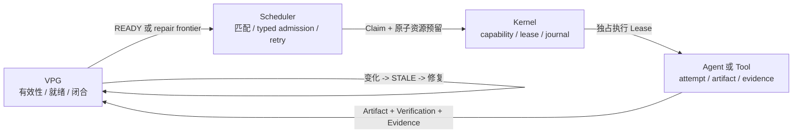

# LongHorizonOS 使用与运维说明书

> 本文承载完整的安装、SDK、Harness、Context、资源、恢复、运维、benchmark 与实现边界。  
> 项目定位和最短安装入口见 [`README.zh-CN.md`](../README.zh-CN.md)。  
> English manual: [`USER-OPERATOR-MANUAL.md`](USER-OPERATOR-MANUAL.md)。

---

<div align="center">


### 面向长时程 Agent 的状态化在线计算

**LongHorizonOS 将长期 Agent 执行视为一个持续变化的在线有状态计算问题：
系统持续观察语义进度、Agent 认知、上下文和资源状态，并动态调度、复用、
中断、并行和修复计算，以最低代价完成可验证的最终目标。**

`Schedule · Reuse · Interrupt · Parallelize · Repair`

**Harness 让长时间运行的 Agent 成为可能；LongHorizonOS 让这段长期
Agent 计算变得高效。**

**Graph 表示持续演化的计算；OS 持续根据 Graph 重新调度。**

当前 `v0.1.x` alpha 已实现这条路线的单机边界：基于 Graph 的失效传播与
选择性修复、Kernel fencing 所有权、有界 `adaptive=True` 调度和显式的
逻辑资源感知准入。Always-on 自主策略、物理资源管理和分布式运行时仍是
目标设计，不是当前保证。

[](https://www.python.org/)
[](../LICENSE)
[](releases/v0.1.0.md)
[](architecture/LONGHORIZONOS-CORE-V1.md)

[English manual](USER-OPERATOR-MANUAL.md) | 简体中文

[一分钟版本](#一分钟版本) |
[跑通闭环](#跑通闭环) |
[为什么需要它](#为什么需要它) |
[真实测评](#真实测评) |
[使用 SDK](#使用-sdk) |
[当前阶段](#当前阶段) |
[计算管理设计](LONG-HORIZON-COMPUTE-MANAGEMENT.md)

</div>

---

## 一分钟版本

Harness 负责让一个 Agent 持续把活干下去。LongHorizonOS 负责判断**这份活现在还
值不值得干**——不值得的时候，在它跑到一半时把它停掉。

下面两个测量说明这件事值多少钱。两者都跑真实子进程、量真实墙钟；两者都**不调用
模型**，所以都不声称省了 token 或省了钱。

### 1. 停掉已经注定作废的计算

一个兄弟任务提交了某个 artifact 的新版本，而此时两个同伴还在读旧版本。指标是
「输入已经被取代、但仍在燃烧」的子进程时间——这个数字来自子进程自己上报的
usage，所以「被杀掉」是**观测到的**，不是从「跑得比较短」反推的。

| 输入声明 | 注定作废的子进程时间（中位数，n=7） | 击杀 | 旁观者被误伤 |
|---|---:|---:|---:|
| 完整——冲突图拒绝把它们排在一起 | **0 ms** | 0 | 从未 |
| 不完整，抢占关闭 | **4126 ms** | 0 | 从未 |
| 不完整，抢占开启 | **265 ms** | 7/7 | **从未** |

要按顺序读这三行，因为**只有中间那行是问题**：

1. 声明**正确**时这个竞争根本不会发生——推导出的冲突图会把写者和它的读者分开。
   抢占是第二道防线，不是第一道。
2. 声明**非空但错误**才是危险情况：冲突图信任了它，没查出重叠，照样并行排上，
   于是 4.1 秒的子进程计算跑在已经不存在的输入上。现实中 agent 本来就会漏报自己
   读了什么，所以这不是人为构造的边角情况，这是常态。
3. 抢占消掉了其中 **约 94%** 的无效计算。

最后一列才是能否决这个特性的那一列。**抢占范围过大会摧毁仍然有效的计算，那比从
不抢占更糟。** 旁观者（声明输入从未变化）在任何一组、任何一次运行中都没被碰过。

关于这张表有两个必须说明的地方。控制行的 0 ms 是因为冲突图把读者推到了后一个
batch，在被测量的单 batch 窗口内它们根本没跑——写者随后耗尽 30 秒协调超时，那一
行的 `wall_clock` 是这个超时，不是工作量。它证明的是「竞争不会发生」，不是「正确
声明是免费的」。另外抢占那一行的 Goal 状态是 `open`，因为被杀掉的工作没有在测量
窗口内重新派发——这个 benchmark 测的是**避免掉的无效计算**，不是端到端的
time-to-verified。

原始结果：[`artifacts/incomplete-declaration-20260818.json`](../artifacts/incomplete-declaration-20260818.json)。

### 2. 优先调度关键路径

42 个任务：一条重量级、深度 10 的串行链，加 30 个廉价的宽任务——在这种图形状下，
**什么时候开始跑这条链**决定了 Goal 什么时候关闭。

| | serial | static parallel | LongHorizonOS |
|---|---:|---:|---:|
| 墙钟（中位数，n=3） | 9.31 s | 7.07 s | **6.33 s** |
| `chain_priority` | 0.743 | 0.743 | **0.344** |

`chain_priority` 是这条链上各任务归一化起跑位置的均值：`0.743` 表示链被推到派发
顺序的靠后位置，`0.344` 表示它被提前了。它是派发顺序的**确定性**属性，所以和墙钟
不同，它*解释*了时间差异，而不是把时间差异重述一遍——而且它能精确复现：把迭代量
缩小 60 倍重跑，serial/static/adaptive 仍然是 `0.7428 / 0.7428 / 0.3437`，而同样
这两次运行的墙钟比值从 `1.1177x` 漂到了 `1.0312x`。这个落差就是那个确定性指标存在
的全部理由。

原始结果：[`artifacts/critical-path-heavy.json`](../artifacts/critical-path-heavy.json)。

### 3. 已知的天花板：派发是一道 batch barrier

上面那个数字是**下限**，原因是机制而不是调参。`run_async` 规划一批之后会等**整批**
跑完才重新规划，所以短任务腾出来的 slot，必须等到这一批里最慢的那个结束才能再被
使用。测量「slot 空着、而已就绪的任务正在等它」的那部分容量（n=3，同一个 42 任务
负载）：

| | serial | static parallel | LongHorizonOS |
|---|---:|---:|---:|
| 墙钟（中位数） | 7.63 s | 6.09 s | **5.12 s** |
| 白放掉的并发容量 | —（单 slot） | 26.5% | **39.3%** |

也就是说，这里的 1.19x 是在**大约五分之二的并发容量被浪费**的情况下拿到的。
work-conserving 的连续派发是本仓库目前已知最大的、尚未拿到的收益，而它**没有实现**。

有一点必须直说：**barrier 对调度决策更好的那一方惩罚更重。** 优先跑关键路径是正确
决定，而且确实有效——但它会留下一队「已就绪、被刻意降级」的廉价任务，而 barrier
让空出的 slot 无法去捡它们。静态臂在这个指标上看起来更干净，恰恰是因为它的排序决策
更差。

这个指标是对 `min(空闲 slot 数, 已就绪但未启动的任务数)` 按时间积分。两个夹逼项都是
必须的：去掉「空闲 slot」项，被降级的任务会被算成浪费；去掉「已就绪」项，串行链真实
的依赖等待会被算成浪费。而取**最小值**而不是按任务累加，是让它能和墙钟对比的关键——
30 个任务等同一个 2 秒的 barrier，损失是 2 slot-秒，不是 60。

原始结果：[`artifacts/barrier-cost-20260819.json`](../artifacts/barrier-cost-20260819.json)。

### 这套东西在哪里不起作用

在一个**没有决策可做**的对称负载上——8 个等成本任务、两棵互不相干的子树、图从不
变化——`static ÷ adaptive` 测出来是 **0.93x（n=5）** 到 **约 1.00x（n=7）**。
LongHorizonOS 与一个好的静态计划持平，或者略慢一点。

**这是正确答案，不是坏消息。** 在那种负载上静态计划本来就是最优的，在线调度最好
也只能追平，同时还要为这套机制付开销。在那种负载上**赢了**才意味着测量出了问题。

在线调度只在两种情况下值回成本：图会**变化**（有东西被取代、失效、或者做错了），
或者图有**形状**（存在关键路径、成本分布不均）。它不是一个通用加速器，本仓库也不
把它当通用加速器来汇报。

---

## 跑通闭环

LongHorizonOS 需要 Python 3.11 或更高版本。核心 Demo 确定性运行、完全离线，
不需要 API Key：

```bash
git clone https://github.com/Yang-Jiashu/LongHorizonOS.git
cd LongHorizonOS
python -m pip install .
lhos demo recovery-repair --json
```

这不是预先录制的输出。命令会经过真实的 SDK、Scheduler、Kernel Lease、VPG、
失效传播和修复路径：

```text
Worker 故障
  -> 恢复执行所有权
source.py@v1 -> source.py@v2
  -> 因果相关的 3 个 Task 变为 STALE
  -> 1 个无关的 VERIFIED Task 保持有效
  -> 推导最小 Repair Frontier
  -> 要求新的精确版本 Evidence
  -> Goal 再次闭合
```

JSON 结果包含 `crash_recovered`、`affected_tasks`、`preserved_tasks`、
`repair_frontier`、`repair_attempts`、`final_closed` 等机器可检查字段。

下面的命令会通过真实 SDK 权威路径运行一个**有界、由调用方驱动**的在线监督器
闭环：

```bash
lhos demo online-supervisor --json
```

它按 `start -> observe -> execute bounded epoch -> re-observe` 运行，直到三个
有依赖关系的任务使 Goal 闭合。JSON 会明确给出 `bounded = true`、
`daemon_started = false`、`uses_llm = false`、实际 dispatch/verified 的任务、
Graph 版本和停止原因。Executor 与 verifier 都是确定性的本地受控实现；这不是
always-on 服务、真实模型测评或物理资源放置测评。Host telemetry collector
本身只负责观测；调用方可以显式通过 `derive_host_capacity(...)` 和
`AgentOS.apply_host_capacity(...)` 更新一个指定的逻辑 Scheduler pool，但
这仍不提供物理放置、隔离或 quota。详见
[Bounded Event-Driven Supervisor](EVENT-DRIVEN-SUPERVISOR.md)。

Provenance 边界 Demo 是一个独立的、确定性的 v0.2 实验：

```bash
lhos demo provenance-repair --json
```

它运行独立的 `lhos.provenance` 观测原语：

```text
显式记录版本化输入
  -> 比较声明输入与实际观测输入
  -> 对未知输入采用 STRICT 拒绝（fail closed）
  -> filing.csv@v1 -> filing.csv@v2
  -> 沿声明 Graph 推导受影响 cone 与 Repair Frontier
  -> 持久化 JSONL hash-chain 并重新 replay
```

JSON 会明确报告它的边界：`hidden_probe_coverage = "UNKNOWN"`、
`strict_fail_closed = true`、`automatic_dependency_discovery = false`、
`graph_relative = true`。SDK 现在提供显式的 `context_v1` adapter：任务选择
该模式时，`ExecutionContext` 和 coverage report 会随正常
Evidence/VPG 提交路径传递；legacy `task_id` callback 在 strict 策略下会被
标记为 `UNKNOWN`。这**不是自动依赖发现**：Recorder 只能在显式
executor/tool 边界记录输入，不能自动发现任意 Python、浏览器、操作系统或
隐式语义依赖；`COMPLETE` provenance 报告是覆盖率证据，本身不等于 VPG 的
`VERIFIED` 结果。详见
[Provenance Demo 契约](demos/PROVENANCE-REPAIR.md)和
[Provenance API 契约](PROVENANCE-CONTRACT.md)。

对于 `context_v1` Attempt，合法的 Context VM `page_bindings` 会被记录为精确的
`READ` provenance event（`source="context_vm"`）；格式错误的 binding 会被标记为
unknown，而不是由系统猜测。这个边界只覆盖已经 materialize 的 Context page，
不会捕获隐藏的 Python、浏览器、网络或工具读取。

对于 workspace 文件，可选的 `WorkspaceProvenanceGateway` 提供限制在指定根目录内、
受 capability 约束的读写边界，并记录精确字节的 SHA-256，支持原子写入和写入前
比较。strict 模式下，调用方传入的 `version=` 必须通过
`version_validator(snapshot) -> bool` 或兼容 Facts 接口的
`version_authority.read_hash(pid, uri, version)` 验证；单独一个整数版本号不构成
语义权威。audit/compatibility 模式可以保留未经验证的调用方版本，并记录
`version_source="caller"`。在语义 Evidence 提交前，内置 SDK 还会对通过该
gateway 读取的 workspace read-set 执行有界的
`validate_read_set_current()` / `require_read_set_current()` 检查；变更、删除、
不可用或截断检查会以 `STALE_COGNITION` / `READ_SET_UNAVAILABLE` fail closed。
这是单机 mediated freshness fence，不是文件锁或跨平面原子事务。commit
validation 的聚焦切片为 **47 个测试**（更大的 mediated workspace/provenance
门禁为重叠的 **53 个测试**）。


`ActionGateway` 是一个**可选、由用户注入的原语**，用于承载 executor
显式通过 `ExecutionContext` 发出的副作用。设置 `secure_mode=True` 后，
SDK 会在用户代码运行前拒绝 `legacy_task_id` callback，并要求使用
`context_v1`。这个边界只覆盖 `ctx.submit_effect(...)`、
`ctx.submit_tool(...)` 等显式调用，不能拦截任意 Python 文件、网络、浏览器、
子进程或 SDK 直连 I/O。Gateway receipt 也不等于 exactly-once 保证：非
pure effect 必须声明幂等键；malformed、身份不匹配或不确定的 receipt 会先被
记录为 unknown/uncertain write，再拒绝语义推进。这是显式 instrumented
边界，不是通用事务协调器。

Kernel Action 现在会持久化副作用类别、恢复策略和重试预算。首次 driver
dispatch 异常时，只有 `PURE + RETRY` 才允许在重新校验当前 Lease/fencing 后
**最多重试一次**；重试会先持久化预留（`retry_count` 和
`ACTION_RETRY_RESERVED` journal event），且重试结果仍必须通过
`commit_if_fenced()`。重试再次异常或返回 `UNKNOWN` 会进入 `UNCERTAIN`。
`IDEMPOTENT` 默认先 inspect，不盲目再次 dispatch；不可逆或未知副作用只有在
显式要求 inspect 时才会查询。直接 Kernel `SubmitAction` 仍是兼容接口，默认值为
`PURE + RETRY`；`secure_mode` 会在进程来源的 syscall 边界要求显式 effect
contract，但对所有自定义 driver 和 raw callback 的 strict admission 尚未实现。
缺少重试预算字段的旧 Action 行/事件会被保守地视为没有可用重试预算。
Transactional Outbox 在 async publisher 失败后，如果调用方显式指定逻辑时钟且
重试延迟为 0，会保持立即可重试；正数 backoff 仍以 publisher 完成时间为基准。

随后可以运行以下快速、离线的测评门禁：

```bash
lhos benchmark semantic-repair --quick
lhos benchmark async-agentos
lhos benchmark hidden-provenance
lhos benchmark online-compute --json
lhos benchmark compute-budget --json
lhos benchmark resource-aware-runtime --json
lhos benchmark wallclock-adaptive-runtime --json
lhos benchmark harness-adaptive --json
```

`hidden-provenance` 是安全边界测评，不是性能承诺：它验证未观测或明确
未知的输入 provenance 在 strict 模式下不能被提升为 VERIFIED，同时保留
`audit` 迁移路径。详见
[Hidden-Provenance 安全测评](benchmarks/HIDDEN-PROVENANCE.md)。

## 为什么需要它

Checkpoint 可以告诉 Agent 上次执行停在哪里，但它本身无法回答：当需求、文件、
工具、模型、API 或外部事实变化以后，过去完成的工作是否仍然成立。

LongHorizonOS 把这个问题交给运行时：

| 运行时问题 | LongHorizonOS 中的权威来源 |
|---|---|
| 什么仍然为真？ | Verified Progress Graph 中的精确版本 Evidence |
| 什么已经过期？ | 感知版本的因果失效传播 |
| 现在什么可以运行？ | Graph 推导的 `READY` 与 Repair Frontier |
| Goal 是否完成？ | VPG 闭合规则，而不是 Agent 自我声明 |
| 谁可以执行或提交？ | Scheduler Claim 与 Kernel Lease fencing |
| 逻辑资源是否足够？ | 原子的 typed resource admission |
| 进程重启后保留什么？ | 持久化 VPG 与可选 Scheduler projection |

### Harness 边界

LongHorizonOS 不替代 Agent Harness。Harness 负责单个 Agent session 的可靠
执行循环，包括模型调用、工具、session 状态、checkpoint/resume、retry 和局部
verification；LongHorizonOS 是管理一个或多个此类执行单元的全局 control plane。

```text
Model
  -> Harness session：一个 Agent 如何持续完成工作
  -> LongHorizonOS control plane：提出这段计算应该 START、CONTINUE、
     DEFER、PREEMPT 还是 REBASE；只有显式注册且通过身份 fencing 的
     adapter 才能接收受支持的控制请求
```

因此 VPG 不只是任务记录。它是持续演化计算的版本化 control state，表达
validity、dependency、version、READY/repair frontier，以及调度策略所依赖的
显式计算结构。Harness 决定一个已准入任务具体怎样完成；LongHorizonOS 提议
下一单位计算是否仍值得花在这个 Harness execution 上（只有显式注册且通过
身份 fencing 的 adapter 才能接收受支持的控制请求）。当前 `AgentOS` bridge
可以投递精确身份的 cooperative `PREEMPT`/`REBASE` interrupt。对于显式注册的
live session，changed-read `REBASE`/`FULL_RELOAD` 还可以执行有界的 durable
fresh-Attempt handoff；但该流程仍是 release-then-acquire，不是跨平面原子事务，
调用方仍需注册或恢复 replacement Harness。

公开 Harness session 协议及其当前有界保证见
[Harness Session Protocol](HARNESS-SESSION-PROTOCOL.md)；笔记到代码的
交付状态见
[Mind-VLA Implementation Matrix](MIND-VLA-IMPLEMENTATION-MATRIX.md)。

对于文件型 `AgentOS`，已经接受的 Harness 控制转换也支持**有界的逻辑
replay**：经过 hash-chain 校验的 Scheduler journal 可以在替换 adapter
提供相同完整 session identity 时恢复 session revision/state/checkpoint/
progress 以及 request 幂等索引。它不会恢复 callback 或模型内存、prompt、
output/details、Python 调用栈、可执行 checkpoint 或运行中的代码，也不会
转移 Claim/Kernel Lease。因此 `REBASE`/`PREEMPT` 仍然属于显式的
ownership/interrupt 操作，不是透明的跨重启进程迁移。

权威边界是刻意划分的：

> **Graph 负责语义真值和就绪状态；Scheduler 负责策略和逻辑资源准入；
> Kernel 负责执行权；Agent 与工具只负责执行和产生 Evidence。**

系统由两个闭环组成：

```text
VPG READY frontier
  -> Scheduler Claim + 资源预留
  -> Kernel Lease
  -> Agent/工具执行
  -> 独立验证
  -> 精确版本 Evidence
  -> VPG Goal closure

Artifact/外部世界变化
  -> Evidence 不再适用
  -> 因果 STALE cone
  -> Goal 重新打开
  -> 最小 Repair Frontier
  -> 新 Evidence
  -> verified reclosure
```

LongHorizonOS 并不声称其他 Workflow Engine 或集群调度器没有状态、Graph、恢复
或资源管理。这些机制已经分别存在。项目真正的差异化判断是：
**Stateful Agent 的语义有效性、选择性修复、执行所有权和资源准入，需要一个统一的
一致性模型。**

更长期的控制模型见
[Long-Horizon Compute Management 设计文档](LONG-HORIZON-COMPUTE-MANAGEMENT.md)。
这是目标架构，不代表当前 alpha 已经提供 telemetry 驱动的物理 GPU
调度/放置、自动 provenance 发现、sandbox 隔离或分布式协调。当前 alpha
提供可选的 observation-only host telemetry adapter；调用方可以通过
`derive_host_capacity(...)` 显式、fail-closed 地把样本映射到一个指定的
逻辑 Scheduler pool，再调用 `AgentOS.apply_host_capacity(...)`。这仍然只是
逻辑准入上限，不是物理放置、隔离或 quota。

## 架构



| 层级 | 负责 | 不应该决定 |
|---|---|---|
| **VPG** | 依赖、Evidence 适用性、Task 有效性、就绪状态、Goal 闭合 | Agent 放置或物理执行 |
| **Scheduler** | Eligibility、确定性匹配、Claim、重试、逻辑资源容量 | 语义真值 |
| **Kernel** | Process/Action 状态、Capability、Lease、fencing、Journal | Evidence 是否足以证明 Goal |
| **Agent / Tool** | 一次执行及其输出 | 自己最终是否在语义上有效 |

## 真实测评

下面是仓库中已经保存的受控 workload 参考结果。它们是可复现的回归证据，不是对
所有 Agent workload 和硬件的泛化性能宣称。

### 1. 选择性语义修复

```bash
lhos benchmark semantic-repair --quick
```

快速测评运行 24 个确定性变更/修复试验，以及一个临时真实工作区场景。执行路径
覆盖公开 SDK、Scheduler、Kernel Lease、Evidence、失效传播与 Goal 闭合。

| 参考指标 | 结果 |
|---|---:|
| 正确的确定性试验 | **24 / 24** |
| 相比全量重跑的平均加权工作量节省 | **48.64%** |
| 相比 oracle task-DAG checkpoint 的平均额外节省 | **0%** |
| 漏失效 / 过度失效 | **0 / 0** |
| 失效后错误保留 `VERIFIED` | **0** |
| 重叠所有权冲突 | **0** |
| 不安全 state-only baseline 的错误闭合 | **24 / 24** |
| 工作区场景 | **影响 3 个、保留 1 个、Goal 重新闭合** |

它证明当前 workload 上的选择性修复是正确的，并且相比全量重启节省工作量。
它**没有**证明优于 oracle-informed task-DAG checkpoint；在当前任务级 Graph
上，LongHorizonOS 与该 baseline 持平。

参考[聚合结果](../artifacts/oss_productization_e5/summaries/summary.json)和
[测量口径](benchmarks/SEMANTIC-REPAIR.md)。

### 2. 公开 `AgentOS.run_async` 路径

```bash
lhos benchmark async-agentos
# 更严格的源码门禁：
python scripts/benchmark_multi_agent_runtime.py --check
```

仓库内参考 workload 包含 24 个相互独立、I/O-shaped 的 Task，每个 executor
延迟 50 ms；使用 2 个 Agent、全局并发 4、每 Agent 并发 2、独立 verifier，
并为每个 Task 申请完整逻辑资源向量。它执行三组串行/并行配对测量，并使用
配对加速比的中位数作为门禁，避免单次计时抖动决定结果。

| 参考指标 | 串行 | 并行 |
|---|---:|---:|
| 端到端耗时中位数 | **2.067 s** | **0.954 s** |
| Executor 峰值并发 | **1** | **4** |
| VERIFIED Task | **24 / 24** | **24 / 24** |
| COMPLETED Claim | **24 / 24** | **24 / 24** |
| 语义验证通过的 Attempt | **24 / 24** | **24 / 24** |
| 所有权/资源/容量违规 | **0** | **0** |
| 结束后的活跃资源预留 | **0** | **0** |

测得配对加速比中位数为 **2.124x**。它证明受控 I/O workload 能通过公开 SDK 并发执行并
正确走到语义闭合；它不代表真实模型吞吐、CUDA 工作、物理 CPU/GPU 隔离、
分布式调度或任意 Agent workload 的加速。

参考[原始结果](../artifacts/benchmark_results/multi-agent-runtime.json)和
[测评口径](benchmarks/ASYNC-AGENTOS.md)。

### 3. 在线计算控制（确定性离线模拟器）

```bash
lhos benchmark online-compute --json
```

该受控 workload 比较固定并行策略与有界自适应策略：在模拟 API 变化后，
adaptive 策略会延后不稳定/冲突分支，避免 stale 重做，同时保留独立分支的
并行执行。

| 受控指标 | Static | Adaptive |
|---|---:|---:|
| 模拟总 token | **2,760** | **1,440** |
| 模拟 wall time | **10.0 s** | **5.0 s** |
| stale/repeated work token | **1,320** | **0** |
| Verified Progress / token | **0.0003623** | **0.0006944** |
| Verified Progress / minute | **6.0** | **12.0** |

可以注入一个可复现的 provider profile 来改变成本/延迟的记账尺度：

```powershell
python -m lhos.cli.core benchmark online-compute --json `
  --provider-id cheap-sim `
  --latency-multiplier 1.5 `
  --input-token-multiplier 0.75 `
  --output-token-multiplier 0.5 `
  --output-cost-per-token-usd 0.000005
```

JSON 还会返回 provider profile、stale/re-executed task IDs、
verified-progress trace、每个 scheduling epoch 的并行度、成本节省和
重做减少量。它是**确定性的离线模拟器**，不是 LLM/GPU/真实 provider
吞吐测评；不测量模型质量、真实 provider 定价、物理 CPU/GPU/RAM/VRAM、
分布式调度、隐藏依赖发现或生产吞吐。详见
[Online Compute Control 测评口径](benchmarks/ONLINE-COMPUTE-CONTROL.md)。

程序化测评还公开了有界 multi-seed API：
`run_multi_seed_benchmark(seeds=(...))`。它保留单 seed
`run_benchmark()` 契约，同时返回每个 seed 的可审计报告以及 mean/min/max
汇总：

```python
from lhos.benchmarks.adaptive_control import run_multi_seed_benchmark

report = run_multi_seed_benchmark(seeds=(7, 11, 19))
```

当前 canonical controlled scenario 对 seed 不敏感，seed 只是报告中的审计
metadata；因此默认 sweep 验证的是聚合与可复现性，不是多个独立随机 workload。
真正的 seed 变化需要调用方按 seed 生成不同 scenario 参数。这个 API 不能被解释为
具有统计效力的真实 LLM/provider/GPU 测评。

### 4. Resource-Aware Adaptive Runtime

```bash
lhos benchmark resource-aware-runtime --json
```

这个确定性 synthetic workload 让同一张四任务 Graph 真实经过
`AgentOS.run_async` → Scheduler → Claim/Kernel Lease → verifier → VPG Evidence。
逻辑资源池为 1,000 CPU millicores，任务请求为 700/700/300/300：
仅 conflict-aware 的固定并行策略需要 **3 个 epoch**，产生 **1 次 advisory
超容量 proposal 和 1 次 Scheduler 资源拒绝**；resource-aware packing 用
**2 个 epoch** 到达同一个 VERIFIED Goal，proposal 超容量与资源拒绝均为 **0**。
两种模式实际 admitted/executor 容量违规都为 0。这不是 wall-clock、物理
CPU/GPU/RAM/VRAM 或真实 LLM 加速结论。详见
[测评口径](RESOURCE-AWARE-RUNTIME-BENCHMARK.md)与
[`artifacts/resource-aware-runtime-20260815.json`](../artifacts/resource-aware-runtime-20260815.json)。

### 5. 真实本机 wall-clock Adaptive Runtime 门禁

```bash
lhos benchmark wallclock-adaptive-runtime --json
```

这个有界确定性 I/O workload 会通过公开的
`AgentOS.run_async` → Scheduler → Claim → Kernel Lease → AsyncWorkerPool →
verifier → VPG Evidence 路径执行真实 `asyncio.sleep`。resource/conflict-aware
模式在同一个 VERIFIED Goal 上达到 **2 个 epoch、0 次资源拒绝**，资源无感知
基线为 **3 个 epoch、1 次拒绝**。本机参考运行观察到约 **1.29x** wall-clock
加速，但时间只作信息记录，不代表 LLM/GPU/物理资源或生产吞吐性能。详见
[wall-clock 测评口径](ADAPTIVE-WALLCLOCK-RUNTIME-BENCHMARK.md)。

有界在线重规划示例展示了调用方显式重新观测资源后，下一轮如何改变批处理：

```bash
python examples/resource_replanning_e2e.py
```

它先在 1,000-byte 逻辑池中并行选择两个 500-byte 任务，再显式应用新样本
把指定 pool 降到 500 bytes，并让剩余 frontier 每个 epoch 只选择一个任务。
这是 caller-owned、single-host 的 bounded 示例，不会启动 daemon，也不代表
物理 placement/GPU 控制。详见
[资源重规划契约](RESOURCE-REPLANNING-E2E.md)。

### 6. VPG 持久化历史

```bash
python scripts/benchmark_vpg_incremental_history.py --check
```

在“每个 patch 新增一个 Task”的 workload 中：

| 提交 patch 数 | History 行数 | History payload | READY frontier 事件 payload | 数据库总大小 | 总提交耗时 |
|---:|---:|---:|---:|---:|---:|
| 100 | 100 | 35,274 B | 11,892 B | 483,328 B | 0.895 s |
| 200 | 200 | 70,874 B | 23,892 B | 888,832 B | 4.032 s |
| 400 | 400 | 142,074 B | 47,892 B | 1,638,400 B | 17.202 s |

N=400 时，旧 full-copy 结构需要 **80,200 条 history 记录**，此前实测约
**37.9 MB**。最新运行中 entity-revision history 只保存 **400 条记录**，数据库为
**1.64 MB**，history 行数减少 **99.50%**。READY frontier 事件现在持久化为
count + SHA-256 摘要，因此其 payload 也呈线性增长（N=400 为 **47,892 B**），
不再在每个版本重复写完整 frontier。

这已经修复连续小 patch 中 durable history 与 READY-frontier 事件 payload 的
`O(V^2)` 写放大。但端到端提交耗时仍然超线性，因为当前运行时每次提交仍会对
完整候选 projection 做构造、派生、解码、校验与 hash。上表是一次本机参考运行，
不是延迟保证。

参考[原始结果](../artifacts/benchmark_results/vpg-incremental-history-2026-08-12-frontier-summary-final.json)。

### 7. Harness 路径自适应控制

```bash
python -m lhos.cli.core benchmark harness-adaptive --json
```

该测评通过公开的 `AgentOS.run_async` 路径运行，覆盖 Scheduler
Claim/Attempt 准入、Kernel Lease fencing、精确身份的 Harness `START`、
独立 verification 和 VPG Evidence 提交。在仓库内的确定性四任务 workload
上，两种策略均闭合同一个 Goal：

| 受控指标 | Static | Adaptive |
|---|---:|---:|
| Attempt 数 | **5** | **4** |
| 模拟 usage token | **1,120** | **896** |
| stale/rework token | **224** | **0** |
| 本机耗时 | **418.6 ms** | **369.4 ms** |
| Goal 闭合 / 所有权路径 | **true / true** | **true / true** |

Static 策略会有意重叠两个 writer，并对一个失败 Attempt 重试；Adaptive
策略会串行化显式声明的冲突，同时保持独立工作并发。usage token 是模拟记账，
本机 wall-clock 也只用于说明执行形态。该测评不代表隐藏依赖发现、真实模型
质量、物理资源放置或分布式吞吐。详见
[Harness Adaptive 测评口径](benchmarks/HARNESS-ADAPTIVE.md)，原始结果见
`artifacts/harness-adaptive-20260815-final.json`。

### 8. Baseline vs LongHorizonOS wall-clock

```bash
python -m lhos.benchmarks.baseline_vs_lhos
```

这个确定性合成 workload 通过公开的 `AgentOS.run_async` 路径把**同一个**
VERIFIED Goal 闭合两次：串行单 Agent 基线（`adaptive=False`、
`max_concurrency=1`）对比自适应 LongHorizonOS（三个 Agent、`adaptive=True`，
因此 graph-utility 会对 frontier 排序，派生的 conflict graph 会批处理互不冲突
的工作，matching 也可能优先选择已持有任务声明读取的 Agent）。workload 为一条
四任务的 critical-path 链外加六个相互独立的 side task，全部是确定性
`asyncio.sleep`。

真正有意义的是与运行无关的确定性事实：两侧闭合完全相同的 verified 任务集；
**10 次 dispatch 中有 7 次是 warm**（被选中的 Agent 已持有该任务声明的读取）；
ranking ablation 显示 repair-first lexical 排序**一个** critical path 任务都没
选中，而 graph-utility 把 critical-path 头节点排在最前。相对串行基线的
wall-clock 加速只作信息参考且有噪声：五次本机运行区间为 **1.55x–1.94x（中位数
约 1.70x）**，而唯一入库样本实测约 **2.11x**，均低于 **2.5x** 的 critical-path
上界。它不调用任何模型、不分配 GPU、不执行任何真实编码任务，也不测量任何
token 或金钱节省；它测量的是 Scheduler 的行为，而非 Agent 的能力。原始结果见
[`artifacts/baseline-vs-lhos-20260817.json`](../artifacts/baseline-vs-lhos-20260817.json)。

### 9. 半途抢占的收益

```bash
python -m lhos.benchmarks.preemption_payoff --repeat 7
```

结果表在[一分钟版本](#一分钟版本)。这里给的是复现命令，以及这个 benchmark 对
自己强制执行的契约。

墙钟和节省的绝对值**刻意不被回归测试卡住**，因为它们是真实测量、天然有噪声。被卡
住的是让这个测量有意义的三个事实：

- 取代性的提交确实**发生在受害者还在跑的时候**——取代者会对每个受害者阻塞在一个
  `asyncio.Event` 上，而不是靠 sleep 时序去赌。本仓库此前有一个 benchmark 就是因为
  变更落在 batch 已经跑完之后，结果什么都没测到；
- 抢占确实**杀掉了**东西——依据是子进程自己上报的
  `terminated_by == "semantic_interrupt"`，不是从「跑得比较短」反推的；
- 声明输入从未变化的旁观者**从未被碰过**。

回归测试：`tests/benchmarks/test_preemption_payoff.py`。

### 10. 关键路径调度与静态/自适应的交叉点

```bash
# 调度顺序决定 makespan 的那种形状
python -m lhos.benchmarks.scheduling_regimes --shape critical-path --repeat 3

# 调度顺序无关紧要的那种形状——刻意保留的空结果
python -m lhos.benchmarks.scheduling_regimes --shape symmetric --repeat 5
```

critical-path 负载是 42 个任务——一条深度 10 的重量级串行链加 30 个廉价宽任务——
是在对称的 8 任务版本给出空结果之后才换成这个形状的。**两种形状都保留**，因为那个
空结果正是这个论断的边界；把它删掉就只剩下好看的那一半了。

决定性指标是 `chain_priority`，即链上各任务归一化起跑位置的均值。它是派发顺序的
确定性属性，所以和墙钟不同，它*解释*了差异而不是重述差异——而且它能精确复现：把
迭代量缩小 60 倍重跑 critical-path 形状，serial/static/adaptive 仍然是
`0.7428 / 0.7428 / 0.3437`，而同样这两次运行的墙钟比值从 `1.1177x` 漂到了
`1.0312x`。这个落差就是这个确定性指标存在的全部理由。

原始结果：
[`artifacts/critical-path-heavy.json`](../artifacts/critical-path-heavy.json)、
[`artifacts/critical-path-wide.json`](../artifacts/critical-path-wide.json)、
[`artifacts/scheduling-regimes-final-20260817.json`](../artifacts/scheduling-regimes-final-20260817.json)。

### 显式计算预算（可选）

计算预算路径必须由调用方显式开启。给
`AgentOS.run()` 或 `run_async()` 传入 `budget_aware=True`、
`adaptive=True`、`budget_estimates` 和 `budget_limits`，系统才会在每个
有界 epoch 中按 Verified Progress/成本策略筛选候选任务。Scheduler 仍然
负责最终的 READY、Claim、Lease 和 dispatch 判定：只有真正 dispatch 的
任务才扣除声明的 estimate；如果后续 executor 失败或 Attempt 变为 stale，
仍按保守规则消耗该声明；Scheduler 拒绝或 Graph race 导致没有 dispatch
则不扣除。

这里的声明值不是 provider 实测账单、发票、quota 执行或物理 CPU/GPU 预留。
同步执行路径现在会实测真实 wall-clock，并连同 executor 提供的 token/成本计数
一起通过 `UsageLedger.record_measured` 记录；一个有界的逐任务整数 EWMA
（0.25x–4x）会据此把后续运行的 token/时间/成本维度向实测历史校准。异步执行路径
现在同样实测 executor 墙钟（每次派发一段 monotonic span，对外为
`executor_elapsed_ms`）并接入同一套校准；逐任务的成功/失败/输入变动计数现在也从
Attempt 终态观测得来（`observe_task_outcomes`），不再是声明值。仍为声明值的是
任务 *value* 与 verification token；`UsageLedger` 也仍是不可变的**纯内存、
非 durable 对象，不跨运行持久化**。详见
[显式计算预算与 Verified Progress 效用](COMPUTE-BUDGET.md)。

预算计划会返回 `ComputeBudgetRemaining`：某个维度为 `None` 表示没有设置
上限（unbounded），为 `0` 表示有界上限已经耗尽。一次 admission 可以只接收
部分任务，其他 READY 任务会保留明确的预算阻塞原因；只有权威 Scheduler
实际 dispatch 的 task ID 才计入 usage，因此 partial admission 或没有发生
dispatch 的 Graph race 不会消耗预算。

## 使用 SDK

### 最小 Verified Goal

```python
from lhos.sdk import Agent, AgentOS, Goal, scripted_executor

with AgentOS(":memory:") as runtime:
    runtime.add_agent(Agent("coder", specializations=("python",)))

    goal = Goal("Ship hello")
    goal.task(
        "Write hello",
        agent="coder",
        verify=scripted_executor(artifact_id="hello.txt", version=1),
    )

    result = runtime.run(goal, max_dispatches=4)
    print(result.goal_state, result.task_states)
    # closed {'Write hello': 'verified'}
```

运行同一个示例：

```bash
python examples/quickstart/hello_world.py
```

### 可选的 mediated effect（`context_v1`）

当 Task 需要执行外部副作用时，可以注入一个 gateway，并让 executor 接收
`ExecutionContext`。下面的 gateway 只展示接口形状；真实集成必须负责执行
外部 sink，并持久化/协调 receipt。

```python
from lhos.sdk import (
    Agent,
    AgentOS,
    EffectRequest,
    Goal,
    VerificationOutcome,
)


class DemoGateway:
    def submit(self, request: EffectRequest) -> dict:
        # 替换为真实且具备幂等语义的 sink 操作。
        return {
            "effect_id": request.effect_id,
            "status": "completed",
            "action_id": f"action:{request.effect_id}",
            "idempotency_key": request.declaration.idempotency_key,
        }


def execute(ctx) -> VerificationOutcome:
    ctx.declare_effect(
        "publish",
        side_effect_class="idempotent",
        resource_uri="sink://release",
        idempotency_key="publish-v1",
        operation="write",
    )
    ctx.submit_effect("publish", "write", arguments={"version": 1})
    return VerificationOutcome(
        passed=True,
        artifact_id="release.txt",
        version=1,
        content="published",
    )


with AgentOS(
    ":memory:",
    secure_mode=True,
    action_gateway=DemoGateway(),
) as runtime:
    runtime.add_agent(
        Agent("publisher", executor=execute, executor_api="context_v1")
    )
    goal = Goal("Publish release")
    goal.task("publish", agent="publisher")
    result = runtime.run(goal, max_dispatches=1)
```

`secure_mode` 是显式 opt-in，并不会把任意 Python callback 变成 sandbox。
应把 gateway 理解为 instrumented effect 的 mediated contract，而不是通用
事务协调器。

### 异步执行与 typed resources

```python
import asyncio

from lhos.sdk import Agent, AgentOS, Goal, VerificationOutcome


async def execute(task_id: str) -> None:
    await asyncio.sleep(0.05)  # 替换为异步模型或工具调用


def verified(task_id: str) -> VerificationOutcome:
    return VerificationOutcome(
        passed=True,
        artifact_id=f"{task_id}.txt",
        version=1,
        content="verified output",
    )


async def main() -> None:
    with AgentOS(":memory:") as runtime:
        runtime.add_agent(
            Agent(
                "worker",
                executor=execute,
                max_concurrency=2,
                resource_capacity={
                    "cpu_millis": 2_000,
                    "ram_bytes": 2_000_000_000,
                    "gpu_count": 1,
                    "vram_bytes": 8_000_000_000,
                    "model_slots": {"local-model": 2},
                },
            )
        )

        goal = Goal("Parallel verified work")
        for task_id in ("A", "B"):
            goal.task(
                task_id,
                agent="worker",
                verify=lambda task_id=task_id: verified(task_id),
                resources={
                    "cpu_millis": 500,
                    "ram_bytes": 256_000_000,
                    "model_slots": {"local-model": 1},
                },
            )

        result = await runtime.run_async(goal, max_concurrency=2)
        print(result.goal_state, result.verified)


asyncio.run(main())
```

Scheduler 会在执行前原子预留 Task 的完整资源向量，并在成功、失败、取消和
reconcile 路径释放资源。这些是**每 Agent 的逻辑容量预留**，不会检测或强制限制
真实主机的 CPU、RAM、GPU 或 VRAM 消耗。

`run_async` 支持同步或异步的 Agent executor 与 `Task.verify`。同步 `run()`
会拒绝异步 callback，并释放已经取得的 Claim，而不会把它静默当作已完成。

`scripted_executor` 是确定性的 Demo/测试工具。真实 workload 应提供
`Agent.executor` 与独立的 `Task.verify`，或使用仓库中的命令/工具集成。
没有适用 Evidence 的 Task 会保持未验证状态。`Agent.model` 只是配置元数据，
不会自动创建 Provider Client。

更多可运行示例：

```bash
python examples/quickstart/multi_agent.py
python examples/quickstart/repair.py
python examples/quickstart/real_coding_task.py
```

### 显式开启有界的自适应调度 Epoch

SDK 也提供了在线计算管理循环的第一段有界实现。设置
`adaptive=True` 后，运行时会在每个 scheduling epoch 重新观察状态：

```python
from lhos.sdk import Agent, AgentOS, ConflictGraph, Goal, TaskAccessSet

goal = Goal("State-dependent batch")
goal.task("api", agent="worker", outputs=("artifact://api",))
goal.task(
    "backend",
    agent="worker",
    inputs=("artifact://api",),
    outputs=("workspace://backend",),
)
goal.task(
    "docs",
    agent="worker",
    inputs=("artifact://api",),
    outputs=("workspace://docs",),
)

conflicts = ConflictGraph.from_access_sets(
    [
        TaskAccessSet(task_id="api", write_set=("artifact://api",)),
        TaskAccessSet(
            task_id="backend",
            read_set=("artifact://api",),
            write_set=("workspace://backend",),
        ),
        TaskAccessSet(
            task_id="docs",
            read_set=("artifact://api",),
            write_set=("workspace://docs",),
        ),
    ]
)

result = await runtime.run_async(
    goal,
    adaptive=True,
    conflict_graph=conflicts,
    max_concurrency=2,
)
```

每个 epoch 会生成确定性的 frontier/batch 建议，把选中的 task id 作为
**建议性过滤器**传给现有 Scheduler，同时附带一个 **dispatch-order 排序**
（默认 graph-utility），Scheduler 会据此对其权威 frontier 做稳定重排。该排序
只决定已经 ready 的任务谁先拿到 Claim，绝不会准入尚未 ready 的任务。
Readiness、eligibility、逻辑资源准入、Claim、Lease 和 fencing 仍由
Scheduler/Kernel 掌握。默认值仍是 `adaptive=False`。该有界路径不是 always-on controller：同步 `run()` 和异步
`run_async()` 都可以在显式 `max_parallelism` 上限内提出批处理建议；异步路径
还会受 `max_concurrency` 的实际 callback 并发上限约束。同步 `run()` 可以在
同一 epoch 领取多个相互独立的任务，但 caller-owned callback 仍按顺序执行，
因此真实 executor 并发需要使用 `run_async()`。Conflict 边只来自显式的
`Task.inputs`/`outputs` 或调用方提供的 `ConflictGraph`；未声明/未知访问会按
serial-only 处理，不会被假设为相互独立。

如果希望在只读规划阶段同时考虑显式的逻辑资源请求，可以直接使用
`ResourceAwareParallelismPolicy`，或使用 `AgentOS.suggest_resource_aware_batch(...)`
门面：

```python
from lhos.sdk import ResourceAwareParallelismPolicy

# `goal` 必须已经在 `runtime` 中完成编译；`conflicts` 必须显式提供。
suggestion = runtime.suggest_resource_aware_batch(
    goal,
    conflicts,
    task_resources={
        "backend": {"cpu_millis": 600},
        "docs": {"cpu_millis": 300},
    },
    max_parallelism=4,
)
print(suggestion.selected_task_ids, suggestion.deferred_task_ids)

# 等价的纯策略接口：
state = runtime.runtime_state(goal)
suggestion = ResourceAwareParallelismPolicy(max_parallelism=4).suggest(
    state,
    conflicts,
    {"backend": {"cpu_millis": 600}, "docs": {"cpu_millis": 300}},
)
```

该策略是确定性的 advisory 建议：它组合不可变的 `RuntimeStateView`、
显式 task resource request 和显式 `ConflictGraph`；真正执行前仍由
Scheduler/Kernel 重新校验 readiness、资源准入、Claim、Lease 和 fencing。
可选的 host telemetry adapter 不会被隐式当作逻辑资源容量；调用方可以按
[telemetry-to-logical-capacity bridge](RESOURCE-TELEMETRY.md) 显式更新
一个指定 pool。

实际执行路径也可以显式开启同一策略：

```python
result = await runtime.run_async(
    goal,
    adaptive=True,
    resource_aware=True,
    conflict_graph=conflicts,
    max_parallelism=4,
    max_concurrency=4,
)
```

每个 resource-aware epoch 会在 `RunResult` 中保留有界的
`resource_audit`，但 Scheduler/Kernel 仍是最终准入和 fencing 权威。

如果显式请求持久化（`persist_adaptive_epochs=True` 或
`plan_frontier(persist=True)`），每个不可变的策略 epoch 还会写入一个有界且幂等的
`SCHEDULING_EPOCH_PLANNED` Scheduler 审计事件。事件只记录 IDs、版本、
哈希、截断后的候选/选中/延后 task 列表以及有界的不可用原因；不会记录
prompt、模型输出或完整 Context。持久化 epoch 只是审计与 replay 操作，
不会领取任务，也不会绕过 Scheduler/Kernel 的准入、Claim、Lease 或 fencing。

`AgentOS.runtime_state(goal)` 暴露四类观测状态（语义进度、Agent 认知、
Context VM 绑定和逻辑资源）。每个 SDK Attempt 都会获得受 fencing 保护的
Context VM snapshot 与持久化 `AgentSnapshot`；提交前 read-set 校验可以把
过期推理隔离为 `STALE_COGNITION`。有界的
`AgentOS.plan_compute_routing(...)` 还可以基于显式、版本固定的元数据计算
Context overlap，并给出只读的 `REUSE_AGENT`/`FRESH_AGENT`、模型 tier、
Context budget 和 verification strength 建议。这些只是 advisory policy：
不会启动/复用进程、claim 工作、调用 provider 或修改 Scheduler。当前仍然
不是自动隐藏读取发现、默认执行路径上的可强制终止 preemption、自动 provider
调度或 telemetry 驱动的物理 GPU 放置。可选的
`collect_host_resource_telemetry()` adapter 只观测 CPU/RAM 以及可用时的
NVIDIA GPU/VRAM；只有显式调用 `apply_host_capacity(...)` 才会更新指定的
逻辑 pool，仍不提供 physical admission、placement、isolation 或 quota。

对于显式 opt-in 的调用方，`ComputeProviderRegistry` 与
`AgentOS(provider_registry=...)` 提供有界的 provider 执行适配器。当
`adaptive=True` 且
`Task.metadata["compute_routing"]["provider_routing"]["enabled"] = true` 时，
运行时可以为该次已调度 Attempt 解析已注册的 model、verifier 以及可选
Context adapter hook。解析发生在 Scheduler Claim 和 Context 建立之后；
provider hook 不能领取任务、获取 Lease 或发布语义 Evidence。同步/异步、
fail-closed 和 opt-out 覆盖见 `tests/sdk/test_provider_routing.py`。这只是
显式执行接线，不是自动 provider 选择、provider-aware Scheduler 或物理资源
放置。`AgentOS.plan_interrupts(..., persist=True)` 仍是可审计的建议
操作；对于正在运行的 `run_async()` batch，`AgentOS.deliver_interrupt(...)`
会校验 graph/epoch/claim/task/attempt 的精确身份，并向支持 token 的
executor 投递 cooperative interrupt。异步 SDK 还会在 verifier 到 Evidence
提交的 commit fence 再次检查 interrupt，因此迟到或被忽略的 interrupt
不能发布 `VERIFIED` Evidence。它仍不会强制终止任意 callback、自动执行
Context rebase，或协调第三方 Harness session。

### 单次在线执行 Epoch（有界）

除了 `schedule_online_epoch(...)` 的“规划 -> 准入 -> 显式清理”桥接，SDK 还提供
最小可执行纵向切片：

```python
result = await runtime.execute_online_epoch(
    goal,
    max_concurrency=2,
    max_dispatches=2,
)
```

`execute_online_epoch(...)` 是 caller-invoked、one-shot 的 epoch，复用真实的
`run_async(..., adaptive=True, max_steps=1)` 路径：Scheduler 负责 READY、Claim、
Attempt、Lease 和资源准入，配置的 executor/verifier 负责执行与验证，VPG 负责
Evidence commit。它返回 `RunResult` 及有界的 `meta["online_epoch"]` 审计，区分
policy 选中、实际 dispatch 和 serial fallback；`completed` 才表示包含语义
commit，`completed_with_failures`、`no_dispatch` 和 `no_work_budget` 会保守地
反映失败或无用户代码执行。

这个 API 不消费 `schedule_online_epoch(..., keep_claims=True)` 的 retained Claims，
不接管外部 Harness session，也不是 always-on watcher/controller；调用方必须显式
启动下一 epoch。`max_dispatches=0` 是严格 observe-only 的零预算路径：可完成
Goal 注册/编译和初始观察，但不会 adaptive planning、持久化 epoch、Claim/Lease
准入或调用用户 executor/verifier。

需要调用方显式运行多个 epoch 时，可以使用：

```python
loop = await runtime.execute_online_epochs(
    goal,
    max_epochs=8,
    max_concurrency=2,
    max_dispatches_per_epoch=2,
)
```

`execute_online_epochs(...)` 会在每个真实执行 epoch 后重新观察 VPG，并在 Goal
闭合、epoch 失败、没有 dispatch、没有工作预算或达到显式 epoch 上限时停止。
它仍是 caller-invoked 的有界循环，不是后台 daemon，不恢复任意 Python 调用栈，
不消费 retained online-epoch ownership，也不管理外部 Harness session。

如果调用方通过 `schedule_online_epoch(..., keep_claims=True)` 保留了精确
Claim，并且已经为每个 Claim 构造了 Harness adapter，可以显式调用：

```python
handoff = runtime.handoff_online_epoch_to_harness(
    epoch,
    {
        dispatch.claim_id: harness_by_claim[dispatch.claim_id]
        for dispatch in epoch.dispatches
    },
)
```

`handoff_online_epoch_to_harness(...)` 会校验完整的
Graph/Task/Agent/Process/Claim/Attempt/semantic-epoch/Lease 身份后再注册
Harness session；同一精确身份的 replay 是幂等的，映射不完整、身份过期或
ownership 已终止都会 fail closed。它不会执行 Harness、释放 Claim、自动
Context rebase，也不是 Scheduler/Kernel/Harness 之间的原子事务。

### Freshness guard 与 cleanup marker

Graph version 前进时，Context/Harness read-set 必须有完整、可识别的显式 delta；
partial/unknown coverage 或无法识别的 read 会 fail closed，阻止 stale cognition
复用或 Evidence commit。同一 graph version 下的 partial observation 保留兼容性
no-op。`expected_graph_version` 是可选 admission freshness fence；如果准入期间
Graph 发生变化，结果标记为 policy-stale，并只补偿精确 Claim，不执行 reconcile
副作用。

Scheduler 已提供幂等的 `execution-cleanup.v1` durable 审计 marker 原语
（确定性 SHA-256 `marker_id`），用于记录尚未完成的精确 Claim cleanup。
`cleanup_markers` 返回未解决 marker；`reconcile_cleanup_markers()` 只有在精确
Claim 已 terminal 且权威 lease lookup 确认无 live lease 时才标记 resolved，active
或 unknown ownership 会继续 pending。Marker 只是 durable audit/reconciliation
记录，不会自动释放/重定向 Claim，也不是跨服务原子事务。当前
`SchedulerSession.run_pass()` 与 `AgentOS.run_async()` 的 bounded cleanup
失败路径已经自动写入该 marker。

## 运维入口

只读 Run 检查需要持久化数据库和已保存的 Manifest：

```bash
lhos status --state run.json --goal "Ship hello"
lhos inspect --state run.json --goal "Ship hello" task "Write hello"
lhos graph --state run.json --goal "Ship hello"
```

VPG 生命周期命令是显式的 Operator 操作：

```bash
lhos vpg history --db run.db --graph GRAPH_ID --json
lhos vpg compact --db run.db --graph GRAPH_ID \
  --retain-from 100 --actor operator --reason "retention policy" --yes
lhos vpg migrate-legacy --db legacy.db --graph GRAPH_ID --json
```

旧库迁移默认只进行只读预览。信任一个缺少 snapshot 的旧 projection 时，必须
提交预览返回的精确版本和 hash，并明确提供操作人和原因。History compaction
要求存在经过验证的 checkpoint，并显式传入 `--yes`。

## 已实现能力

- Evidence-backed VPG 有效性、Graph 推导的就绪状态与 Goal 闭合
- 扁平化的逐任务 verification 构建成本：`build_verification_indices()` 在每个
  pass 只预计算一次 VERIFIES/PRODUCES 邻接表，而不再为每个 Task 重走整张边表，
  消除了 O(N·E) 热点，因此大规模 Goal 不再受此前实际存在的 SDK 任务数上限
  限制。`MAX_PATCH_OPS = 500` 仍守护不可信 patch；大型可信 Goal 通过
  composition-root 路径原子发布。
- 精确 Artifact 版本适用性与因果 `STALE` 传播
- 最小 Repair Frontier、选择性重执行与 verified reclosure
- Process / Action / Journal 原语、Crash recovery 与执行所有权 reconcile
- Capability / Lease / Signal 原语及 Kernel Lease fencing
- Versioned Artifact FS、Namespace isolation、Version-checked commits 与
  Canonical URI security
- 公开的同步与异步 Agent 执行路径
- 同步/异步 executor 与 verifier 的全局和每 Agent 并发限制
- 确定性 Agent eligibility/matching、Claim、retry 与 Attempt。matching 现在
  新增一个有界的 context-residency 项：若某 Agent 的持久化 `AgentSnapshot`
  read-set 已覆盖任务声明的读取，则优先选择它（上限为 `LOCALITY_BONUS_MAX`），
  因此 warm-*Agent* 选择已经生效，尽管 warm-*进程* 复用尚未实现。
- 持久化的 `AgentSnapshot`：记录 Attempt 所基于的
  `ContextIdentity`、显式 read-set/write-set、计算进度和成本字段
- commit-time read-guard：当输入版本变化时，将 Attempt 隔离为
  `STALE_COGNITION`，禁止过时认知提交新 Evidence；该状态与 guard 事件可在
  Scheduler 关闭/重开后恢复
- 只读的 `RuntimeStateView` / `GlobalRuntimeState`，可通过
  `AgentOS.runtime_state(goal)` 查看语义进度、Agent 认知、Context 和逻辑资源
- 可选的确定性规划原语：`FrontierPolicy`/`SchedulingEpoch` 提供 WHAT/WHEN
  frontier 建议。独立的 `FrontierPolicy` 默认仍是 repair-first lexical 排序，
  但 `adaptive=True` 执行 epoch 现在改用 `ranking_strategy="graph_utility"`：
  它只在安全 frontier 内根据声明 VPG 的 critical path 与 immediate downstream
  unlock value 排序，不会绕过 repair 优先级或安全过滤。
  `ConflictGraph`/`DynamicParallelismPolicy` 根据显式
  read/write 声明给出批处理建议；`SemanticInterruptPolicy` 输出可审计的
  `CONTINUE`/`DEFER`/`PREEMPT`/`REBASE`/`REVERIFY` 建议
- `run()`/`run_async()` 已提供有界的 `adaptive=True` 路径：每个 epoch 重新规划，
  同时向现有 Scheduler 提供建议性的 `allowed_task_ids` 过滤器和一个
  `dispatch_order` 排序（默认 graph-utility），Scheduler 会据此对其权威 frontier
  做稳定重排；有界的 liveness fallback 会放开过滤器但保留排序。该排序只重排
  已经 ready 的任务，绝不准入未 ready 的任务。每个 epoch 的 metadata 会记录
  `dispatch_order_applied` 与 `locality_matched_task_ids`（并由
  `ScheduleResult.dispatch_order_applied` 和 `.locality_matched` 对应）。
  Scheduler/Kernel 仍是 readiness、eligibility、资源准入、Claim、Lease 和
  fencing 的权威。默认值仍为 `adaptive=False`。
- 可持久化有界且幂等的 `SCHEDULING_EPOCH_PLANNED` 审计事件，用于策略
  audit/replay；事件只包含有界的 ID、版本、哈希和决策元数据，不会领取任务
  或绕过 Scheduler/Kernel 权威。
- 已提供有界的进程内 Harness 控制桥接：通过
  `AgentOS.register_harness()` / `control_harness()` 实施精确的
  Claim/Attempt/session 身份 fencing、revision/request 幂等和 journal 审计。
  文件型重开只恢复逻辑 session 元数据，不会转移 Claim/Lease、迁移
  callback/模型状态，也不能控制任意第三方 Harness 进程。
- 可选、可强杀的 Harness 执行边界 `SubprocessHarnessAdapter`（从 `lhos.sdk`
  导出）：把 Agent 工作放进子进程，因此 `PREEMPT` 能真正终止它——先发温和
  信号、再硬杀、最后 reap，并由后台 wall-clock 看门狗兜底。它复用被冻结的
  `CallableHarnessAdapter` 完成全部 identity/revision/checkpoint fencing，不
  重写协议。由于冻结的 v1 capability 词表没有 `"forceful"` 取值，它只能**声明**
  `preemption_mode="cooperative"`，实际执行的却是真正的 OS 级 kill。它是可选
  的、**不在任何默认执行路径上**——必须由调用方显式注册——普通进程内 Python
  callable 仍不可强杀（若子进程再 fork 出孙进程仍可能泄漏）。
- `AgentOS.handoff_online_epoch_to_harness(...)` 可以把
  `schedule_online_epoch(..., keep_claims=True)` 返回的 retained dispatch
  绑定到一组精确 Harness session；它验证完整 session/Lease 身份并支持同一
  身份的幂等 replay，但不会执行 Harness、释放 ownership 或提供跨平面原子事务。
- `AgentOS.execute_online_epochs(...)` 可以按调用方给出的上限重复真实
  `execute_online_epoch(...)` 路径，并在每轮后重新观察 VPG、按闭合/失败/
  无 dispatch/无预算条件保守停止；它不是 always-on controller。
- 有界、确定性的 `ComputeRoutingPolicy` 已通过
  `AgentOS.plan_compute_routing(...)`（以及模块级 SDK symbols）提供：它仅根据
  显式元数据计算 fail-closed 的 Context overlap/locality，并输出
  Agent 复用/新 Agent、model tier、Context budget 与 verification strength
  建议；该 advisory surface 不会调用 provider、创建/复用进程或改变执行路径。
  不过 cognitive locality 并非处处失效：一个*独立*的 Scheduler 侧
  context-residency 项（见上面的 eligibility/matching 条目）确实会影响真实
  dispatch 路径上选择哪个 Agent。该项只重排 Agent 选择，仍然不会创建、复用或
  迁移进程。
- 已提供显式 opt-in 的 `ComputeProviderRegistry` 执行适配器，可通过
  `AgentOS(provider_registry=...)` 注入。仅当 `adaptive=True` 且任务 metadata
  开启 `provider_routing` 时，才会在 Claim 和 Context 建立后调用已注册的
  model/verifier/context hook。该适配器有同步/异步及 fail-closed 测试
  （`tests/sdk/test_provider_routing.py`）；不会自动选择 provider、领取任务、
  获取 Lease 或执行物理资源调度。
- 已提供显式 `budget_aware=True` 主路径：调用方必须同时给出
  `adaptive=True`、逐任务 `budget_estimates` 与 `budget_limits`。每个 epoch
  只对 Scheduler 实际 dispatch 的任务扣除声明 estimate；失败或 stale 的
  已 dispatch Attempt 仍按保守规则计入，Scheduler 拒绝或无 dispatch 的
  Graph race 不计入。这是 declared accounting，不是 provider 实测账单、
  quota 或物理资源预留；`UsageLedger` 仍是纯内存、非 durable 的 attempt
  记录。
- 上述 policy 原语和 adaptive 过滤器都是**显式 opt-in 且有边界**的能力：不会
  自动发现隐藏 provenance、把 Scheduler 变成 always-on controller，或推断
  provider 经济性。对显式接入的、支持 `cancellation_token=`
  的 `AsyncWorkerPool` executor，系统可以投递 cooperative interrupt；
  但不会强制杀死任意 callback、释放 Claim 或转移 Lease。
- 当前 checkout 还提供两个刻意有界的 control-plane bridge：
  `EventDrivenSupervisor`（`AgentOS.event_supervisor(...)`）支持调用方拥有的
  `start -> submit -> step -> stop` 生命周期（以及有界 `run()`/异步迭代器），
  每步重新观察 RuntimeState、校验显式事件、可选轮询声明式 workspace watcher，
  再执行一个有界 online epoch。重复 event ID 只有在 payload 完全相同时才幂等；
  stale graph/version、blocked route、观测或执行失败会进入 `FAILED_CLOSED`。
  它没有后台线程/daemon、隐藏 retry、force-kill、live 外部 Harness rebase
  或 atomic ownership 事务；主 `run()`/`run_async()` 路径在显式
  Manifest/Facts 覆盖完整时支持一次有界的 fresh-Attempt Context 刷新（同步与
  异步 `run()`/`run_async()` 均适用）。
- ownership intent protocol（`prepare_handoff`、`commit_handoff`、
  `recover_handoff`）会在现有 fenced release-then-acquire 路径之前持久化精确
  source Claim/Attempt 与调用方 `handoff_id`，支持幂等 replay 和
  `IN_DOUBT` fail-closed recovery；它是 recovery witness，不是
  Scheduler/Kernel/Harness/VPG 的两阶段跨平面事务。
- CPU/RAM/GPU/VRAM/model-slot 逻辑资源向量的原子准入与清理
- 持久化的 Action 副作用分类与恢复策略。`PURE + RETRY` 在 dispatch 异常后
  最多执行一次受 fencing 保护的重试；idempotent、不可逆和未知结果进入
  inspect/uncertain 的 fail-closed 分支。
- 对旧 `actions_projection` 的 additive SQLite 迁移：补充资源声明、fencing
  token、副作用类别、恢复策略和重试预算。历史行保留兼容默认值；缺少重试预算
  状态时按预算已耗尽处理，不会被追溯性地重新解释。
- Kernel Process、Action、Capability、Lease、Signal 与 Journal 原语
- 主 SDK Evidence/VPG commit 路径上的 Lease-generation fencing
- Scheduler/Claim heartbeat，以及可选的 `AsyncWorkerPool` cooperative
  heartbeat loop（默认关闭）。启用时必须提供 heartbeat callback（或
  `heartbeat` 别名）或 Scheduler 的 `heartbeat`/`renew_claim` hook；没有
  可用 hook 会 fail closed。它不是可强制终止进程的 cancellation 机制。
- 可选的 Scheduler 事件/状态持久化 replay 与 hash-chain 完整性校验。同一
  SQLite 文件内的 writer 受 generation、state hash 和 event-tail CAS 保护；
  支持边界仍是单 Scheduler writer，不提供 leader election 或分布式
  multi-writer 协调。
- VPG entity-revision 历史、历史重建、hash 与 fail-closed recovery
- VPG history retention/compaction 与显式可信旧库迁移工具
- Shell、Workspace、Git 与 OpenAI-compatible 集成模块
- 显式的 v0.2 provenance recorder、`context_v1` SDK adapter、声明/观测覆盖率
  报告、strict/audit/legacy 策略决策、Evidence metadata 接入与持久化 JSONL
  replay，以及可选、由用户注入的 `ActionGateway` 原语；同时支持 Context VM
  page-binding provenance 与 root-confined `WorkspaceProvenanceGateway`。这些是
  已实现的有界/中介能力；自动依赖发现和通用 mediated gateway 尚未实现。
  secure mode 下 malformed 或身份不匹配的 receipt 会记录为 uncertain write，不能授权语义闭合。
- 已实现面向调用方显式声明 workspace 文件的有界
  `WorkspaceObservationWatcher`。同一次 poll 中已分配的变化会先统一校验，再通过
  一次原子的批量 VPG/D3 刷新提交。Observation token 的身份持久化并绑定
  content/version/Graph；即使 commit 后响应丢失，重试也会复用同一 observation，
  不会重复发布语义变化。`AgentOS.poll_workspace_and_route(...)` 与
  `route_workspace_observation(...)` 还提供 one-shot 的
  watcher -> interrupt policy -> exact Attempt fence -> cooperative
  `REBASE/PREEMPT` 路由；传入的 poll interrupts 会重新校验，拒绝状态会进入
  blocked 审计而不是误记为 delivered。它仍只是显式轮询边界，不是通用
  world observation 或后台 daemon。
- post-admission/cancellation 路径的精确 Claim 清理、`execution-cleanup.v1`
  durable audit marker 与权威 lease reconciliation；这是有界单机补偿，不是
  跨服务 exactly-once 或原子事务
- 为后续跨平面接线准备的 Transactional Outbox primitive；显式逻辑时钟下的
  zero-delay retry 已保证立即可重试
- 确定性 Demo、可观测 CLI 与可复现 Benchmark 门禁

## 当前阶段

**项目阶段：实验性的单机系统原型 / 早期研究 Alpha（`v0.1.0`）。**
Core Architecture V1 已冻结；公开 SDK、CLI、持久化契约和 Operator 工作流仍是
实验性的 `v0.x` 接口。

发布校验详情，以及此前逐个里程碑的测试基线链条，见
[`docs/releases/v0.1.0.md`](releases/v0.1.0.md)。
2026 年 8 月 18 日在本机复现的当前仓库证据为：

- non-slow：`3656 passed, 2 skipped, 19 deselected, 30 warnings`
  （`437.94s`）；日志：`artifacts/full-test-nonslow-20260818-readme.log`
- Ruff lint（`ruff check src tests`）：通过。Ruff format
  （`ruff format --check src tests`）：`603 files already formatted`。
- Mypy：`no issues found in 294 source files`。
- slow marker 门禁：`18 passed`（上次运行 `1253.07s`）；日志：
  `artifacts/slow-tests-compute-budget-20260816.log`

该证据包含语义抢占接线（`run_async` 上的 `preempt_superseded=True`）、可强杀的
`subprocess_task_executor`、已观测的异步 executor 墙钟与 Attempt 结果标定、
per-agent context residency 匹配、access-correction / context-utilization /
context-budget 三个建议性接口，以及两处 per-pass Scheduler 索引优化。

watcher route/rejection 加上
caller-owned `WorkspaceWatchLoop` 通过 **30 个聚焦测试**；mediated
workspace commit-time validation 为 **47 个聚焦测试**；live
`REBASE`/`FULL_RELOAD` fresh-Attempt handoff 为 **27 个聚焦测试**。这些数字彼此重叠，
不可相加，也不代表生产就绪。Supervisor 仍由调用方显式驱动；multi-seed
使用确定性模拟 provider/scenario；handoff intent 也不是
Scheduler/Kernel/Harness/VPG 跨平面原子事务。
此前 2026 年 8 月 14 日冻结源码的 `3037 passed` 结果仍保留为 historical baseline：
`artifacts/full-test-nonslow-frozen-20260814.log`。当前彼此重叠、不可相加的聚焦门禁包括：
workspace watcher `25 passed`、较早的 observation-token/authority/watcher 集成
`35 passed`、Journal/atomicity/rebuild/SQLite isolation 与 migration
`25 passed`（包含 empty-rebuild offset zero），以及 Journal/Lease 合并门禁
`56 passed`（Journal 25 + Lease 31）。这些都不代表生产就绪。

当前源码门禁已于 2026-08-18 在本地复现通过：`src tests` 范围内的 Ruff lint 与
Ruff format 均通过（**603 files already formatted**），**294** 个源码文件的 Mypy
通过，`compileall` 通过，上面的 non-slow 套件也按配置的 marker 分组通过。

打包证据的日期更早，单独标注：`dist-final-20260816-compute-budget` 中的
wheel/sdist 已通过 `twine check`，fresh venv 安装后 SDK 导入以及
`compute-budget`、`recovery-repair`、`budget_aware=True` 三个 smoke 均通过。
**该构建早于上面的抢占与标定工作，此后未重新构建。**

以上全部是本地复现证据，不代表 GitHub-hosted Actions 已经实际执行并成功。

## 尚未实现（Not yet implemented）

- 任意文件、API、浏览器、工具或 Python 读取的自动隐藏依赖/provenance 发现。
  已实现显式声明 workspace 文件的 `WorkspaceObservationWatcher`；其
  `poll_and_reconcile` 会先校验同一轮的全部已分配变化，再通过一次原子的批量
  VPG/D3 刷新提交；one-shot route façade 还能把经过校验的 interrupt 路由到
  精确 cooperative Attempt；caller-owned `WorkspaceWatchLoop` 提供有界的重复
  polling。watcher/loop 聚焦切片为 **30 passed**，但它仍不是通用 watcher
  或 always-on daemon。
- Always-on Adaptive Policy controller、自动隐藏 provenance 驱动的
  ConflictGraph 构建，以及 provider-policy 驱动的自动模型/Context/verifier
  选择。`ComputeRoutingPolicy` 的有界只读建议和显式
  `ComputeProviderRegistry` 执行适配器已实现并有测试，但适配器必须由
  `adaptive=True` 与任务 metadata 显式启用，尚无 provider 成本收益测评
- 自动校准任务*价值*、verification token 估计、provider 实测账单或跨运行
  durable 预算历史。`budget_aware=True` 现在确实会在进程内根据实测历史校准声明的
  *成本、token、时间*三个维度，同步与异步两条执行路径都实测墙钟，并用有界的逐任务
  整数 EWMA（0.25x–4x）修正后续估计。逐任务的成功/失败/输入变动计数现在也从
  Attempt 终态观测得来，并且刻意把「这个任务的输入在底下变了」与「这个任务失败了」
  分开记，所以输入变动绝不会算到该任务的成功率上。仍为声明值的是任务 *value* 与
  verification token。`UsageLedger` 也仍是纯内存 accounting 对象、不属于可由
  Scheduler/VPG replay 恢复的状态，因此校准结果不跨进程重启持久化。
- 端到端 SDK/Harness 层的 Semantic Interrupt 编排，包括通用 world watcher、
   原子 Lease handoff、通用 Harness lifecycle 与 cancellation policy。
  有界的 `WorkspaceObservationWatcher` 可以轮询声明的文件并生成带 Graph
  绑定的 `ARTIFACT_CHANGED` 建议；`poll_and_reconcile` 还能把同一轮已分配变化
  原子地批量执行失效传播，one-shot route façade 可以投递精确 cooperative
  `REBASE/PREEMPT`，但不会接管 ownership 或强制终止 callback。
  有界的精确身份 Harness bridge、面向 live `run_async()` 的
  `AgentOS.deliver_interrupt(...)` 以及底层 token-aware
  `AsyncWorkerPool` cooperative delivery 已实现；retained Claim→Harness
  显式绑定也已实现。live 外部 Harness 的 Context rebase、原子 ownership
  transaction、不支持 token 的 legacy callback 仍不支持；进程内 Python
   callable 也仍不可强杀，但现在有**两个**真正可强杀的执行边界：可选的
   `SubprocessHarnessAdapter`，以及 `subprocess_task_executor`——后者把一个普通
   `context_v1` 任务放进子进程执行，可从公开的 `run_async` 路径直接使用。开启
   `preempt_superseded=True` 后，兄弟任务提交并取代某个在跑同伴的声明输入时，会
   投递一个 cooperative interrupt 把那个子进程在半途杀掉；实测效果见
   [一分钟版本](#一分钟版本)。两者都是 opt-in，都不在任何默认路径上。
   此外显式 live session 的 `REBASE`/`FULL_RELOAD` 已可通过有界
   durable handoff fence/release 旧 Claim、创建 fresh Attempt、detach 旧
   Harness 并 replay；该路径仍是 release-then-acquire、非跨平面原子事务，
   需要调用方为 replacement Attempt 注册新 Harness 或执行
   `recover_handoff(...)`。主 SDK 的 fresh-Attempt 自动刷新仅限显式
   Manifest/Facts 且对未知输入 fail-closed。
- 自动/provider-policy 驱动的 Cognitive locality *进程* 路由：warm 进程
  复用或创建、动态修改 live Context 预算、自动选择 provider，以及自动分配
  verifier 成本。显式 registry 适配器不提供这些生命周期或优化保证。
  warm-*Agent* 选择是另一回事，且现在已生效：Scheduler 会优先选择其持久化
  read-set 已覆盖任务声明读取的 Agent，但这只重排选择哪个 Agent，绝不会创建、
  复用或迁移进程。
- Distributed multi-agent cluster 调度与多主机共识
- telemetry 驱动的物理主机/Device admission、placement 与隔离
  （显式 bridge 只更新一个逻辑 Scheduler capacity，不提供这些保证）
- Provider RPM/TPM quota、preemption、fairness 与 starvation guarantee
- 不可逆外部副作用的跨平面 exactly-once fencing
- 通用 belief revision、矛盾求解与自主 repair planning

### 重要边界

- Typed resource 是 Scheduler 管理的**每 Agent 逻辑资源池**，不是共享主机/
  Device Inventory。可选的 `collect_host_resource_telemetry()` adapter 可以
  观测 CPU/RAM 以及可用时的 NVIDIA GPU/VRAM，并显式报告 unavailable 状态；
  `derive_host_capacity(...)` + `AgentOS.apply_host_capacity(...)` 可以在调用方
  明确授权后更新一个指定逻辑 pool，但不会提供 physical admission、placement、
  isolation、quota 或 OS 级 CPU/GPU/RAM/VRAM enforcement。
- 尚未实现 RPM/TPM/API quota、browser/sandbox/workspace lock、preemption、
  fairness 和 starvation guarantee。Cleanup marker 只提供 durable audit/reconcile
  记录，不会自动释放 Claim。
- Durable Scheduler replay 假设只有一个 Scheduler writer；没有 leader
  election、分布式 CAS 或 multi-writer fencing。
- Scheduler reconciliation、TTL reclaim 以及按 Attempt 绑定的
  Scheduler/Claim heartbeat 已实现。`AsyncWorkerPool` 可通过
  `heartbeat_interval` 加 heartbeat callback（或 `heartbeat` 别名），或者
  Scheduler 的 `heartbeat`/`renew_claim` hook，启用 cooperative heartbeat
  loop；默认关闭，配置 interval 但没有可用 hook 时会 fail closed。这不
  提供可强制杀死任务的 cancellation 边界，原始 callback 仍可能继续运行。
- Terminal process publication 已提供一个有界的 PID 重获 fence：系统先发布
  terminal state，再执行 cleanup；`atomic_acquire` 会在 writer transaction
  内拒绝已存在的 `EXITED`/`FAILED` PID。但 cleanup 与 terminal transition
  仍不是一个跨 service 原子事务，因此这不是通用的 lifecycle 原子 handoff。
- Executor 并发是真实的，但单次 `run_async` 内的 Evidence/VPG commit 会串行化；
  不同 runtime 实例之间并不共享这把锁。
- 主 Lease-to-VPG 路径已经 fencing，但 Facts、Action、Claim completion、
  VPG patch、Lease release 与外部系统还不是一个统一事务。
- Transactional Outbox primitive 尚未接入所有 Action/Claim/Lease/VPG 主路径；
  外部不可逆副作用不是 exactly-once。
- Checkpoint/recovery 覆盖持久化 runtime metadata/projection 和可选 workspace
  状态，不保存任意 Python 内存、调用栈或正在运行的代码。
- VPG durable history 的增长已经增量化，但 derivation/validation/hash 仍处理
  完整 projection；实体删除 tombstone 尚未实现。
- 尚无分布式集群、生产级 sandbox、通用 belief revision、托管服务或 Web
  Dashboard。
- 仓库还缺少具有统计效力的真实模型、真实 GPU 和直接竞品对比测评。
- Provenance capture 当前是显式观测原语，`context_v1` 已接入主 SDK 的
  Evidence/VPG 提交适配层。`ActionGateway` 是可选、注入式能力：
  `secure_mode` 会拒绝 legacy callback，但不能拦截任意 Python 直连 I/O，
  也不是通用的 Action/Outbox/Artifact 跨平面事务或 exactly-once 协议。
  它不会自动发现隐藏依赖，legacy callback 在 strict 策略下会被标记为
  `UNKNOWN`。
- `AgentOS.workspace_watcher(...)` 只观察显式列出的 `WorkspaceTool` 资源，
  对变化签发 content-hash-backed observation token，对删除只报告变化而不
  伪造版本；它不会拦截直接 Python、网络、浏览器、工具或子进程 I/O。详见
  [`docs/WORKSPACE-WATCHER.md`](WORKSPACE-WATCHER.md)。
- `secure_mode` 包含两个有边界的检查：进程来源的 `SubmitAction` syscall
  必须显式声明 `side_effect_class` 和 `recovery_policy`；通过注入 gateway
  路由的 `ExecutionContext` 调用还必须满足幂等键与 receipt 身份检查。
  它不会拦截每个 driver、raw callback 或任意 Python I/O。直接
  `SubmitAction` 兼容路径仍默认 `PURE + RETRY`；如果自定义 driver 被错误
  分类，仍可能被重试，因此调用方必须声明真实副作用类别与恢复策略。
- 首次 dispatch 异常不等于已经证明“没有发生副作用”。受限的 pure retry 是兼容性
  恢复策略，不是 exactly-once 保证；要获得更强语义，sink 必须消费幂等键和 fencing
  身份。
- Claim/attempt/epoch 绑定、provenance digest 校验和 Lease fencing 已保护
  主 SDK Evidence/VPG 路径；自动 provenance discovery、外部副作用
  exactly-once 以及跨 worker crash campaign 仍未完成。
- `AgentSnapshot`、`STALE_COGNITION` quarantine、`RuntimeStateView`、三个
  policy 模块以及 worker-pool cooperative interrupt delivery 都是有边界的
  观测/控制原语；它们尚未把当前 Scheduler 变成 always-on 在线自适应计算
  控制器，显式 access 声明也不等于自动 provenance。支持 token 的 executor
  若忽略 interrupt，其完成会被 quarantine。进程内 Python callback 仍不可强杀；
  能真正终止工作的边界有两个，都是可选的：`SubprocessHarnessAdapter` 与
  `subprocess_task_executor`（温和信号 -> 硬杀 -> reap，并带看门狗超时），
  两者都不接入任何默认路径。
- 超过 `MAX_PATCH_OPS` 的可信 SDK Goal 编译现在通过单个 GraphStore 事务
  原子发布；这不代表任意分布式 graph publication 已解决。

因此，不应把当前版本评价为完整的通用 Agent 操作系统。更准确的定义是：
**一个已经能运行的语义控制平面 + 单机执行/资源控制闭环原型。**

## 研究方向

下一阶段的系统工程重点是：

1. mediated provenance/observation authority、已实现的有界显式 workspace
   watcher 接入基线与 hidden-read benchmark；通用 watcher/source validator
   仍待实现；
2. 端到端的 SDK/Harness 层 Semantic Interrupt 编排：通用 watcher 接入、
   cooperative Context rebase、策略驱动的 Harness session 控制，以及
   Claim/Lease 生命周期集成。有界的精确身份 bridge、面向 live `run_async()`
   的 `AgentOS.deliver_interrupt(...)` 与底层 token-aware worker-pool
   delivery 已具备；原子 ownership handoff 和策略自动路由仍待实现；
3. 更细粒度的 Artifact/Evidence 修复，并与 oracle task-DAG checkpoint 对比；
4. Driver 消费 fencing token 的副作用协议、跨平面 commit/reconciliation 与
   crash campaign；
5. 共享 Host/Device Inventory、真实模型/工具/GPU workload，最后再做多进程与
   分布式 Control Plane fencing。

真正的研究问题不是“Graph 或 Scheduler 是否已经存在”，而是：

> **能否让 Evidence-backed semantic validity 直接驱动资源感知执行，使长时程
> Agent 系统保留所有仍然有效的结果、拒绝 stale commit，并且只花费 verified
> reclosure 真正需要的资源？**

### 一个开放的设计方向：今天悲观，明天乐观

冲突图完全由**声明**的读写集推导而来，它的准入规则是刻意悲观的：一个访问集合不
完全已知（`known=False`）的任务，绝不会和任何东西并行排在一起。这条规则正是上面
对称负载测出 `约 1.00x` 的原因——调度器拒绝了它无法证明安全的并行。

并发控制对同一个问题还有第二个、更老的答案：**先跑**，记录实际读了什么，在提交时
校验这个读集，只对真正发生了竞争的事务作废并修复。这笔交易在这里是否更划算是个
经验问题——冲突罕见时它赢，重做代价超过并行收益时它输——而真正有意思的结果是
**交叉点在哪里**。

这笔交易需要的零件已经全部存在，并且各自都有测试：

| 需求 | 已有接口 |
|---|---|
| 记录实际读了什么 | `lhos.sdk.read_recorder`、`lhos.sdk.undeclared_reads` |
| 把观测折回访问集合 | `lhos.sdk.access_correction` |
| 提交时校验读集 | mediated workspace commit-time validation |
| 只作废并修复受影响的子图 | 版本化失效锥 + repair frontier |
| 与其跑完注定作废的活，不如提前中止 | `preempt_superseded=True`（上文已实测） |

因此那张三行的抢占表可以读作这个问题的第一个数据点：中间那行正是一次**失败的悲观
检查**的代价，第三行是提前中止能挽回的部分。当前版本没有改动任何准入规则，这里也
**不作任何新颖性主张**——面向 agent 式调度器的乐观并发控制相关工作尚未完成检索。

## 文档

- [快速开始](QUICKSTART.md)
- [概念与权威模型](CONCEPTS.md)
- [Core Architecture V1](architecture/LONGHORIZONOS-CORE-V1.md)
- [公开 Python API](sdk/PUBLIC-API.md)
- [恢复与修复 Demo](demos/RECOVERY-REPAIR.md)
- [Provenance 覆盖率与选择性修复 Demo](demos/PROVENANCE-REPAIR.md)
- [语义修复 Benchmark](benchmarks/SEMANTIC-REPAIR.md)
- [Async AgentOS Benchmark](benchmarks/ASYNC-AGENTOS.md)
- [Hidden-Provenance 安全 Benchmark](benchmarks/HIDDEN-PROVENANCE.md)
- [在线计算控制 Benchmark](benchmarks/ONLINE-COMPUTE-CONTROL.md)
- [Resource-Aware Parallelism](RESOURCE-AWARE-PARALLELISM.md)
- [Host Telemetry 与逻辑容量桥接](RESOURCE-TELEMETRY.md)
- [Resource-Aware Adaptive Runtime Benchmark](RESOURCE-AWARE-RUNTIME-BENCHMARK.md)
- [Real Wall-Clock Adaptive Runtime Benchmark](ADAPTIVE-WALLCLOCK-RUNTIME-BENCHMARK.md)
- [有界 Resource Replanning E2E](RESOURCE-REPLANNING-E2E.md)
- [有界事件驱动 Supervisor](EVENT-DRIVEN-SUPERVISOR.md)
- [Ownership handoff 契约](OWNERSHIP-HANDOFF-CONTRACT.md)
- [显式 Workspace Watcher](WORKSPACE-WATCHER.md)
- [Long-Horizon Compute Management 设计](LONG-HORIZON-COMPUTE-MANAGEMENT.md)
- [显式计算预算与 Verified Progress 效用](COMPUTE-BUDGET.md)
- [工程 Review 与路线图](LONGHORIZONOS_REVIEW_AND_ROADMAP_2026-08-11.md)
- [问题清单](ISSUE-INVENTORY.md)
- [当前实现状态](IMPLEMENTATION-STATUS.md)
- [最新实现进度（2026-08-16 15:45）](IMPLEMENTATION-PROGRESS-2026-08-16-1545.md)
- [实现路线图](ROADMAP.md)
- [代码路径图](ARCHITECTURE-PATHS.md)
- [Provenance 契约](PROVENANCE-CONTRACT.md)

## 开发

```bash
python -m pip install -e ".[dev]"
python -m pytest -q -m "not slow"
python -m ruff check .
python -m ruff format --check src tests examples scripts
python -m mypy src/lhos
```

欢迎贡献。任何把语义权威移出 VPG，或把执行所有权移出 Kernel Lease 的变更，
都需要先提交架构提案。

---

<div align="center">

**让 Agent 能够解释：世界变化之后，究竟还有什么是真的。**

</div>
